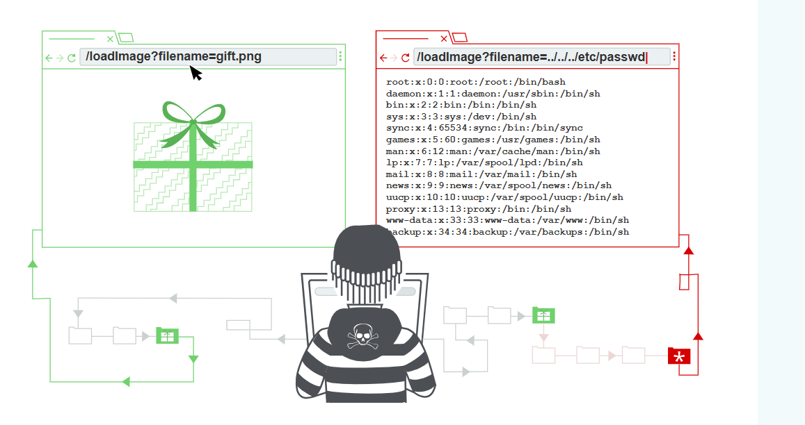

# Path Traversal
Ở phần này tôi sẽ giải thích cách hoạt động :
> Thuật toán duyệt đường đi sẽ ra sao?
> Cách thực hiện các cuộc tấn công vượt đường dẫn ra sao và vượt qua các chướng ngại vật thường gặp
> Cách ngăn chặn duyệt đường dẫn tùy ý

## Duyệt đường dẫn là gì?
Là quá trình là cuộc tấn công duyệt thư mục, các lỗ hổng này cho phép duyệt đọc tập tin tùy ý ở bên trong hệ thống hay máy chủ.
> Có thể bao gồm mã và dữ liệu người dùng
> Thông tin đăng nhập các hệ thống máy chủ
> Các tập tin hệ điều hành nhạy cảm
## Đọc tập tin tùy ý thông qua duyệt đường dẫn 
Hãy tưởng tượng ta có đường dẫn như sau
```html

```
URL này `loadImage` nhận một param filename tham số và trả về hình ảnh chúng ta. Các tệp hình ảnh thường nằm ở `/var/www/images` và nói cách khác ứng dụng sẽ đọc đường dẫn `/var/www/images/2.png`
Bằng cách k có sự lọc đầu vào kẻ tấn công có thể tiến hành duyệt thư mục như sau `/var/www/images/../../../etc/passwd` khi đó sẽ tới thư mục root có thể đọc tập tin nhạy cảm tùy ý.
