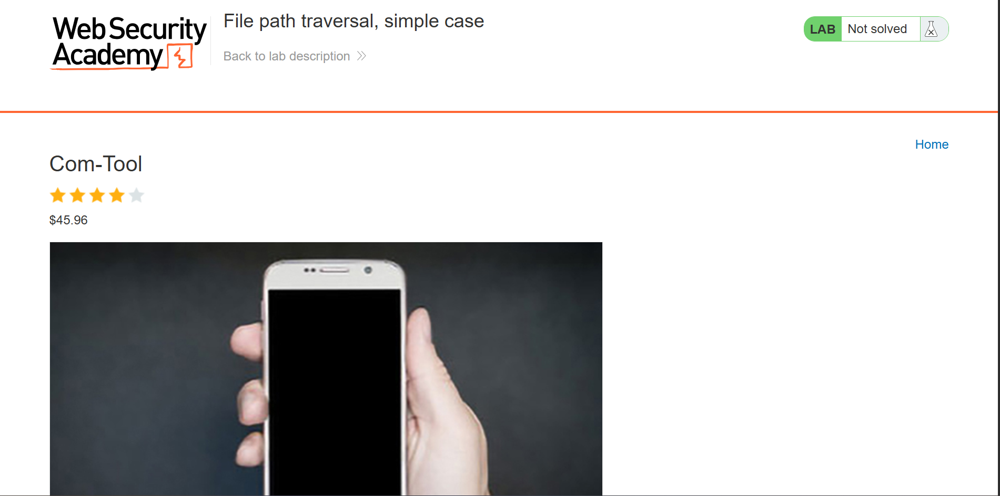
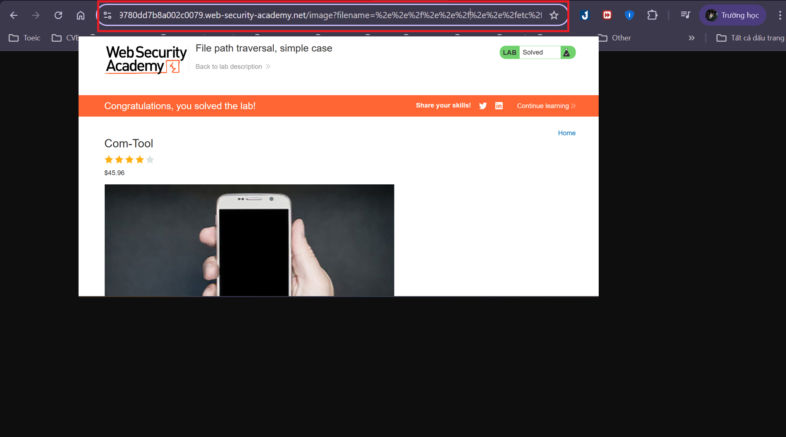

# Writeup Lab: File path traversal, simple case

## Goal 
Mục tiêu bài này rất dễ dàng chỉ cần tìm cách duyệt thư mục lấy được tập tin nhạy cảm /etc/passwd sẽ hoàn thành lab
## Khai thác
Ở đây sẽ có bài đăng báo bất kì bằng cách đó bạn có thể truy cập hình ảnh của nó

Với hình ảnh chúng ta cùng chú ý vào param `filename` param có thể ảnh hưởng đến duyệt đường dẫn và thực hiện khai thác để hoàn thành lab

