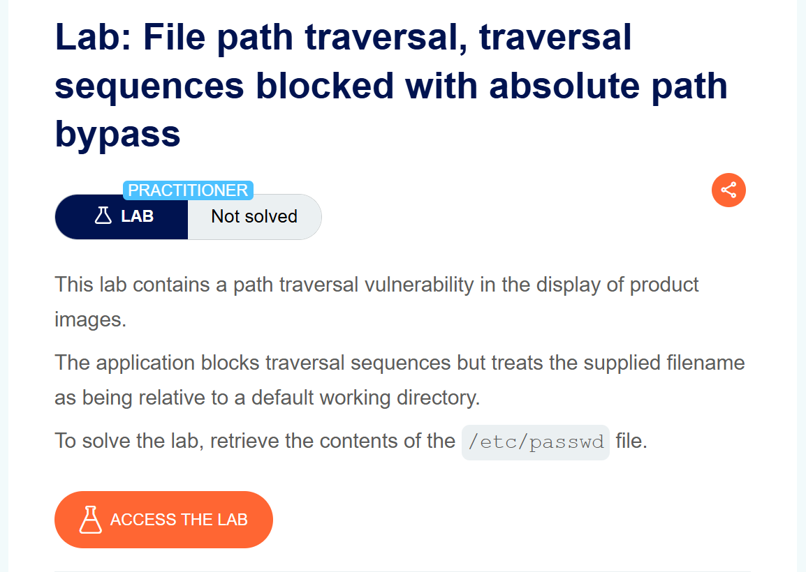
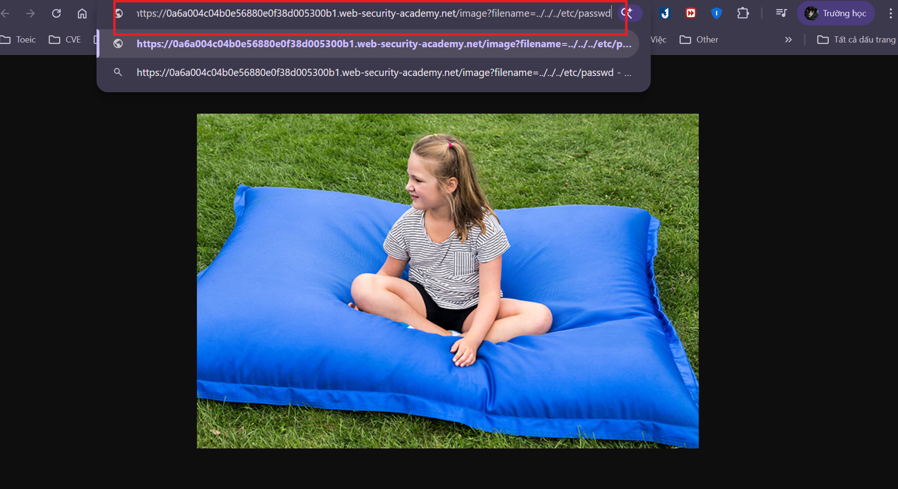
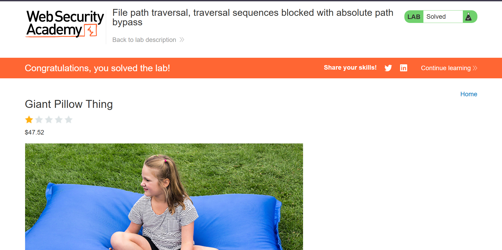

# Writeup LAB File path traversal, traversal sequences blocked with absolute path bypass

## Goal
chúng ta cần retrieve the contents of the /etc/passwd file. để hoàn thành lab
## Khai thác
Ở đay vào trang chủ và vào image của bài đăng tôi sẽ thử một đường dẫn tương đối như sau và kết quả thu được `"No such file"`

Bằng cách đó tôi thay đổi từ đường dẫn tương đối thành tuyệt đối `/etc/passwd` và kết quả đã đọc được tệp /etc/passwd và solve LAB
.