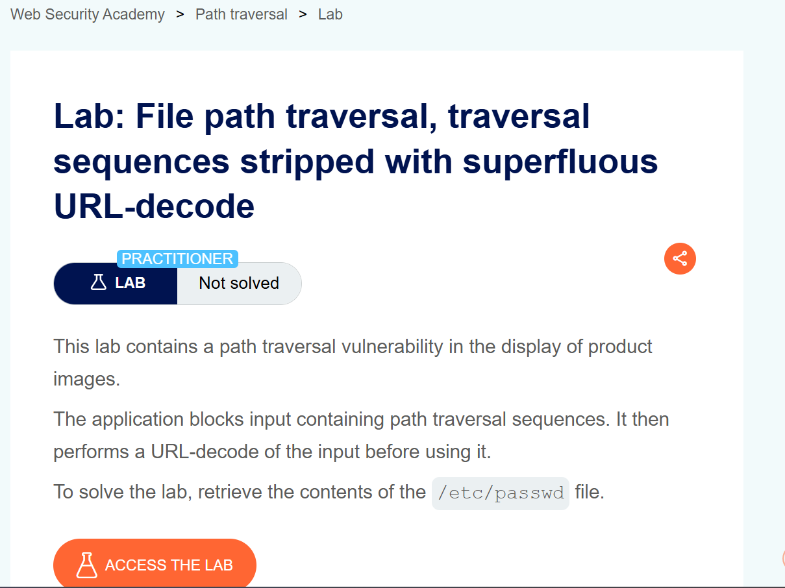
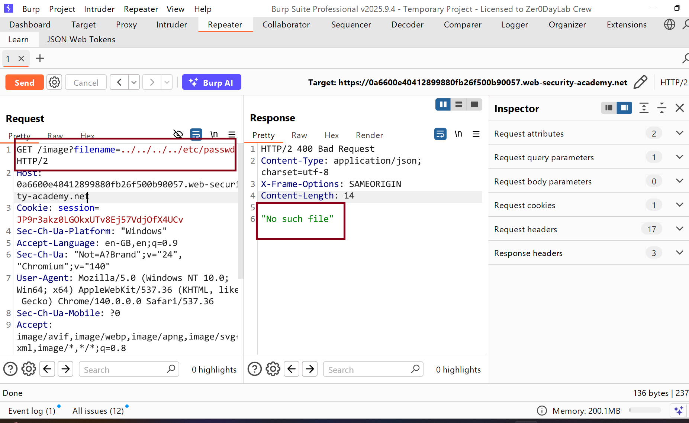
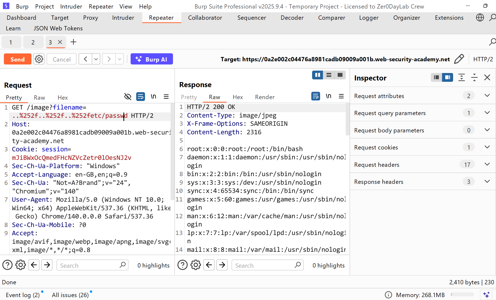

# WRiteup LAB File path traversal, traversal sequences stripped with superfluous URL-decode

## Khai thác.
Trang chủ 

Sau khi truy cập hình ảnh của bài đăng và tiến hành thử duyệt thư mục ở param thu được lỗi và k duyệt được bởi vì serevr đã chặn chuỗi `../` rồi

Bằng cách đó chúng ta có thể sử dụng URL Encode chuỗi duyệt chúng ta giả sử như `%2e%2e%2fetc%2fpasswd` -> Khi Decode URL sẽ có chuỗi dạng nguyên gốc `../etc/passwd` có thể đọc được tệp tùy ý.
Nhưng sau khi thử tôi lại nhận được kết quả `"No such file"` bằng cách đó tôi sẽ thử double encoding lên như sau: `..%252f..%252f..%252fetc/passwd ` đọc tệp /etc/passwd và hoàn thành LAB
