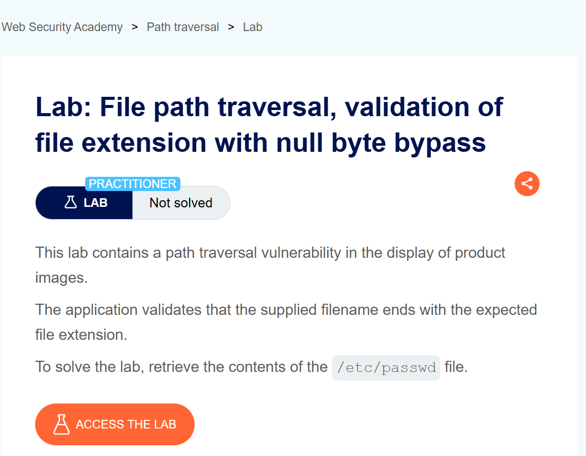
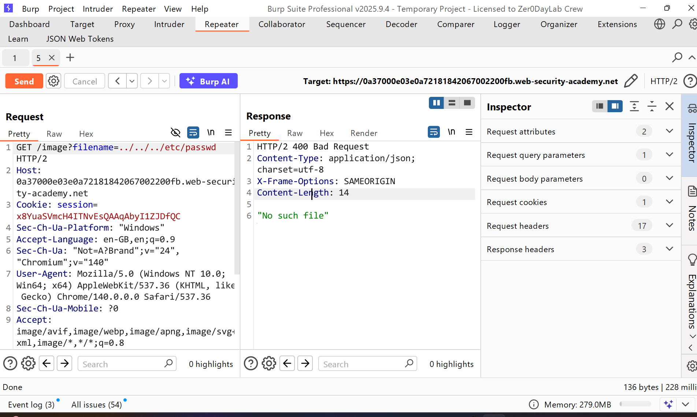
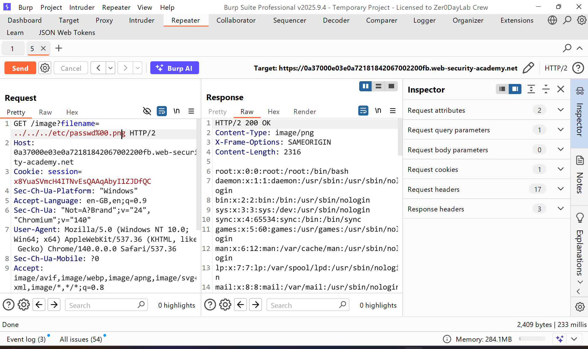

# WRiteup LAB File path traversal, validation of file extension with null byte bypass

## Khai thác
Ở lab này khi chúng ta duyệt đường dẫn thì sẽ k thể đạt được mục đích có lẽ server đã chặn điều gì đó ở tệp mở rộng

Với cách này có thể yêu cầu tên tệp do người dùng cung cấp phải kết thúc bằng phần mở rộng tệp dự kiến, chẳng hạn như .png như note lab đã đề cập thì bằng cách này chúng ta có thể bỏ qua bằng cách sử dụng null byte `%00` null byte nó có thể khi gửi lên server với `%00.png` hợp lệ và sẽ xóa phần mở rộng `.png` đường dẫn sẽ trở thành `../../../etc/passwd` thay vì `../../../etc/passwd%00`
và kết quả đọc được tệp `/etc/passwd`
