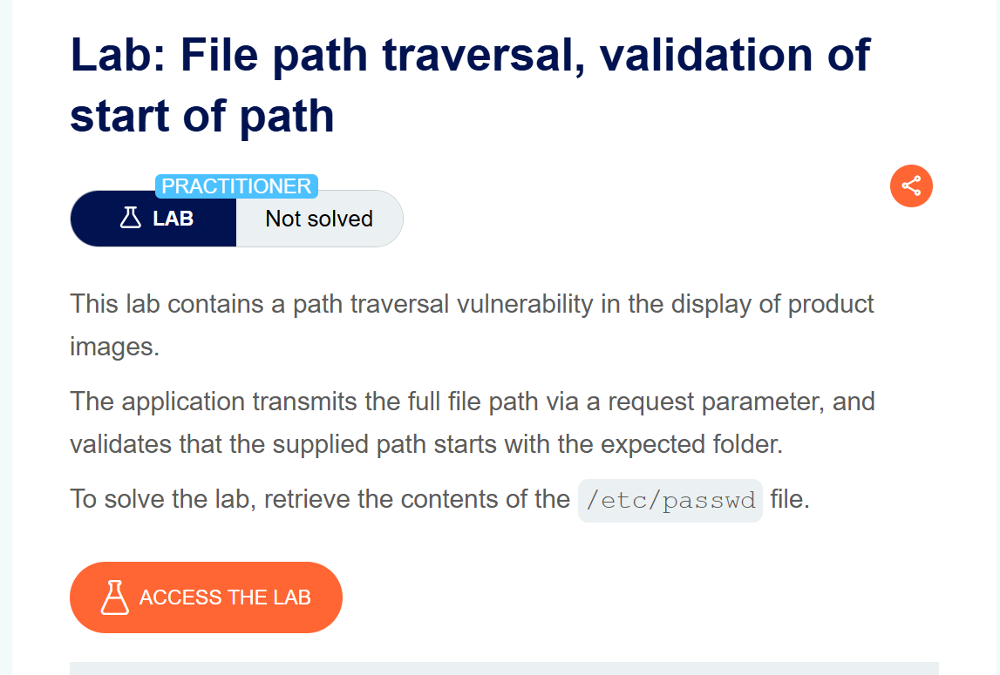
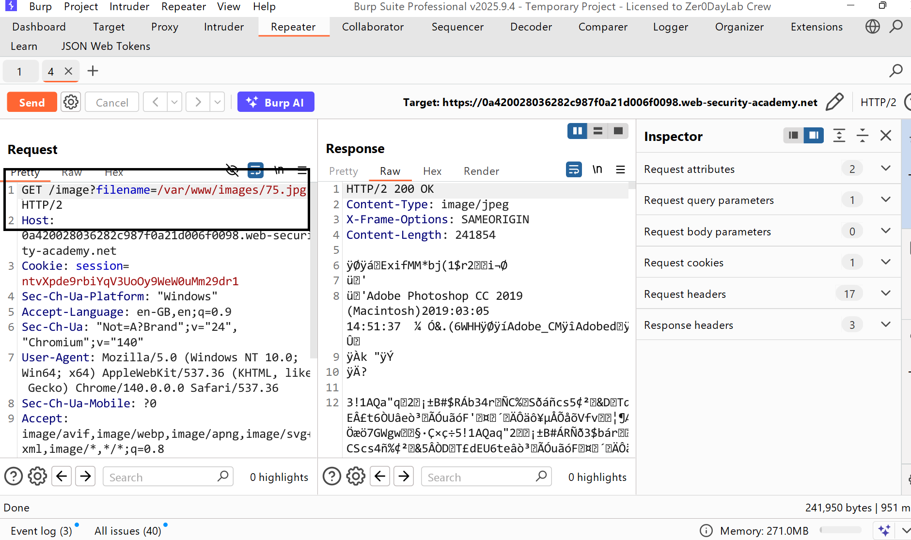
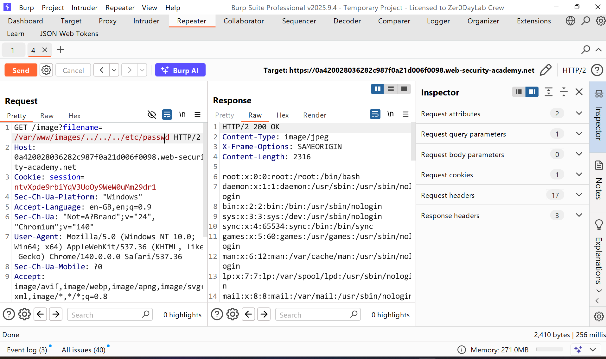

# Writeup LAB File path traversal, validation of start of path

## Khai thác
Ở đây chúng ta có thể thấy nó kèm đường dẫn với thư mục gốc `/var/www/images`

Bằng cách này chúng ta k cần xóa đường dẫn và duyệt khi đã biết đường dduwoojc dẫn gốc mấy cấp và thực hiện duyệt đường dẫn độc tẹp nhạy cảm `/etc/passwd`
để hoàn thành LAB
