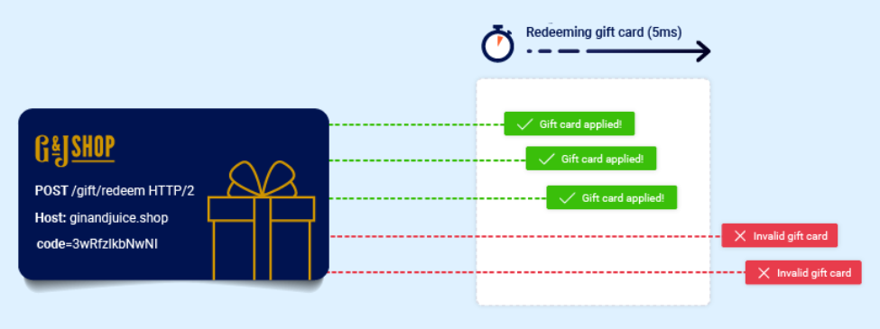
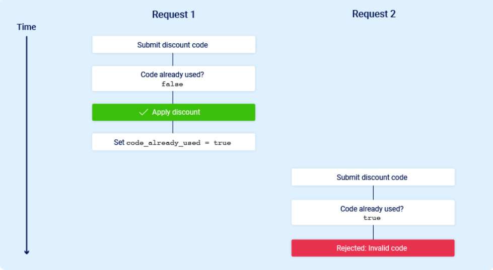
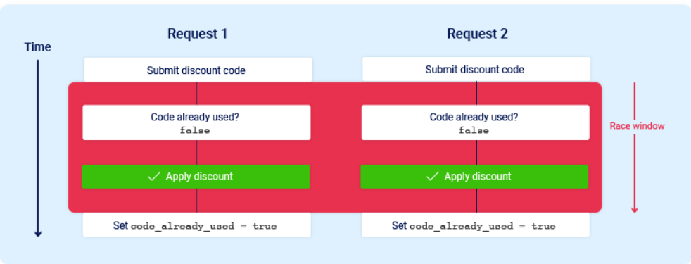
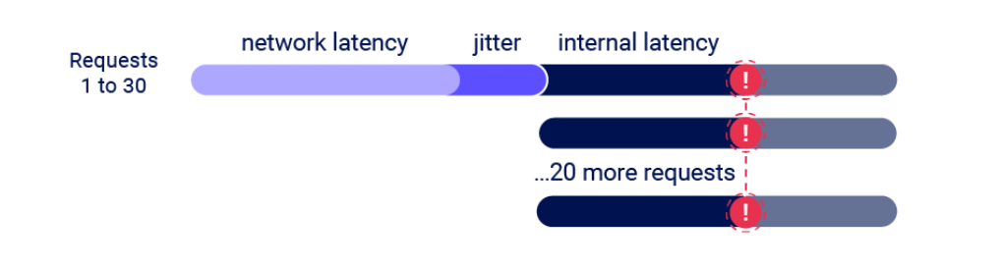

# Race Condition
Race Condition là lỗi xung đột giữa các tiến trình là một loại lỗ hổng nguy hiểm, liên quan đến chặt chẽ đến các sai sót trong logic nghiệp vụ.
Chúng xảy ra khi trang web xử lý các yêu cầu đồng thời mà không có biện pháp bảo vệ thích đáng. Điều này có thể dẫn đến luồng riêng biệt tương tác với cùng một dữ liệu tại cùng 1 thời điểm, dẫn đến xung đột gây ra hành vi không mong muốn.

Khoảng thời gain mà trong đó có thể xảy ra va chạm được gọi là "Cửa số tranh chấp".
## Giới hạn tình trạng vượt quá giới hạn
Loại xung đột truy cập đồng thời phổ biến nhất cho phép bạn vượt qua một giới hạn nào đó do logic nghiệp vụ của ứng dụng đặt ra
> hãy xem xét một cửa hàng trực tuyến cho phép bạn nhập mã khuyến mãi trong quá trình thanh toán để được giảm giá một lần cho đơn hàng của mình. Để áp dụng giảm giá này, ứng dụng có thể thực hiện các bước chính sau:

> 1. Kiểm tra xem đã sử dụng mã này chưa <br>
> 2. Áp dụng mức giảm giá vào tổng giá trị đơn hàng <br>
> 3. Cập nhật bản ghi trong cơ sở dữ liệu để phản ánh việc bạn sử dụng đoạn mã này. <br>

Nếu sau này cố gắng sử dụng đoạn mã này, các bước kiểm tra ban đầu được thực hiện ở đầu quy trình sẽ ngăn bạn làm điều đó:

Giả sử một người dùng chưa từng sử dụng mã giảm giá này trước đây và cố gắng sử dụng nó 2 lần cùng 1 lúc

> Như bạn thấy, ứng dụng chuyển đổi qua một trạng thái phụ tạm thời; tức là, một trạng thái mà nó đi vào và sau đó thoát ra trước khi quá trình xử lý yêu cầu hoàn tất. Trong trường hợp này, trạng thái phụ bắt đầu khi máy chủ bắt đầu xử lý yêu cầu đầu tiên và kết thúc khi nó cập nhật cơ sở dữ liệu để cho biết rằng bạn đã sử dụng mã này. Điều này tạo ra một khoảng thời gian ngắn cho phép bạn liên tục nhận mã giảm giá bao nhiêu lần tùy thích.

Có nhiều biến thế của kiểu tấn công này, bao gồm:
> Đổi thẻ quà tặng nhiều lần <br>
> Đánh giá sản phẩm nhiều lần <br>
> Rút hoặc chuyển tiền vượt quá số dư tài khoản <br>
> Tái sử dụng một giải pháp CAPTCHA duy nhất <br>
> Vượt qua giới hạn tốc độ chống tấn công vét cạn <br>

Lỗi vượt quá giới hạn là một dạng phụ của các lỗi được gọi là "<b>TOCTOU</b>". 
## Phát hiện và khai thác các tình trạng tranh chấp vượt quá giới hạn với Burp Repeater
Quá trình phát hiện và khai thác các điều kiện tranh chấp vượt quá giới hạn tương đối đơn giản.
> 1. Xác định một điểm cuối chỉ sử dụng một lần hoặc bị giới hạn tốc độ truy cập có tác động đến bảo mật hoặc mục đích hữu ích khác. <br>
> 2. Hãy gửi nhiều yêu cầu đến điểm cuối này liên tiếp trong thời gian ngắn để xem bạn có thể vượt quá giới hạn này không. <br>

Thử thách chính là căn chỉnh thời gian các yêu cầu sao cho ít nhất hai cửa sổ tranh chấp trùng khớp, gây ra va chạm. Cửa sổ này thường chỉ kéo dài vài mili giây và thậm chí có thể ngắn hơn nữa.
Tấn công bằng gói tin đơn cho phép bạn loại bỏ hoàn toàn sự nhiễu loạn do độ trễ mạng bằng cách sử dụng một gói tin TCP duy nhất để thực hiện đồng thời 20-30 yêu cầu.

## Phát hiện và khai thác các tình huống tranh chấp vượt quá giới hạn với Turbo Intruder
Ngoài việc hỗ trợ trực tiếp tấn công bằng gói tin đơn trong Burp Repeater, chúng ta có thể sử dụng Turbo Intruder đễ hỗ trợ kỹ thuật này.
> Công cụ Turbo Intruder phù hợp với các tấn công phức tạp hơn, chẳng hạn như cuộc tấn công yêu cầu nhiều lần thử lại, thời gian yêu cầu được phân bổ hợp lý hoặc số lượng yêu cầu cực kì lớn <br>
Để sử dụng phương pháp tấn công gói tin đơn trong Turbo Intruder
> 1. Hãy đảm bảo rằng mục tiêu hỗ trợ HTTP/2. Cuộc tấn công bằng gói tin đơn lẻ không tương thích với HTTP/1. <br>
> 2. Thiết lập `engine=Engine.BURP2` các `concurentConnections=1` tùy chọn cấu hình cho công cụ yêu cầu <br>
> 3. Khi xếp hàng yêu cầu, hãy nhóm chúng lại bằng cách gán chúng cho một cổng được đặt tên bằng cách sử dụng `gate` đối số cho `engine.queue()` phương thức <br>
> 4. Để gửi tất cả các yêu cầu trong một nhóm nhất định, hãy mở cổng tương ứng bằng engine.openGate() phương pháp đã chọn. <br>

```py
def queueRequests(target, wordlists):
    engine = RequestEngine(endpoint=target.endpoint,
                            concurrentConnections=1,
                            engine=Engine.BURP2
                            )
    
    # queue 20 requests in gate '1'
    for i in range(20):
        engine.queue(target.req, gate='1')
    
    # send all requests in gate '1' in parallel
    engine.openGate('1')
```
## Chuỗi nhiều bước ẩn
Một yêu cầu duy nhất có thể khởi động toàn bộ chuỗi nhiều bước ẩn đưa ứng dụng chuyển đổi qua nhiều trạng thái ẩn mà nso đi vào rồi lại thoát ra trước khi quá trình xử lý yêu cầu hoàn tất. `Trạng Thái Con`
Nếu có thể xác định một hoặc nhiều yêu cầu HTTP gây ra tương tác với cùng một dữ liêụ có thể lợi dụng các trạng thái phụ này để khai thác các biến thể nhạy cảm về thời gian của các loại lỗi logic. Điều này cho phép khai thác tình trạng tranh chấp vượt xa cả việc vượt quá giới hạn.
Đoạn mã sau đây minh họa cách một trang web có thể dễ bị tổn thưởng bởi một biến thể của cuộc tấn công này.
```php
session['userid'] = user.userid
if user.mfa_enabled:
session['enforce_mfa'] = True
```
Đây thực chất là một chuỗi nhiều bước ẩn diễn ra trong phạm vi một yêu cầu duy nhất. Quan trọng hơn, nó chuyển đổi qua một trạng thái phụ trong đs người dùng tạm thời có phiên đăng nhập hợp lệ, nhưng xác thực đa yếu tố (MFA) chưa được thực thi.
