# Writeup Lab: Limit overrun race conditions
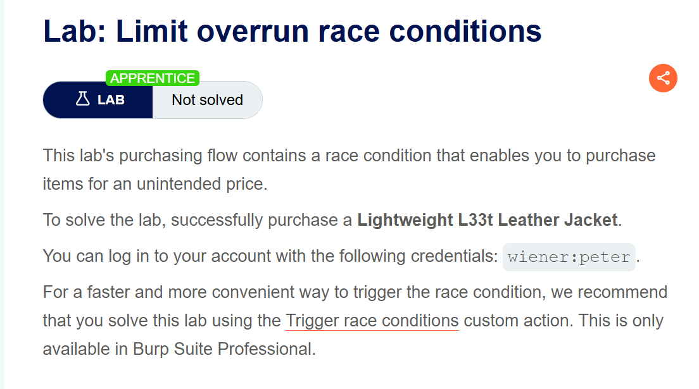 
## Goal
Mục tiêu LAB này cần Race Condition xung đột truy cập đồng thời cho phép mua <b>Áo khoác da Lightweight L33t</b>
## Khai THác
Đầu tien vào challenge chúng ta cùng truy cập cred `wiener:peter` ở đây tài khoản chúng ta có được `50$` và code giảm giá `PROMO20`
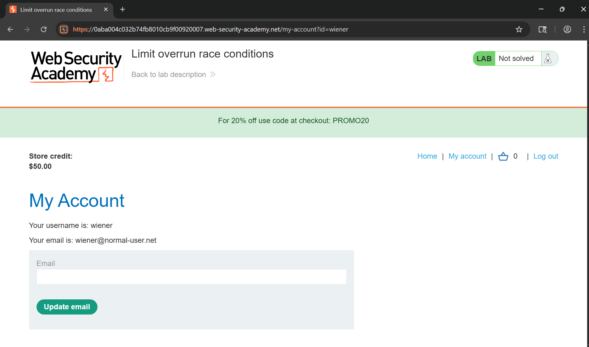
Tiến hành đặt hàng áo khoác da Lightweight L33t thì với giá tiền của chúng ta chúng ta không thể mua được mặt hàng này.
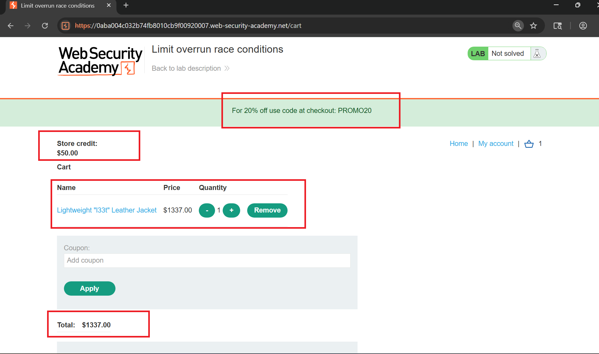
Vậy với cách nào chúng ta có thể mua cái áo khoác này trong khi có 1 mã code giảm có `PROMO20` 20% vậy chúng ta có thể sử dụng gửi mã giảm giá vào cùng 1 lúc áp mã giảm giá thì điều gì sẽ xảy ra chúng ta cùng thực hiện ở Burp Suite
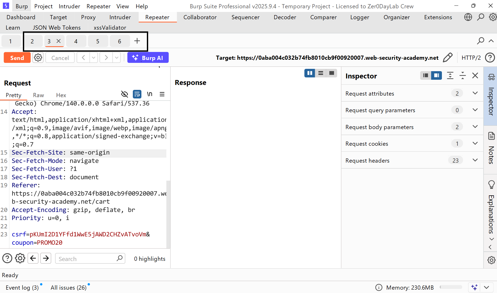
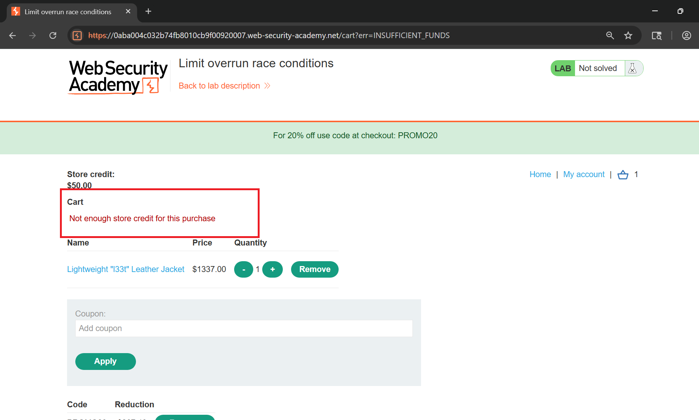
Và để khai thác tình trạng chạy đua tranh chấp vượt qua giới hạn này, trước tiên chúng ta gỡ bỏ mã giảm giá của chúng
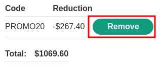
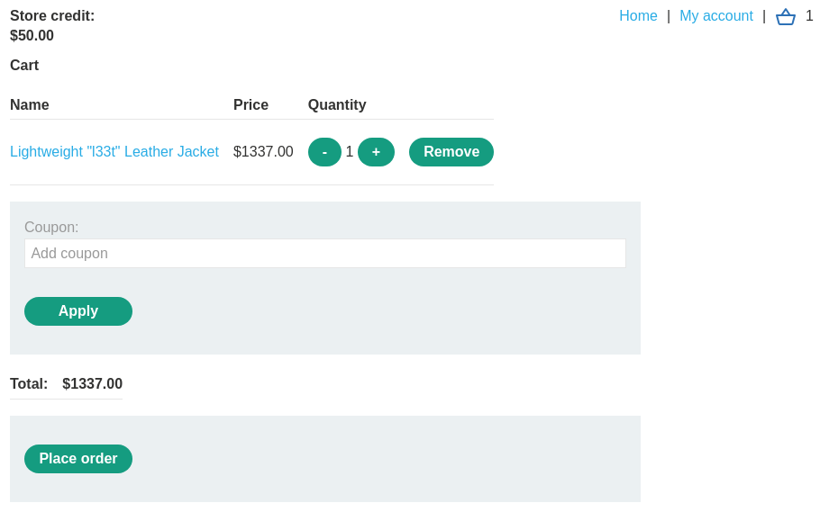
Sau đó, gửi `/cart/coupon` yêu cầu POST đến Repeater của Burp Suite khoảng 30 lần:
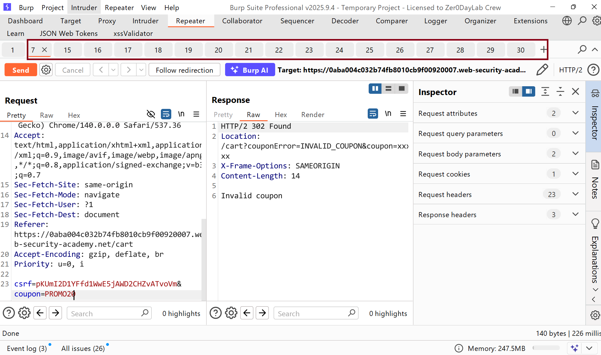
Add vào Group và tiến hành gửi request đồng thời của các request sau đó xem phản ứng kết quả ra sao.
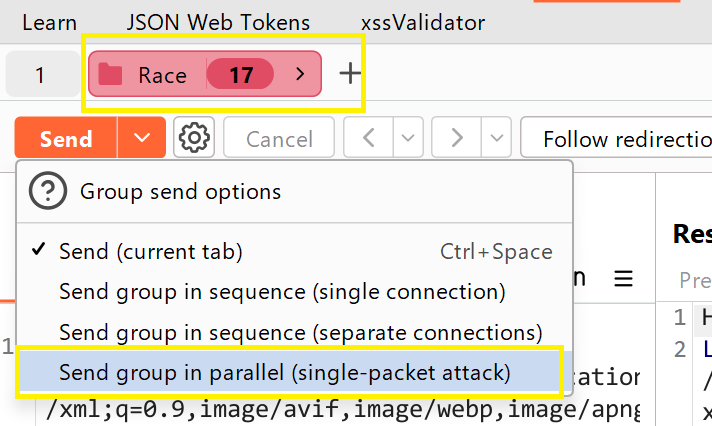
Kết quả số tiền đã được giảm hắn 1 lượng nhất định khi thực race condition gửi xung đột vào cùng 1 thời điểm
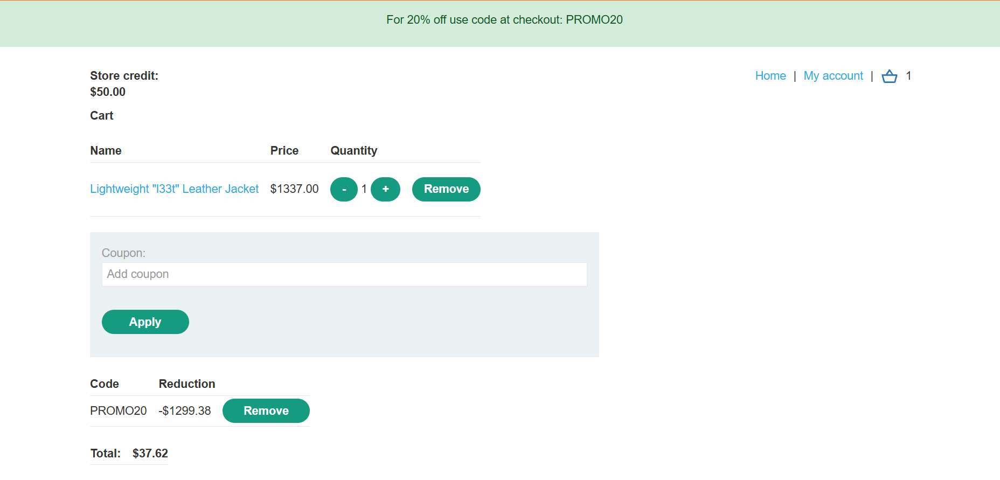
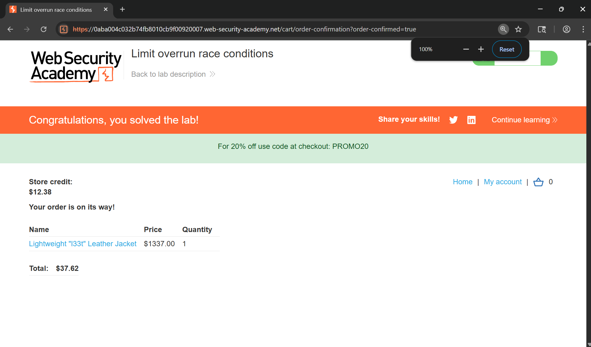