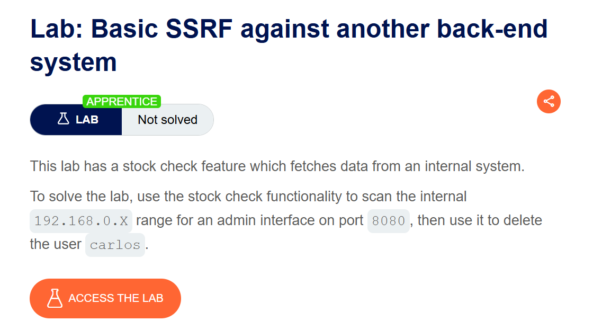
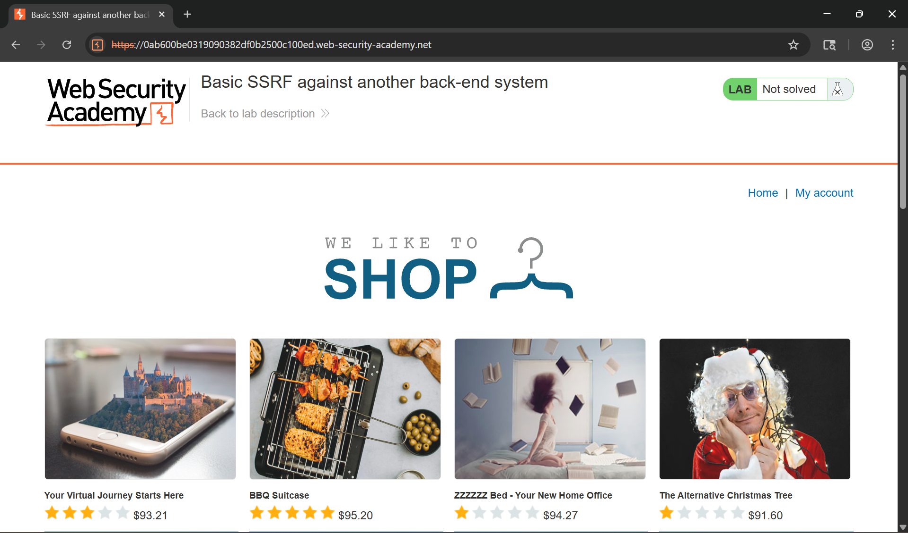
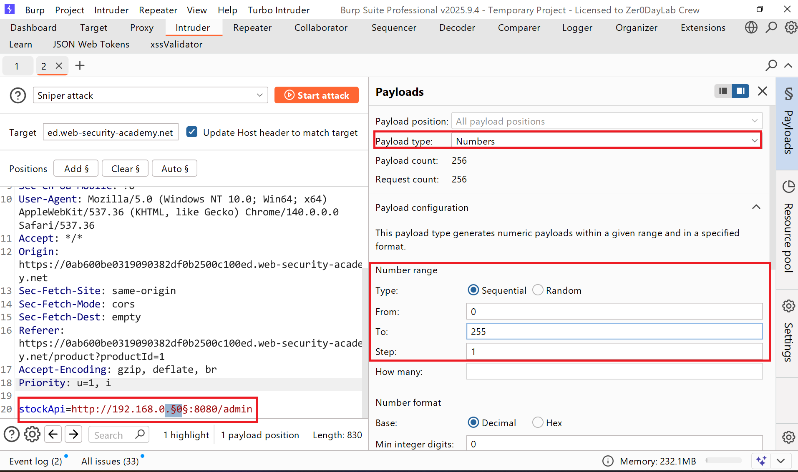
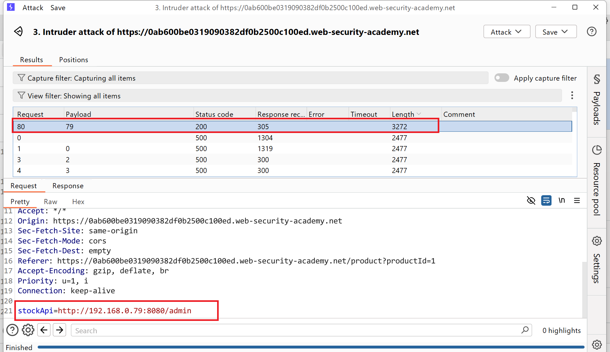
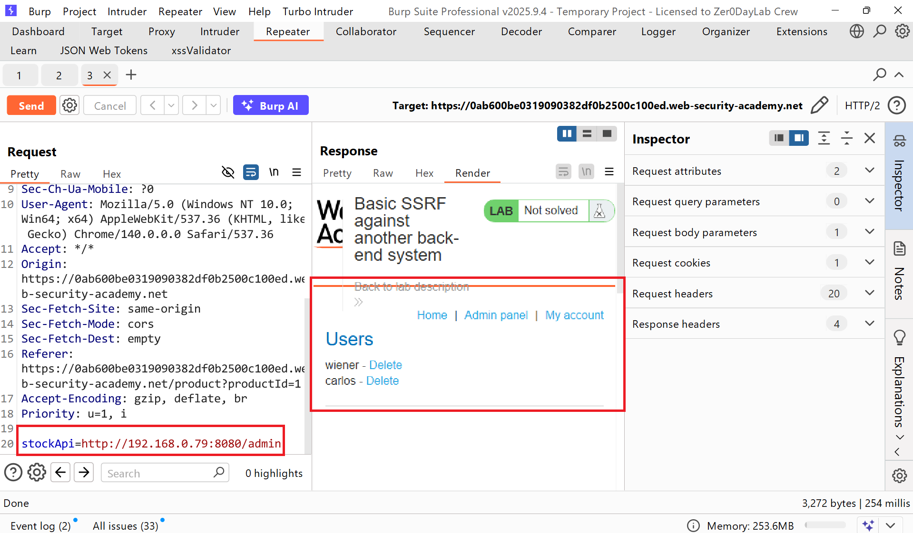
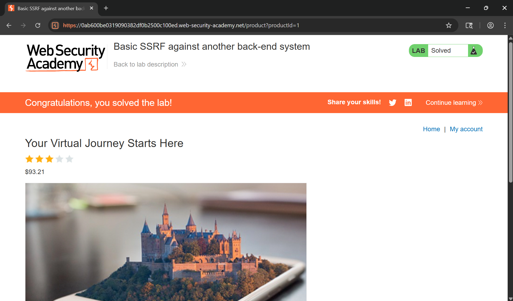

# Writeup LAB Basic SSRF against another back-end system

## Goal
To solve the lab, use the stock check functionality to scan the internal `192.168.0.X` range for an admin interface on port `8080`, then use it to delete the user `carlos.`
## Khai thác
Trang chủ

Như những bài thực hành trước ứng dụng có thể xảy ra lỗ hổng ở chức năng kiểm tra tồn kho đúng không.

Và để có thể truy cập vào được trang quản trị ở đây chúng ta không thể sử dụng `localhost` hay là `127.0.0.1` nữa. Mà hệ thống cho một IP Internal để truy cập nội bộ nhưng IP không hoàn chỉnh nên chúng ta không thể biết được IP chính xác đúng không <br>
Và bằng cách này chúng ta có thể sử dụng công cụ Intruder chúng ta sẽ quét IP và IP mỗi octet có địa chỉ từ 0-255 bằng cách này tôi sẽ sử dụng intruder quét nếu IP hợp lệ sẽ trả về trạng thái khác chúng ta có thể truy cập quản trị
```
stockApi=http://192.168.0.X:8080/admin
```
Chúng ta cùng thực hiện

Sau quá trình thực hiện chúng ta có thể thây độ dài của request 80 nó khác so với các requests khác và response trả về 200

Và tới đây chúng ta có thể truy cập bảng quản trị

Thực hiện xóa user carlos

