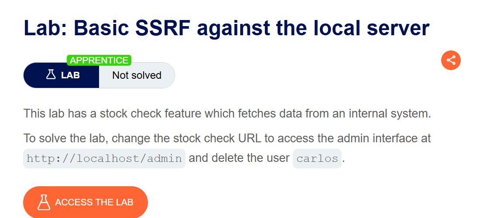
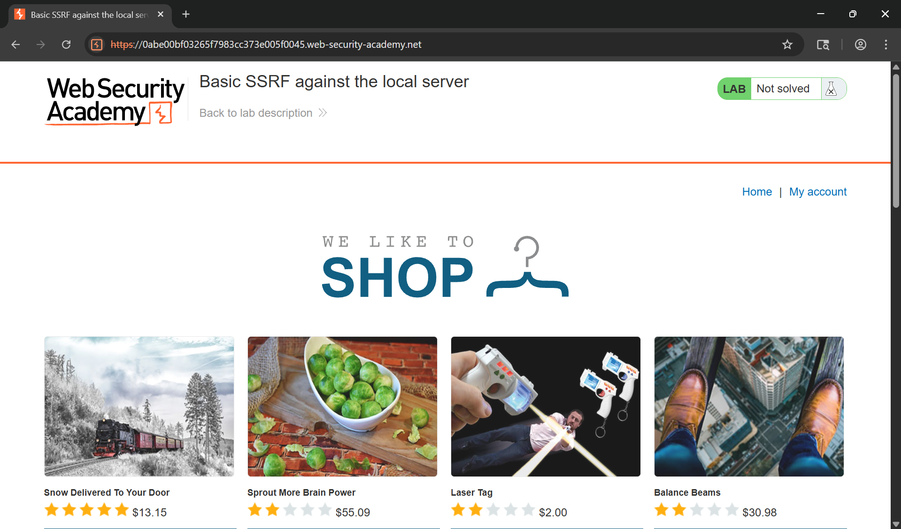
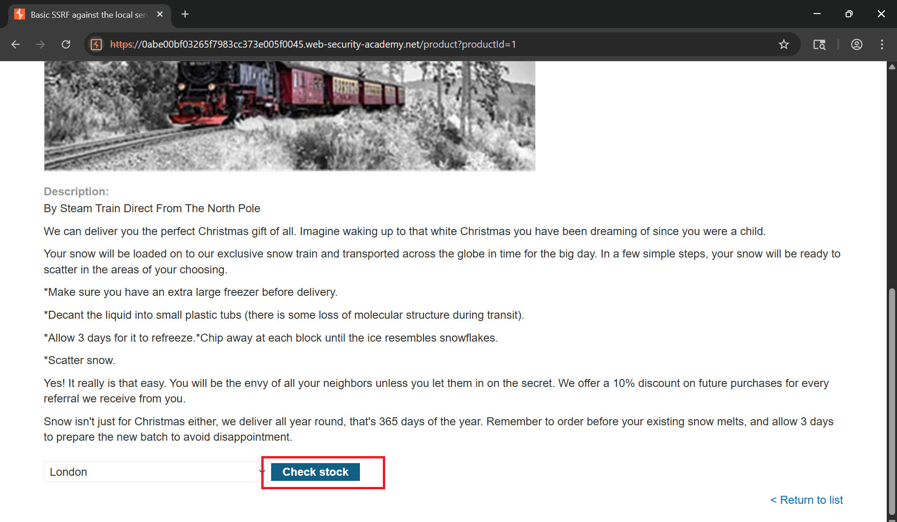
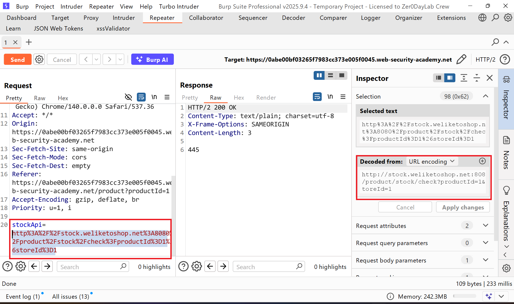
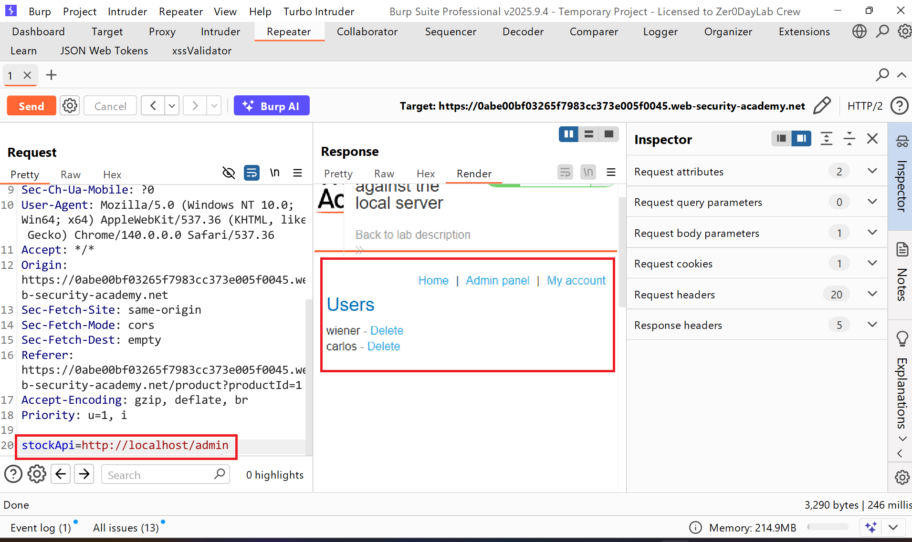
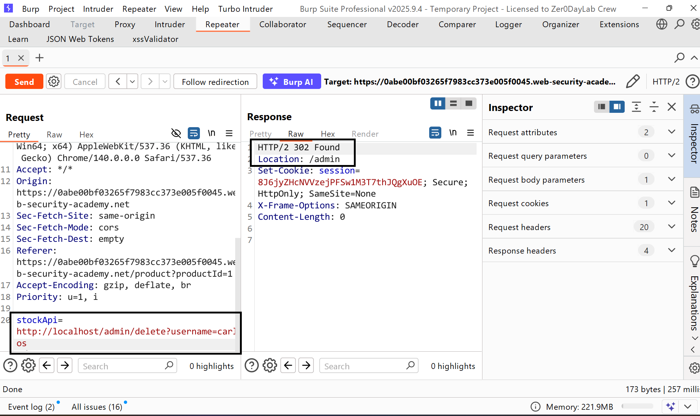
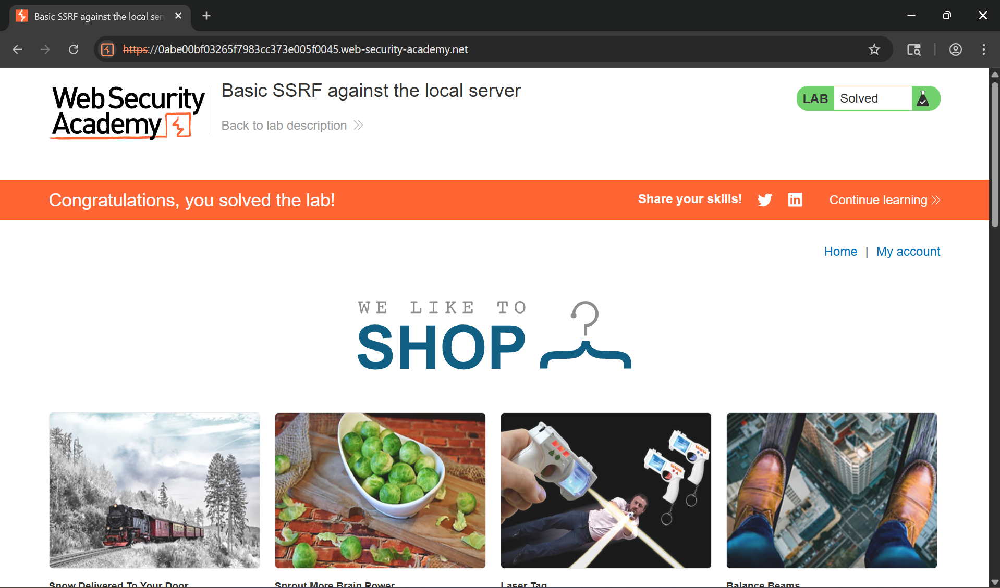

# Writeup LAB Basic SSRF against the local server

## Goal
To solve the lab, change the stock check URL to access the admin interface at `http://localhost/admin` and delete the user `carlos`.
## Khai thác.
Trang chủ

Chúng ta cùng xem chi tiết một sản phẩm nào đó

Lịch sử HTTP Burp lúc này nó sẽ truy vân tới địa chỉ http đó và thực hiện truy vấn check sản phẩm theo productid

Như bạn thấy, nó đang gửi yêu cầu đến một API nội bộ . Vậy nếu tôi thay đổi thành địa chỉ tới `localhost/admin` truy cập vào trang cục bộ thì sao và chúng ta có thể thấy nó đã truy cập vào tài khoản admin

THực hiện xóa tài khoản người dùng carlos

