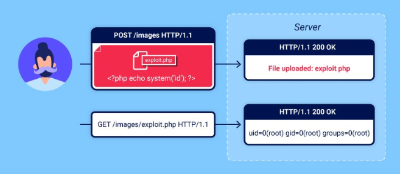

# File upload vulnerabilities
Ở modul này sẽ tìm hiểu các chức năng tải tập tin lên đơn giản để sử dụng từ đó có thể thực hiện các chức năng tấn công mạnh mẽ nhiều cuộc tấn công nghiêm trọng.

## Lỗ hổng bảo mật khi tải lên tập tin là gì
Lỗ hổng tải lên tập tin xảy ra khi máy chủ web cho phép upload các tệp tin tùy mà không xác thực đầy đủ loại nội dung, kích thước.
## Các lỗ hổng bảo mật khi tải lên gây ra những ảnh hưởng gì?
Tác động chính lỗ hổng tải lên tập tin thường phụ thuộc vào hai yếu tố:
> Trang web không xác thực đúng cách các tệp tin, như kích thước, loại tệp, nội dung <br>
> Những hạn chế nào được áp đặt lên tệp tin sau khi tệp tin đã được tải lên thành công <br>
Trong một số trường hợp nhất định các loại tệp nhất định (chẳng hạn như `.php` và `.jsp`) có thể được thực thi mã tùy ý. Kẻ tấn công có thể tải lên một web shell chiếm quyền kiểm soát máy chủ. 
Nếu tên tập tin không được xác thực đúng cách, kẻ tấn công có thể ghi đè lên các tập tin quan trọng chỉ bằng cách tải lên một tập tin có cùng tên. Nếu máy chủ cũng dễ bị tấn công bằng cách xâm nhập thư mục trái phép, điều này có nghĩa là kẻ tấn công thậm chí có thể tải lên các tập tin đến những vị trí không ngờ tới.
## Các lỗ hổng bỏa mật khi tải lên tập tin phát sinh như thế nào
Ví dụ, họ có thể cố gắng đưa các loại tệp nguy hiểm vào danh sách đen, nhưng lại không tính đến sự khác biệt trong quá trình phân tích cú pháp khi kiểm tra phần mở rộng tệp. Cũng như bất kỳ danh sách đen nào, việc vô tình bỏ sót các loại tệp ít phổ biến hơn nhưng vẫn có thể nguy hiểm cũng rất dễ xảy ra.
Trong những trường hợp khác, trang web có thể cố gắng kiểm tra loại tệp bằng cách xác minh các thuộc tính mà kẻ tấn công có thể dễ dàng thao túng bằng các công cụ như Burp Proxy hoặc Repeater
## Khai thác lỗ hổng tải lên tập tin không hạn chế để triển khai web shell
Nếu có thể tải lên một webshell, về cơ bản chúng ta sẽ có toàn quyền kiểm soát máy chủ. Điều này có nghĩ chúng ta có thể đọc và ghi các tệp tùy ý, đánh cắp dữ liệu nhạy cảm, thậm chí sử dụng máy chủ để chuyển hướng.
```php
<?php
echo file_get_contents('/path/to...');
?>
```
Sau khi tải lên , việc gửi yêu cầu đối với tập tin độc hại này sẽ trả về nội dung của tập tin mục tiêu trong phản hồi
> Một webshell đa năng hơn : <br>
```php
<?php   
echo system($_GET['cmd']);
?>
```
Đoạn mã này cho phép thực thi thông qua tham số truy vấn cmd
```txt
GET /example/exploit.php?cmd=id HTTP/1.1
```
## Việc đưa các loại tập tin nguy hiểm vào danh sách đen chưa đủ
Một trong những cách rõ ràng nhất để ngăn chặn người dùng tải lên tệp độc hại là đưa vào danh sách đen các phần mở rộng tệp có khả năng nguy hiểm như `.php` và các phần mở rộng khác vẫn thực thi được như `.php5, .shtml`....
## Ghi đè cấu hình máy chủ.
Máy chủ thường sẽ không thực thi các tệp khi chúng ta cấu hình để làm như vậy. Giả sử trước khi máy chủ Apache thực thi các tệp PHP được yêu cầu bởi máy khách, các nhà phát triển có thể phải thêm các chỉ thị sau vào `/etc/apache2/apache2.conf` tệp của họ:
```txt
Loadmodule php_module /usr/lib/apache2/modules/libphp.so
AddType application/x-httpd-php .php
```
Nhiều máy chủ cho phép các nhà phát triển tạo các tệp cấu hình đặc biệt trong từng thư mục riêng lẻ để ghi đè hoặc bổ sung vào một hoặc nhiều cài đặt toàn cục.
Máy chủ Apache sẽ tải cấu hình dành riêng cho thư mục từ một tệp có tên `.htaccess` nếu tệp đó có tồn tại.
Tương tự, các nhà phát triển có thể thực hiện cấu hình cụ thể cho từng thư mục trên máy chủ IIS bằng cách sử dụng một `web.config` tệp. Điều này có thể bao gồm các chỉ thị như sau, trong trường hợp này cho phép cung cấp các tệp JSON cho người dùng:
```xml
<staticContent>
    <mimeMap fileExtension=".json" mimeType="application/json" />
    </staticContent>
```
## Làm mờ phần mở rộng tệp
Đôi khi những danh sách đen cũng có thể vượt qua bằng các kỹ thuật làm xáo trộn mã cổ điển.
Giả sử mã kiểm tra phân biệt chữ hoa chuwxx thường và không nhận ra đó `exploit.pHp` thực sự nó là `.php`
Nếu mã xử lí ánh xạ phần mở rộng tệp sang loại MIME sau đó không phân biệt chữ hoa và chữ thường, nó cs thể thực thi tệp tùy ý.
Chúng ta cũng có thể đạt được nhiều kết quả tương tự bằng cách sử dụng các kĩ thuật: 
> Cung cấp nhiều phần mở rộng. Tùy thuộc vào thuật toán được sử dụng để phân tích tên tệp, tệp sau đây có thể được hiểu là tệp PHP hoặc hình ảnh JPG: exploit.php.jpg <br>
> Thêm các ký tự cuối cùng. Một số thành phần sẽ loại bỏ hoặc bỏ qua các khoảng trắng, dấu chấm và các ký tự tương tự ở cuối dòng:exploit.php. <br>
> Hãy thử sử dụng mã hóa URL (hoặc mã hóa URL kép) cho dấu chấm, dấu gạch chéo và dấu gạch chéo ngược. Nếu giá trị không được giải mã khi xác thực phần mở rộng tệp, nhưng sau đó được giải mã ở phía máy chủ, điều này cũng có thể cho phép bạn tải lên các tệp độc hại mà lẽ ra sẽ bị chặn: exploit%2Ephp <br>
> Thêm dấu chấm phẩy hoặc ký tự null byte được mã hóa URL trước phần mở rộng tệp. Nếu việc xác thực được viết bằng ngôn ngữ cấp cao như PHP hoặc Java, nhưng máy chủ xử kí tệp bằng các hàm cấp thấp hơn trong C/C++, chẳng hạn, điều này có thể gây ra sự không nhất quán trong việc xác định đâu là phần kết thúc của tên tệp: exploit.asp;.jpg hoặc exploit.asp%00.jpg <br>
> Hãy thử sử dụng các ký tự Unicode đa byte, chúng có thể được chuyển đổi thành byte rỗng và dấu chấm sau khi chuyển đổi hoặc chuẩn hóa Unicode. Các chuỗi như xC0 x2E, xC4 xAEhoặc xC0 xAEcó thể được dịch thành x2Enếu tên tệp được phân tích cú pháp dưới dạng chuỗi UTF-8, nhưng sau đó được chuyển đổi thành ký tự ASCII trước khi được sử dụng trong đường dẫn. <br>
## Lỗi ác thực nội dung tệp
Thay vì tin tưởng một cách ngầm định vào thông tin `Content-Type` được chỉ định trong yêu cầu, các máy chủ bảo mật hơn sẽ cố gắng xác minh xem nội dung của tệp cs thực sự khợp ko...
Một số loại tệp nhất định luôn chứa một chuỗi bye cụ thể trong phần đầu hoặc cuối tệp. Những chuỗi byte này có thể được sử dụng như dấu vân tay hoặc chữ ký để xác định xem nội dung có khớp với loại tệp dự kiến hay không.
Giả sử như tệp JPEG luôn bắt đầu bằng các byte `FF D8 FF`
Đây là một phương pháp xác thực loại tệp mạnh mẽ hơn, nhưng ngay cả khi phương pháp này cũng không hoàn toàn an toàn. Sử dụng các công cụ đặc biệt chẳng hạn như `Exiftool` việc tạo ra một tệp JPEG siêu dữ liệu chứa mã độc trong siêu dữ liệu của nó.
## Khai thác điều kiện tranh chấp khi tải lên tệp
> Các framework hiện đại được trang bị tốt hơn để chống lại các loại tấn công. Chúng thường không tải lên trực tiếp các tệp đích đến dự định trên hệ thống tệp. Thay vào đó, chúng thực hiện các biện pháp phòng ngừa như tải lên các thư mục tạm thời, được cách ly trước và ngẫu nhiên hóa tên để tránh ghi đè lên các tệp hiện có. <br>
> Sau đó chúng thực hiện xác thực tệp tạm thời này và chỉ chuyển nó đến đích khi thực hiện cho là an toàn <br>
## Các điều kiện tranh chấp trong quá trình tải lên tệp dựa trên URL
Các tình trạng tranh chấp tài nguyên tương tự cũng có thể xảy ra trong các hàm cho phép bạn tải lên tệp bằng cách cung cấp URL
> Giả sử nếu tệp được tải vào một thư mục tạm thời với tên ngẫu nhiên, về lý thuyết kẻ tấn công sẽ không thể khai thác bất kỳ điều kiện tranh chấp nào. Nếu chúng không biết tên thư mục, chúng sẽ không thể yêu cầu tệp để kích hoạt quá trình thực thi. Mặt khác nếu tên thư mục ngẫu nhiên được tạo bằng bằng các hàm giả ngẫu nhiên như của PHP `uniqid()` nó có thể bị tấn công bằng phương pháp vét cạn. <br>
> Để thực hiện các cuộc tấn công như vậy dễ dàng hơn, bạn có thể thử kéo dài thời gian xử lý tệp, từ đó kéo dài khoảng thời gian để tấn công vét cạn tên thư mục. Một cách để làm điều này là tải lên một tệp lớn hơn. Nếu tệp được xử lý theo từng phần, bạn có thể tận dụng điều này bằng cách tạo một tệp độc hại với phần mã độc ở đầu, theo sau là một lượng lớn các byte đệm tùy ý.<br>
## Khai thác lỗ hổng tải lên tập tin mà không cần thực thi mã từ xa
### Tải lên các tập lệnh phía máy khách độc hại
Mặc dù có thể không thực thi được các tập lệnh trên máy chủ, nhưng vẫn có thể tải lên các tập lệnh để thực hiện các cuộc tấn công phía máy khách. Giả sử như có thể tải lên tệp HTML hoặc hình ảnh SVG, có thể sử dụng `<script>` các thẻ để tạo ra các payload XSS được lưu trữ.
> Nếu tệp được tải lên xuất hiện trên một trang mà người dùng khác truy cập, trình duyệt của họ sẽ thực thi đoạn mã khi cố gắng hiển thị trang. Lưu ý rằng do các hạn chế của chính sách cùng nguồn gốc, các loại tấn công này chỉ hoạt động nếu tệp được tải lên được cung cấp từ cùng một nguồn gốc mà bạn tải lên. <br>
## Khai thác các lỗ hổng trong quá trình phân tích cú pháp các tệp đã tải lên.
Nếu tệp tin được tải lên có vẻ được lưu trữ và phân phối một cách an toàn, biện pháp cuối cùng là thử khai thác các lỗ hổng cụ thể liên quan đến việc phân tích cú pháp hoặc xử lý các định dạng tệp khác nhau. Ví dụ, bạn biết rằng máy chủ phân tích cú pháp các tệp dựa trên XML, chẳng hạn như các tệp Microsoft Office .`docs` hoặc `.xls` các tệp khác, đây có thể là một hướng tấn công chèn mã XXE.
## Tải lên tập tin bằng phương thức PUT
Cần lưu ý rằng một số máy chủ Web có thể được cấu hình để hỗ trợ `PUT` các yêu cầu này. Nếu không có biện pháp phòng vệ thích hợp, điều này có thể cung cấp một phương tiện thay thế để tải lên các tệp độc hại, ngay cả khi chức năng tải lên không khả dụng thông qua giao diện web
```txt
PUT /images/exploit.php HTTP/1.1
Host: vulnerable-website.com
Content-Type: application/x-httpd-php
Content-Length: 49

<?php echo file_get_contents('/path/to/file'); ?>
```
## Cách phòng ngừa các lỗ hổng khi tải tập tin lên
Việc cho phép người dùng tải lên tập tin là điều phổ biến và không nhất thiết phải nguy hiểm miễn là bạn thực hiện các biện pháp phòng ngừa đúng đắn. Nhìn chung, cách hiệu quả nhất để bảo vệ trang web của bạn khỏi những lỗ hổng này là thực hiện tất cả các biện pháp sau:
> Hãy kiểm tra phần mở rộng tệp so với danh sách trắng các phần mở rộng được cho phép thay vì danh sách đen các phần mở rộng bị cấm. Việc đoán xem bạn muốn cho phép phần mở rộng nào dễ hơn nhiều so với việc đoán xem kẻ tấn công có thể cố gắng tải lên phần mở rộng nào. <br>
> Hãy đảm bảo rằng tên tệp không chứa bất kỳ chuỗi con nào có thể được hiểu là thư mục hoặc chuỗi duyệt ( ../). <br>
> Đổi tên các tệp đã tải lên để tránh xung đột có thể dẫn đến việc ghi đè lên các tệp hiện có. <br>
> Không được tải các tệp lên hệ thống tệp vĩnh viễn của máy chủ cho đến khi chúng được xác thực đầy đủ.<br>
> Nên sử dụng một khuôn khổ đã được thiết lập sẵn để xử lý trước các tập tin tải lên thay vì cố gắng tự viết các cơ chế xác thực của riêng mình. <br>
