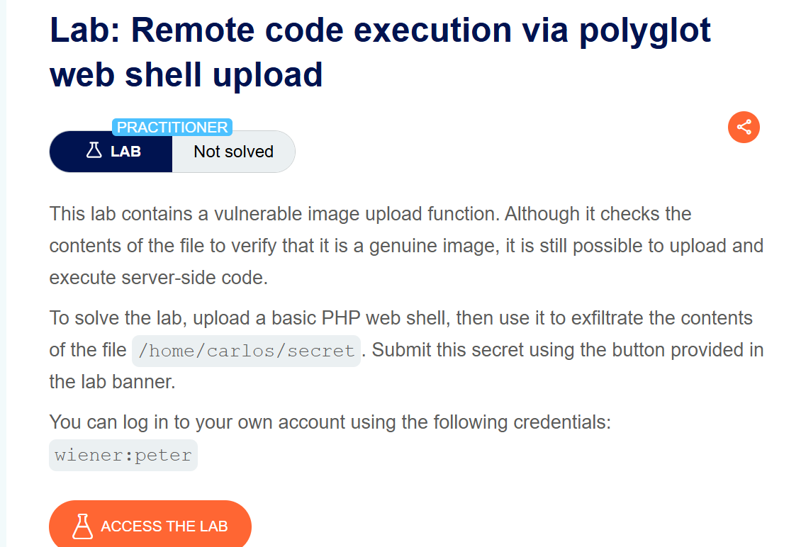
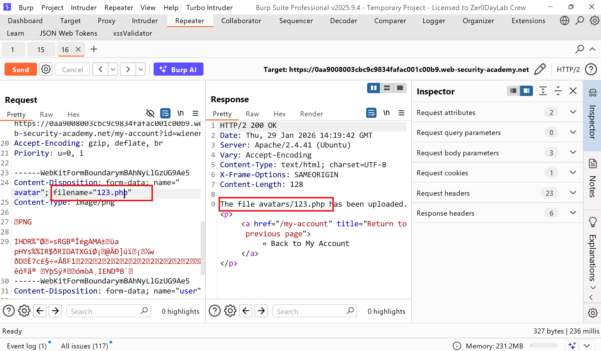
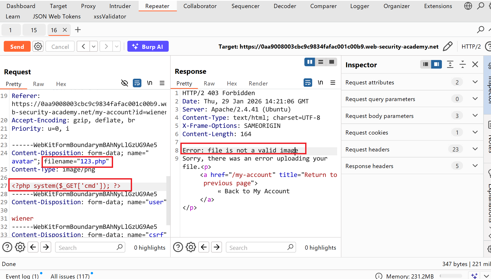
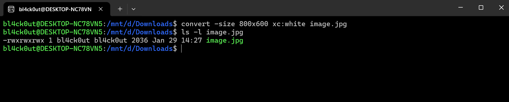
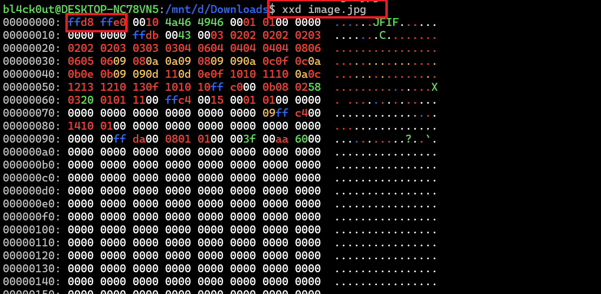
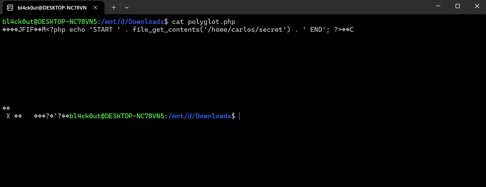
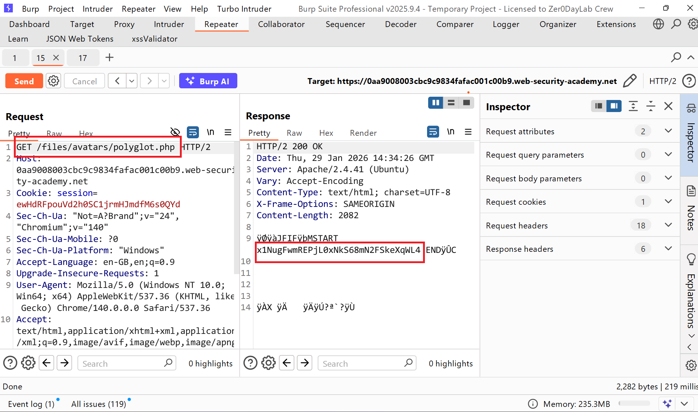
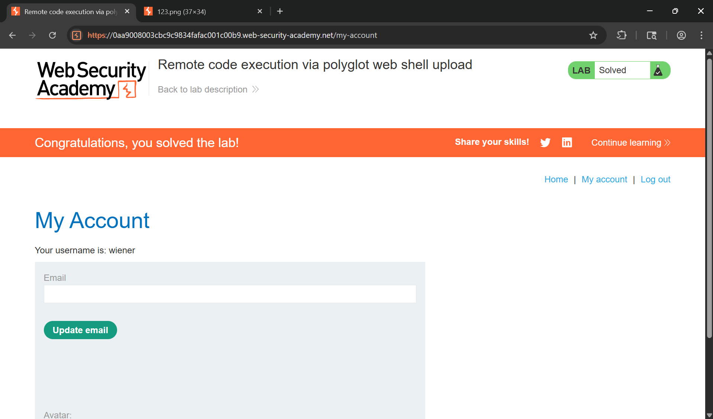

# Writeup LAB Remote code execution via polyglot web shell upload

## Goal
Tải lên một web shell PHP cơ bản, sau đó sử dụng nó để trích xuất nội dung của tệp `/home/carlos/secret`
## Khai thác
Đầu tiên tiến hành đăng nhập với tài khoản `wiener:peter` sau khi vào ứng dụng nó có chức năng upload hình ảnh tiến hành upload 1 hình ảnh bất kì lên vầ ở lịch sử HTTP Burp Suite ta thấy ở đây ứng dụng cho phép tải lên tệp mở rộng `.php`

Nhưng khi chèn webshell upload lên server lại kiểm tra dạng byte tệp tải lên của chúng ta như sau:

Và theo như tài liệu PortSwigger có nói đến là:
> Trong trường hợp chức năng tải ảnh lên, máy chủ có thể cố gắng xác minh một số thuộc tính nội tại của ảnh, chẳng hạn như kích thước. Ví dụ, nếu bạn cố gắng tải lên một tập lệnh PHP, nó sẽ không có bất kỳ kích thước nào. Do đó, máy chủ có thể suy ra rằng nó không thể là một hình ảnh và từ chối việc tải lên.  
> Tương tự, một số loại tệp nhất định luôn chứa một chuỗi byte cụ thể trong phần đầu hoặc cuối tệp. Những chuỗi byte này có thể được sử dụng như dấu vân tay hoặc chữ ký để xác định xem nội dung có khớp với loại tệp dự kiến ​​hay không. Ví dụ, các tệp JPEG luôn bắt đầu bằng các byte FF D8 FF.  
Vâng dạng byte để xác thực loại tệp kiểu MAGIC đầu vào của hình ảnh vậy với những mô tả trên chúng ta có thể tạo ra webshell như nào mà kèm theo chữ kí ma thuật khi upload lên server có thể đánh lừa được. 
Chúng ta cố thể bằng cách sử dụng công cụ `exiftool` ở công cụ này tôi sẽ tạo 1 tệp hình ảnh JPEG đa ngôn ngữ với byte bắt đầu `FF D8 FF` sau đó chèn webshell vào tệp hình ảnh và chuyển đổi file thành file `.php` và tiến hành upload lên server để thực thi.
Cùng thực hiện:
> `convert -size 800x600 xc:white image.jpg` tạo tệp ảnh JPG gốc  

Chúng ta cùng sử dụng lệnh `xxd` để kiểm tra byte hình ảnh như sau và thấy tệp JPEG bắt đầu byte `ffd8` đúng với tệp

Tiếp theo tạo một tệp PHP/JPG đa ngôn ngữ về cơ bản là một hình ảnh bình thường, nhưng chứa mã PHP của bạn trong siêu dữ liệu của nó. 
`exiftool -Comment="<?php echo 'START ' . file_get_contents('/home/carlos/secret') . ' END'; ?>" image.jpg -o polyglot.php`

Rồi tiến hành upload file vừa tạo webshell lên server và sử dụng phương thức GET `/files/avatars/polyglot.php` ta thấy được tệp bí mật:

