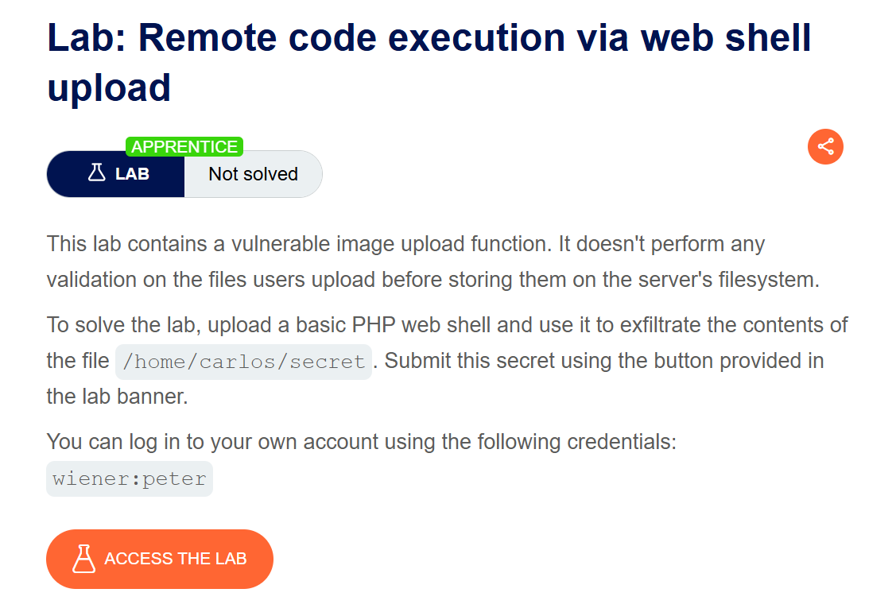
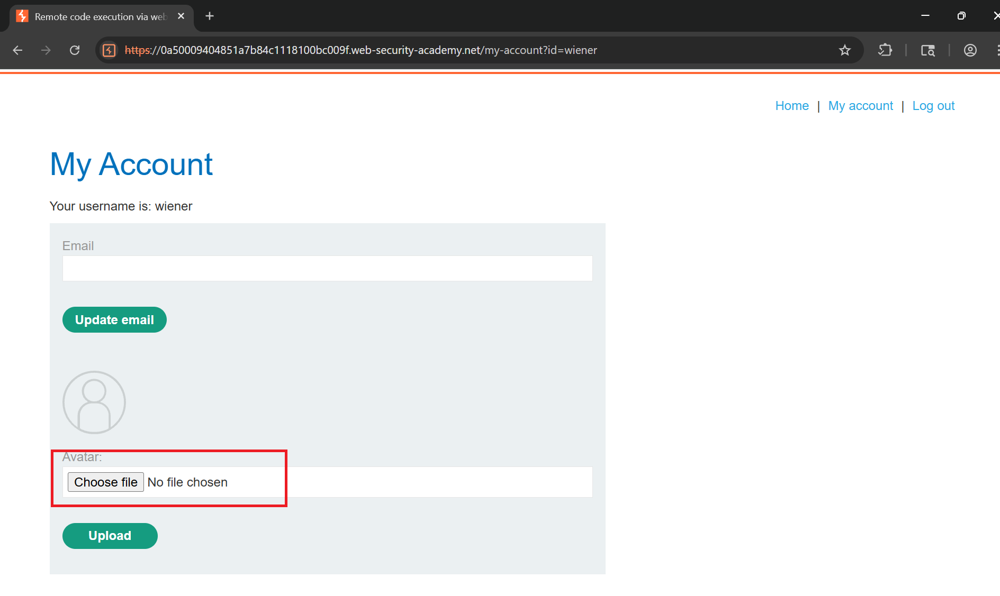
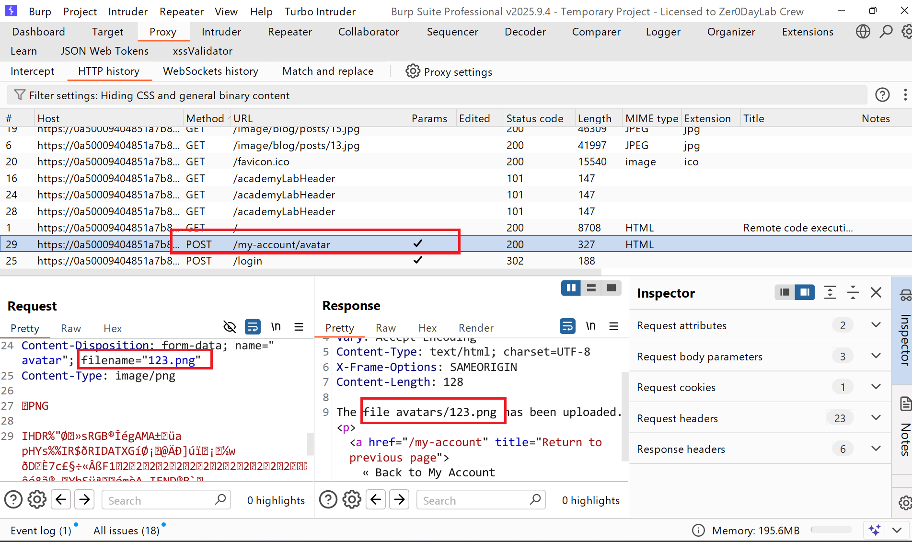
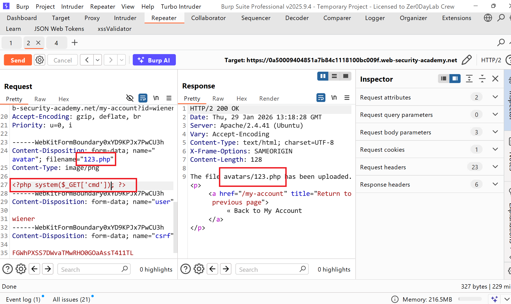
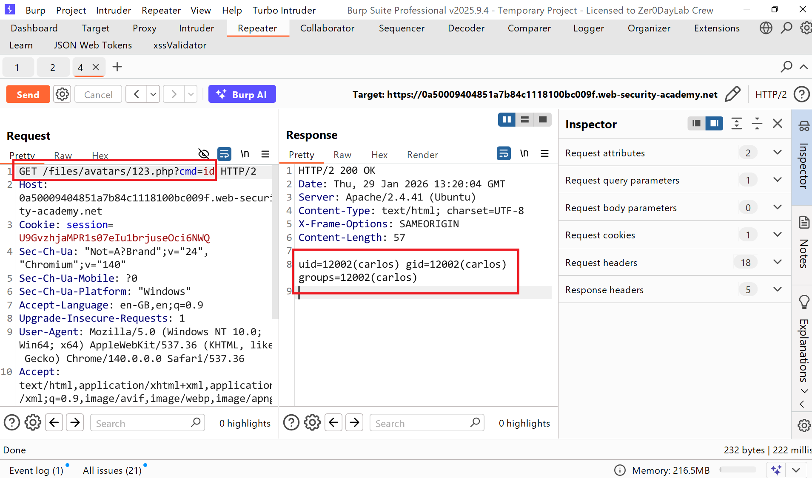
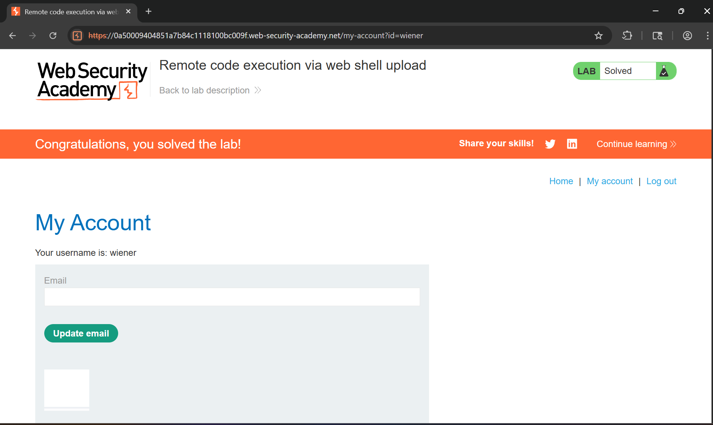

# Writeup LAB Remote code execution via web shell upload

## Goal
Mục tiêu bài LAB này thực thi web shell đọc tập tin `/home/carlos/secret` và gửi mã bí mật
## Khai thác
Chúng ta vào trang chủ tiến hành đăng nhập tài khoản đã xác thực `wiener:peter` 
sau khi đăng nhập vào chúng ta có thể thấy ứng dụng cho phép tải 1 hình ảnh để làm ảnh đại diện

Chúng ta cùng tải lên 1 tập tin bất kì và ở lịch sử HTTP Burp Suite cho thấy tệp đã tải lên kèm đường dẫn lưu hình ảnh

Giả sử nếu ứng dụng không xác thực tệp đầu vào chúng ta có thể sửa đổi loại tệp thành `.php` để có thể thực thi webshell bằng cách chúng ta cùng thử nghiệm xem như thế nào. Và đúng như giả định server không hề lọc tệp mở rộng tùy ý đầu vào bằng cách này chúng ta có thể truyền một webshell đơn giản vào upload lên server

Sau khi upload chúng ta cùng truy cập tham số webshell truyền vào ở đây là `cmd` với `files/avartar/123.php?cmd=id` và tệp đã thực thi thành công

Bây giờ chúng ta cùng truy xuất nội dung tập tin `/home/carlos/secret` và nộp mã bí mật hoàn thành LAB

