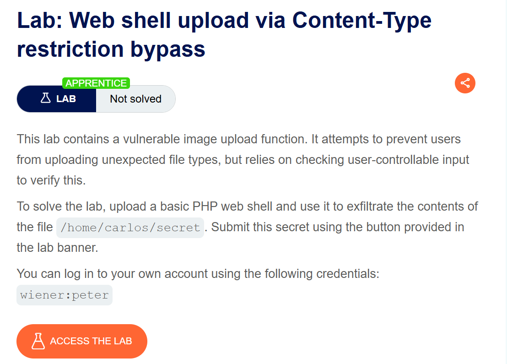
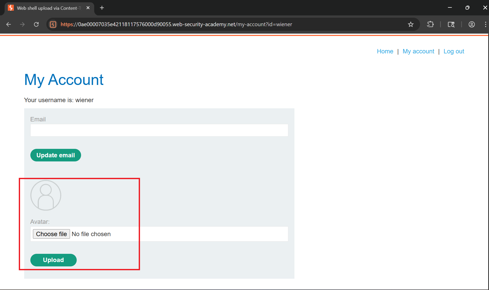
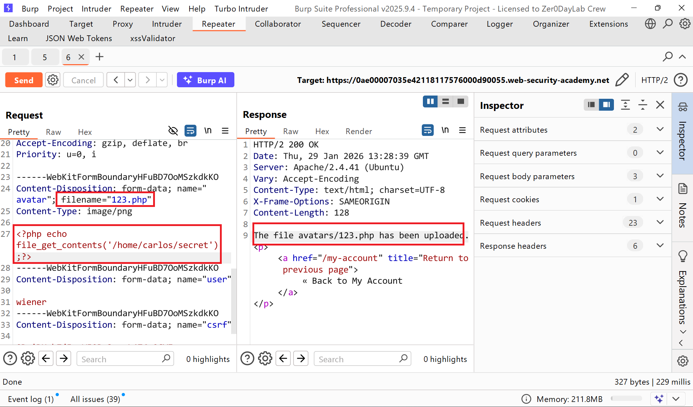
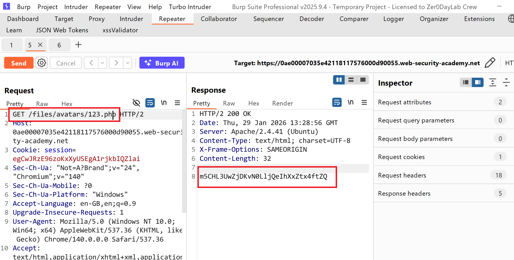
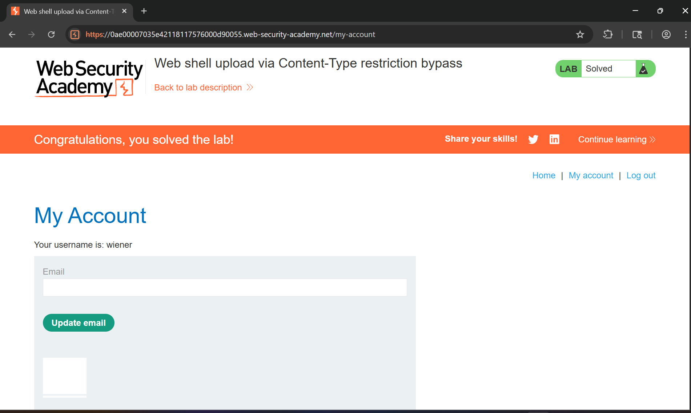

# Writeup Lab: Web shell upload via Content-Type restriction bypass

## Goal
Mục tiêu cũng như các LAB trước tìm cách bypass đọc được tập tin `/home/carlos/secret`
## Khai thác
Đầu tiên chúng ta cùng đăng nhập với cred `wiener:peter` khi vào ứng dụng nó cũng có chức năng upload hình ảnh như sau chúng ta cùng tiến hành upload 1 hình ảnh

Vẫn như LAB cũ chúng ta giả sử hệ thống không lọc đầu vào có thể truyền lên tập tin mở rộng `.php` bất kì thử xem thì nó cũng không lọc đầu vào

Tới đây chúng ta có thể GET webshell và lấy mã bí mật

Nộp mã bí mật và hoàn thành LAB

