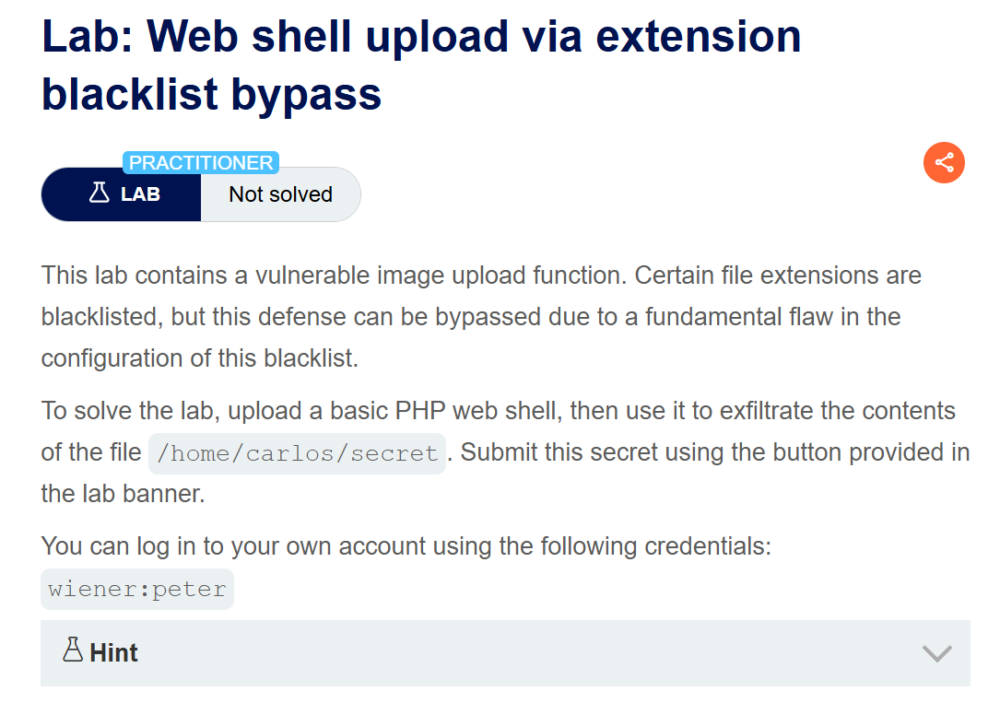
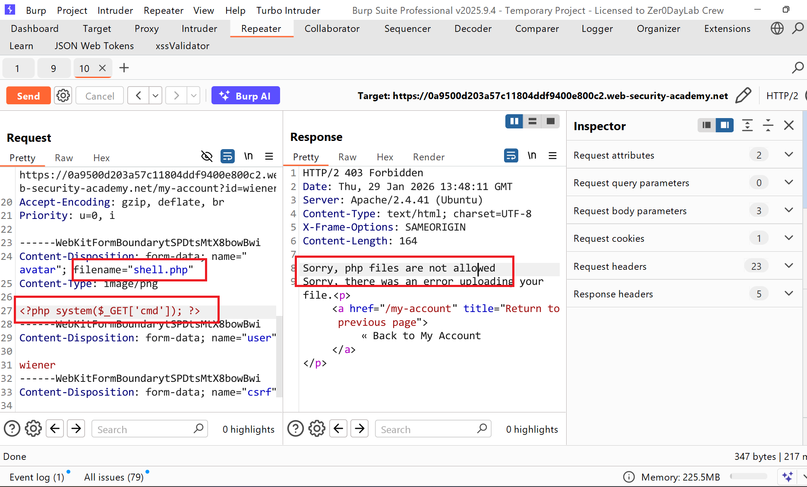
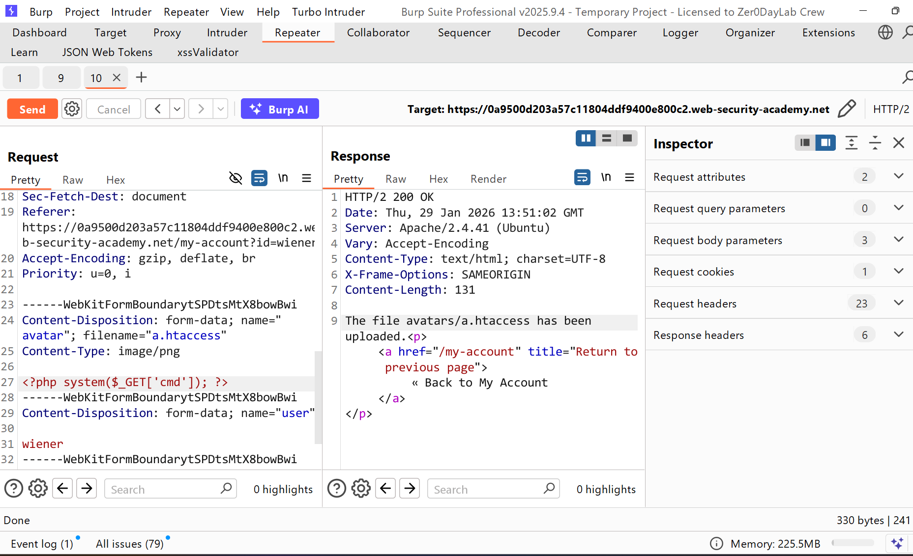
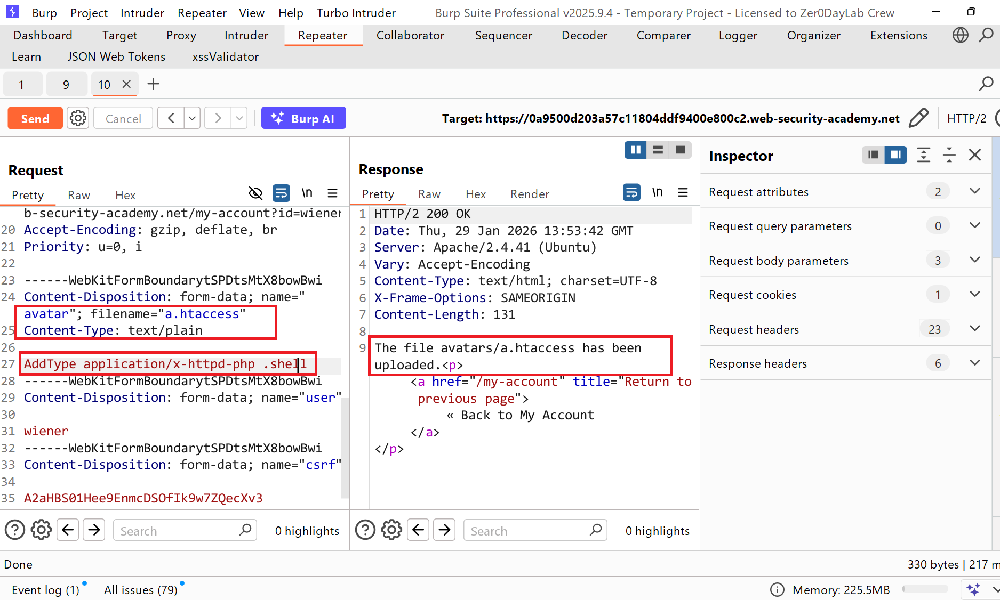
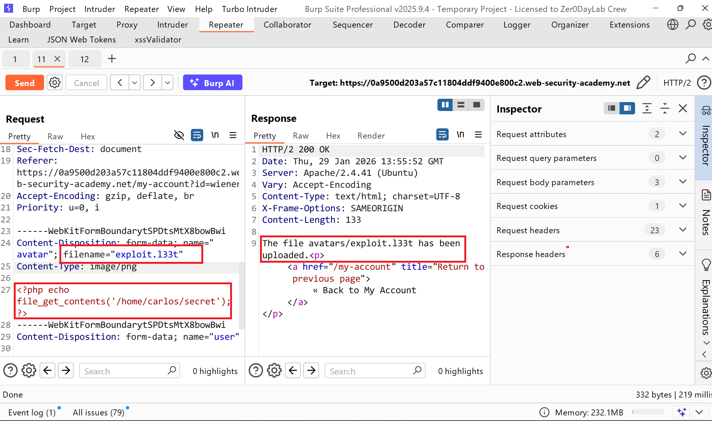
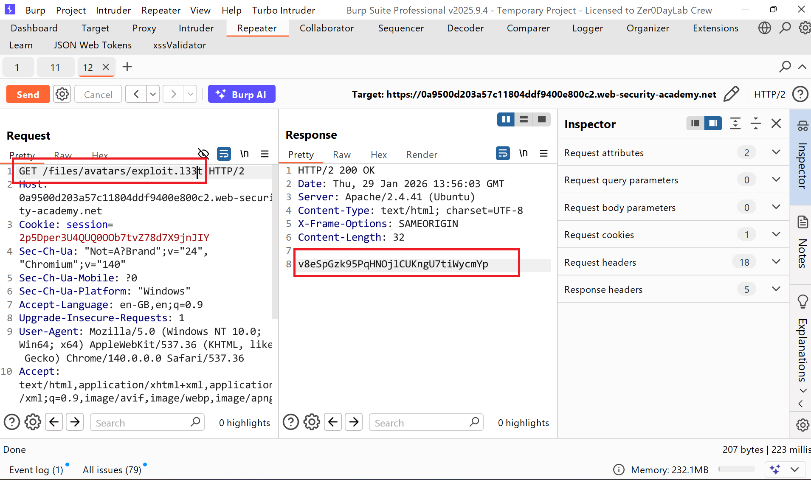
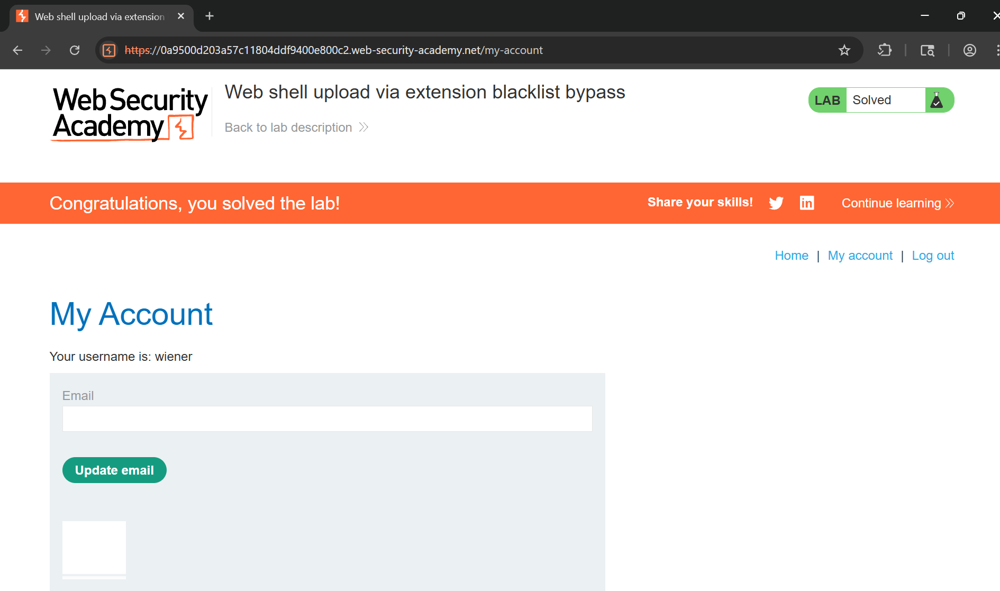

# Writeup LAB: Web shell upload via extension blacklist bypass

## Goal
Mục tiêu chúng ta tìm cách bỏ qua danh sách đen upload webshell thực thi để đọc bí mật của tệp `/home/carlos/secret`
## Khai thác
Đầu tiên chúng ta cùng đăng nhập vào tài khoản `wiener:peter` sau khi vào ứng dụng chúng ta có thể thấy nó có chức năng upload ảnh. Tiến hành upload ảnh bình thường và ở lịch sử HTTP Burpsuite nếu chúng ta thử upload tệp php lên server điều gì sẽ xảy ra và chúng ta có thể thấy ứng dụng đã lọc tệp PHP và không cho upload lên server

Chúng ta cố thể thử bypass bằng cách thay đổi loại kiểu như `pHp` và sử dụng `php.png` và `nullbyte` và đều bị filter. Tôi tự hỏi liệu có tệp nào có thể bỏ qua vâng có đó chính là tệp `.htaccess` chúng ta có thể thấy upload được

> Vậy .htaccess là gì nó là tệp cấu hình của Apache yêu cầu bởi phía máy khách các nhà phất triển có thể phải thêm các chỉ thị sau /etc/apache2/apache2.conf tệp của họ  
> `LoadModule php_module /usr/lib/apache2/modules/libphp.so  
>  AddType application/x-httpd-php .php  
> Nhiều máy chủ cũng cho phép các nhà phát triển tạo các tệp cấu hình đặc biệt trong từng thư mục riêng lẻ để ghi đè hoặc bổ sung vào một hoặc nhiều cài đặt toàn cục. Ví dụ, máy chủ Apache sẽ tải cấu hình dành riêng cho thư mục từ một tệp có tên .htaccessnếu tệp đó tồn tại.  

Bây giờ chúng ta cùng ghi đè tệp cấu hình cho phép tệp mở rộng chúng ta như sau và cho phép đuôi mở rộng `.php` hay `.l33t` và thay đổi content-type: `text/plain`

Sau khi upload thành công chúng ta cùng quay trở lại web shell ban đầu và upload tệp mở rộng vừa ghi đè máy chủ và tệp mở rộng ở đây của tôi là `.l33t`

Sau đó chúng ta có thể truy cập thông qua phương thức GET để lấy tệp bí mật vừa thực thi web shell

Submit tệp bí mật và hoàn thành LAB

