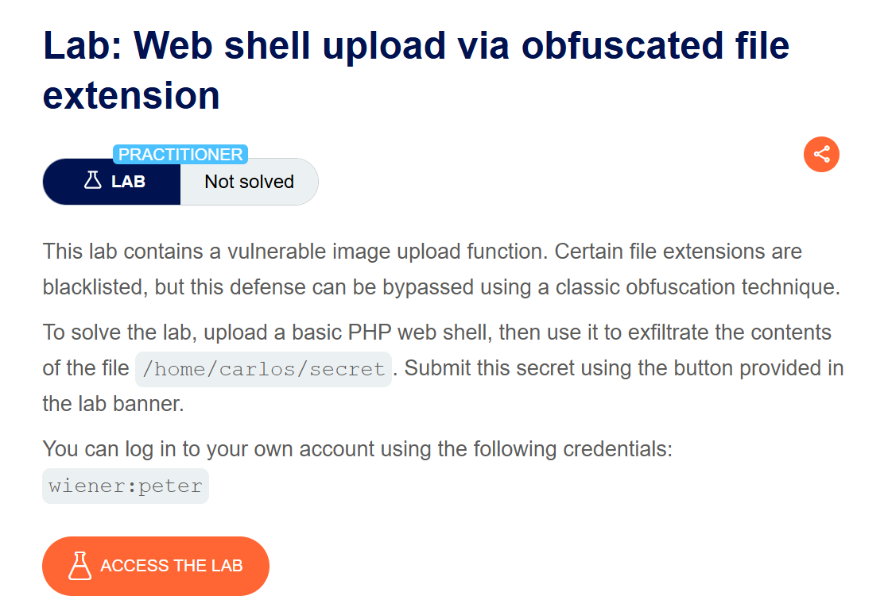
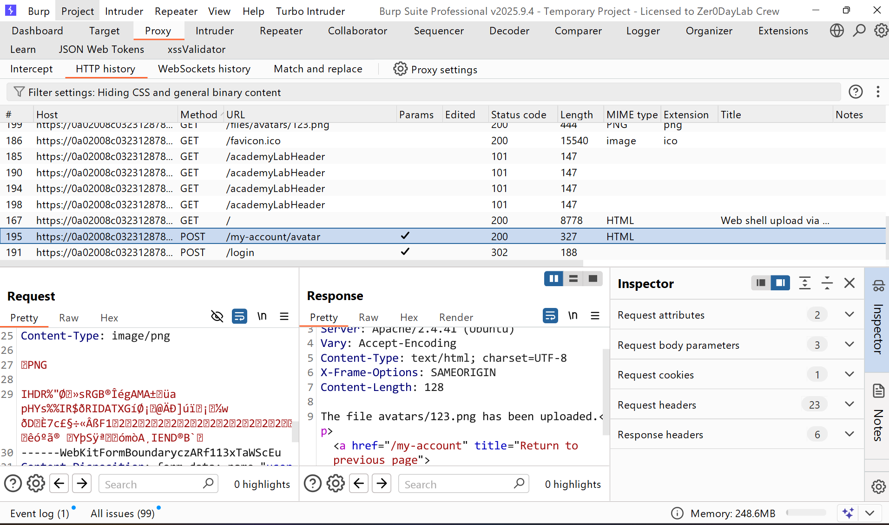
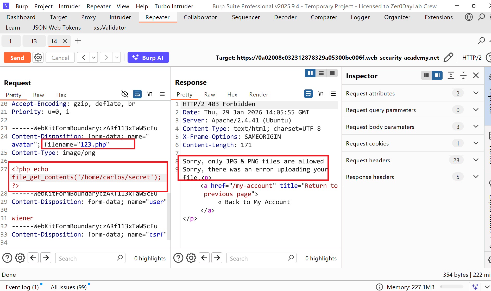
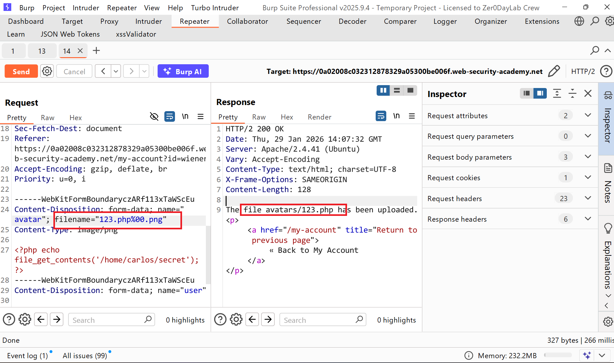
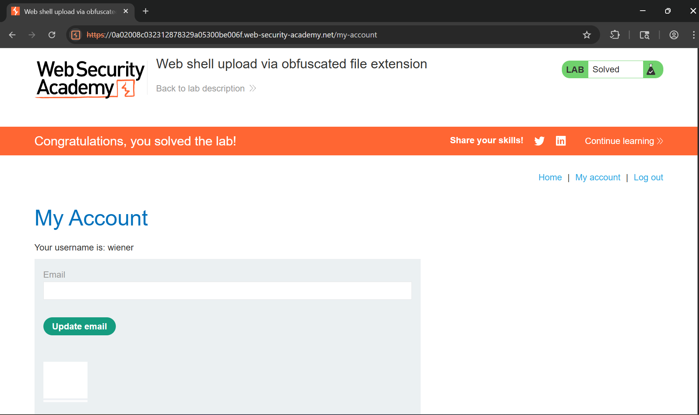

# Writeup LAB Web shell upload via obfuscated file extension

## Goal
Mục tiêu LAB này bằng cách nào đó chúng ta cần bypass tệp mở rộng upload webshell thực thi đọc tệp bí mật ở `/home/carlos/secret`
## Khai thác
Vào trang chủ tiến hành đăng nhập `wiener:peter` và upload 1 tệp hình ảnh bất kì lên và lịch sử HTTP Burp Suite cho thấy

Chúng ta có thể thấy khi tôi upload tệp php nó lọc và chỉ cho phép upload 2 tệp PNG và JPG hình ảnh

Vậy nếu như chúng ta có thể truyền thêm một tệp mở rộng và nullbyte để xóa và kết thúc chuỗi phía sau liệu có thể tải lên được webshell giả sử như `123.php%00.png` kết quả nếu server xác thực không kĩ sẽ khiến ứng dụng có thể được trở thành `123.php` tệp sau nó được coi là kết thúc 1 chuỗi và xóa đi. Và đúng như vậy
 
Tới đây chúng ta có thể truy cập tới phương thức GET file `123.php` thực thi webshell lấy tệp bí mật và submit LAB
