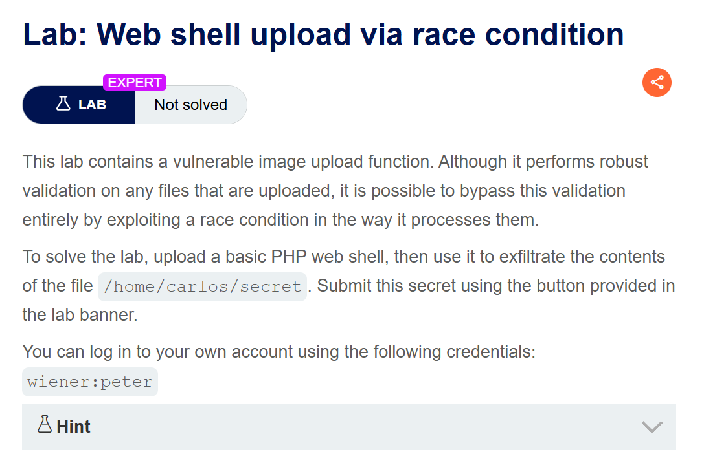
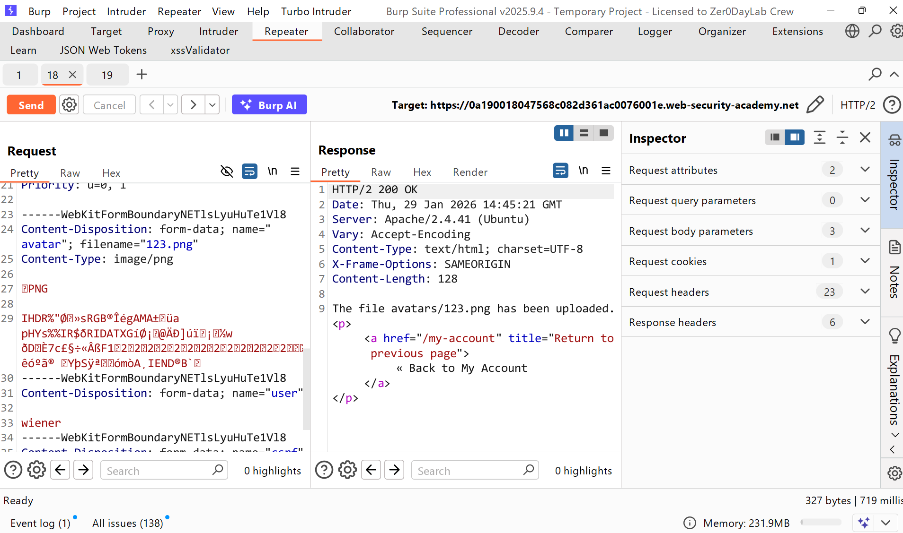
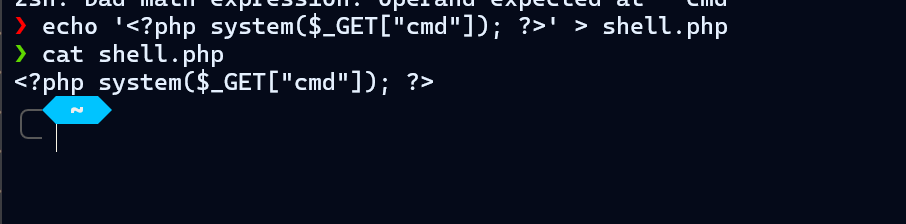
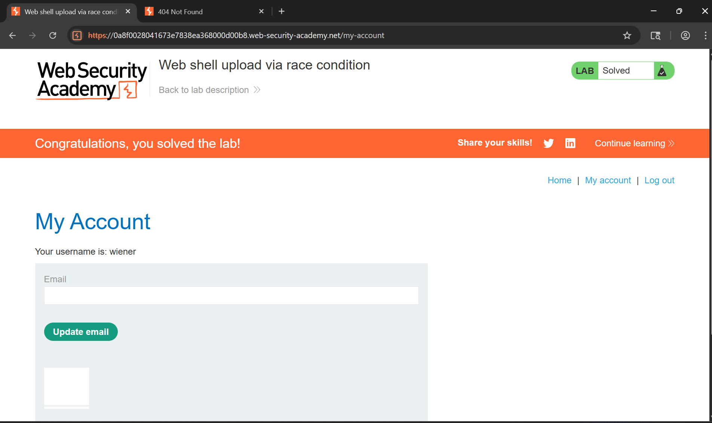

# Writeup LAB Web shell upload via race condition

## Goal
Để giải bài tập, hãy tải lên một web shell PHP cơ bản, sau đó sử dụng nó để trích xuất nội dung của tệp `/home/carlos/secret`. Gửi mã bí mật này bằng nút được cung cấp trên banner của bài tập.
## Khai thác
Chúng ta cùng truy cập trang chủ tiến hành đăng nhập với tài khoản `wiener:peter` ở ứng dụng khi đăng nhập vào có chức năng upload file chúng ta cùng tiến hành upload 1 hình ảnh bất kì lên server và lịch sử HTTP Burpsuite cho thấy

Và ở đây tôi đã thực hiện upload webshell nhưng không thành công tệp không được cho phép.
```php
<?php
$target_dir = "avatars/";
$target_file = $target_dir . $_FILES["avatar"]["name"];

// temporary move
move_uploaded_file($_FILES["avatar"]["tmp_name"], $target_file);

if (checkViruses($target_file) && checkFileType($target_file)) {
    echo "The file ". htmlspecialchars( $target_file). " has been uploaded.";
} else {
    unlink($target_file);
    echo "Sorry, there was an error uploading your file.";
    http_response_code(403);
}

function checkViruses($fileName) {
    // checking for viruses
    ...
}

function checkFileType($fileName) {
    $imageFileType = strtolower(pathinfo($fileName,PATHINFO_EXTENSION));
    if($imageFileType != "jpg" && $imageFileType != "png") {
        echo "Sorry, only JPG & PNG files are allowed\n";
        return false;
    } else {
        return true;
    }
}
?>
```
> Khi chúng ta tải lên một tập tin, hệ thống sẽ tạo một tập tin tạm thời, đó chính là tập tin đã tải lên. <br>
> Sau đó, nó kiểm tra xem tệp của chúng ta có chứa virus hay không và kiểm tra loại tệp.<br>
> Hàm `checkFileType($fileName)` kiểm tra phần mở rộng chúng ta có phải `jpg` hay `png` không <br>
Với những thông tin trên, chúng ta có thể thấy rằng nó dễ bị lỗi xung đột truy cập (race condition).
Điều này là do sau khi chúng ta tải lên một tập tin, nó vẫn tồn tại tạm thời. Ngoài ra, `checkViruses` chức năng này cần một khoảng thời gian để hoạt động!
Vậy nên về lý thuyết chúng ta có thể thực thi webshell bây giờ tạo 1 tệp webshell như sau:

Tiếp theo, để khai thác tình trạng tranh chấp tài nguyên (race condition), tôi sẽ viết một tập lệnh Python liên tục tải lên web shell PHP và đọc nội dung tệp


