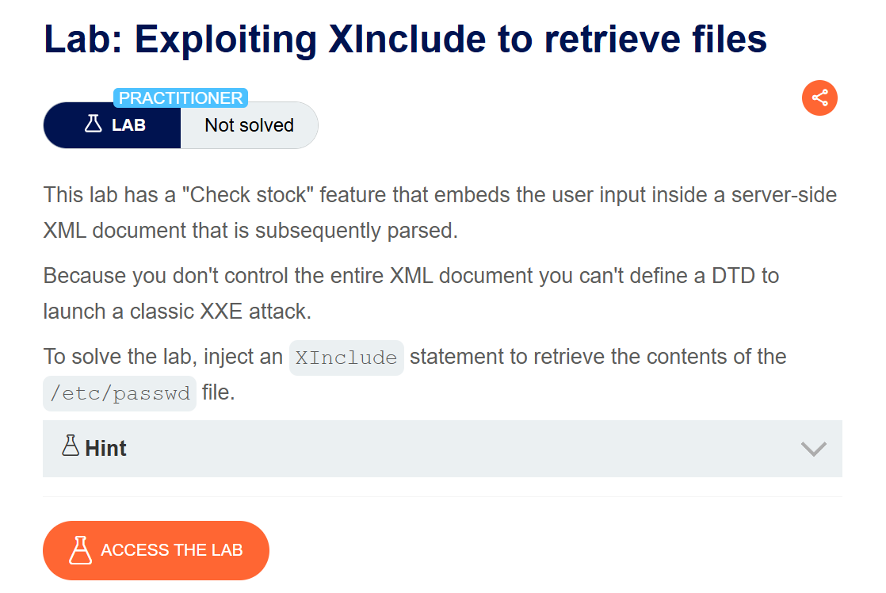
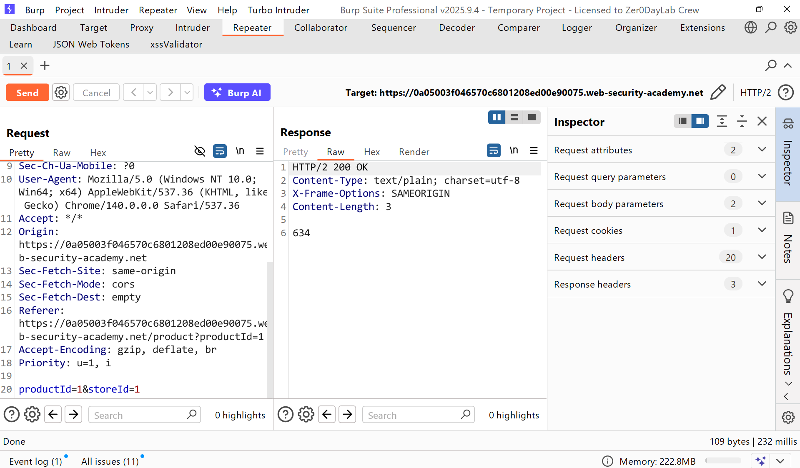
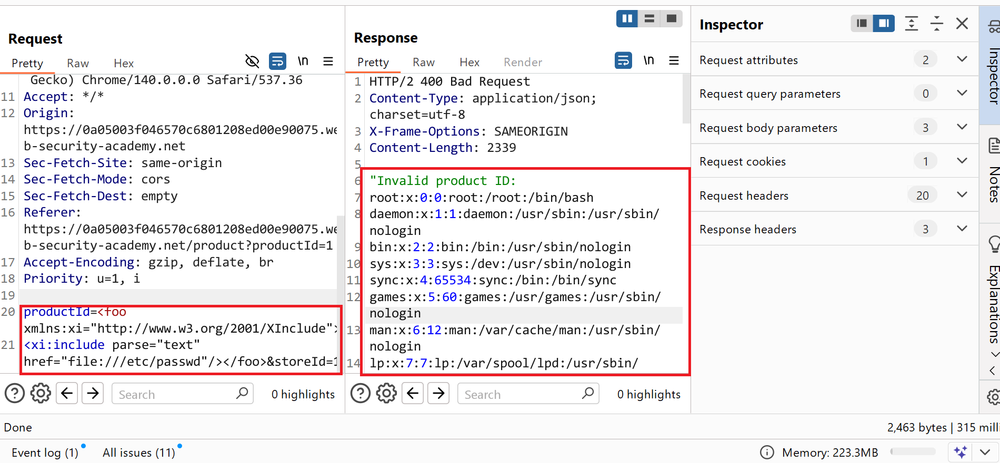
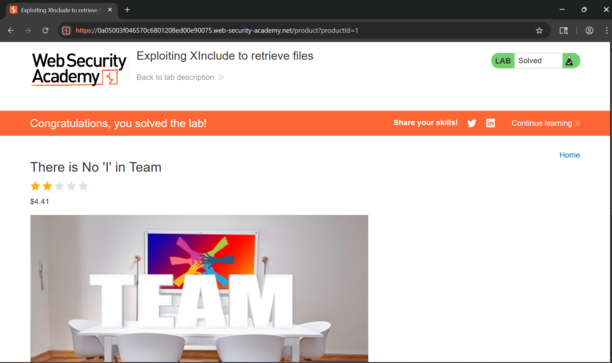

# Writeup LAB: Exploiting XInclude to retrieve files

## Goal
Because you don't control the entire XML document you can't define a DTD to launch a classic XXE attack.
To solve the lab, inject an XInclude statement to retrieve the contents of the `/etc/passwd` file.
## Khai thác.
Trang chủ

Trong bài thực hành trước, chúng ta đã phát hiện ra lỗ hổng tấn công XXE trong tính năng "Kiểm tra kho hàng" , tính năng này phân tích đầu vào XML và trả về bất kỳ giá trị không mong muốn nào trong phản hồi


Để khai thác trích xuất tệp `/etc/passwd` bài này đã chặn chúng ta đưa 1 thực thể DTD bên ngoài vào nên chúng ta không thể sử dụng thực thể DTD bên ngoài nữa. Vậy bây giờ có cách gì <br>
Ở đây chúng ta có thể sử dụng 1 hàm gọi là `XInclude` để thay thế `DOCTYPE` là đặc tả cho phép xây dựng một thực thể XML từ tài liệu XML bằng cách đặt `XInclude` vào cuộc tấn công rồi tham chiếu đến `XInclude` không gian tên và và đường dẫn tệp thực thi chúng ta muốn đưa vào như sau:
```xml
<foo xmlns:xi="http://www.w3.org/2001/XInclude">
<xi:include parse="text" href="file:///etc/passwd"/></foo>
```
Bằng cách đó chúng ta truyền payload trên vào tham số `productID` như sau kết quả sẽ thực thi tệp `/etc/passwd`


