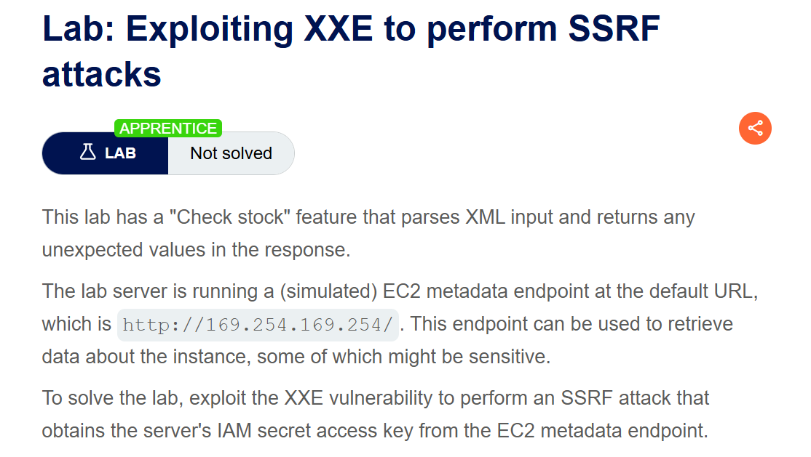
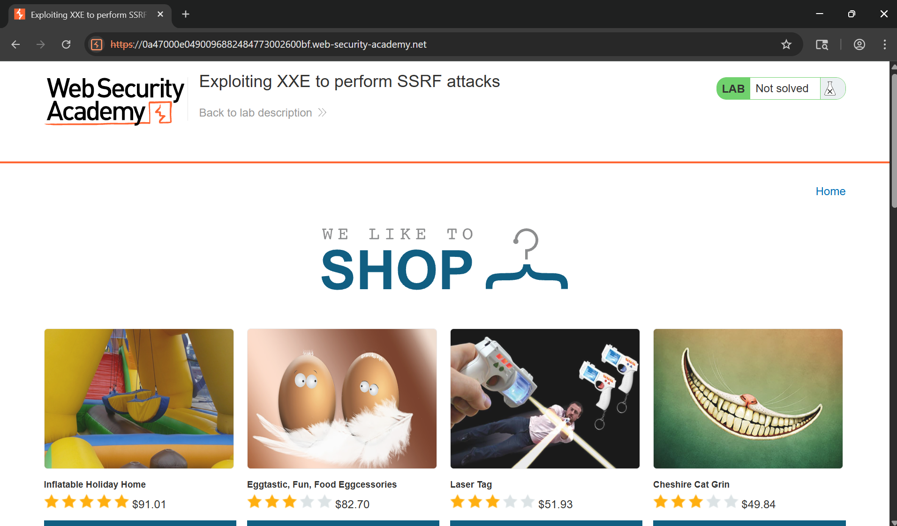
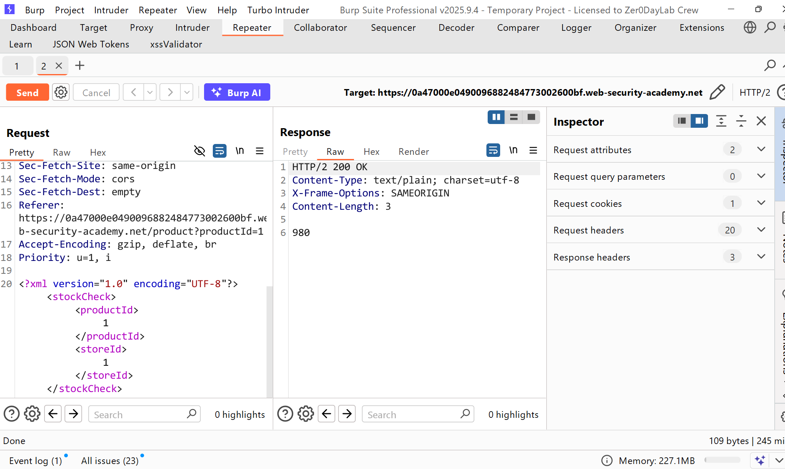
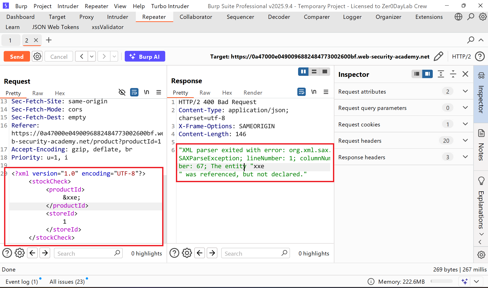
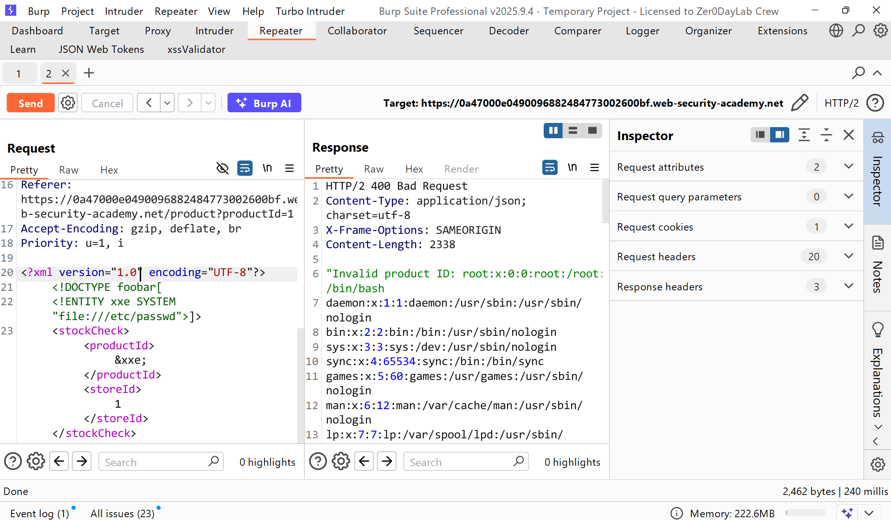
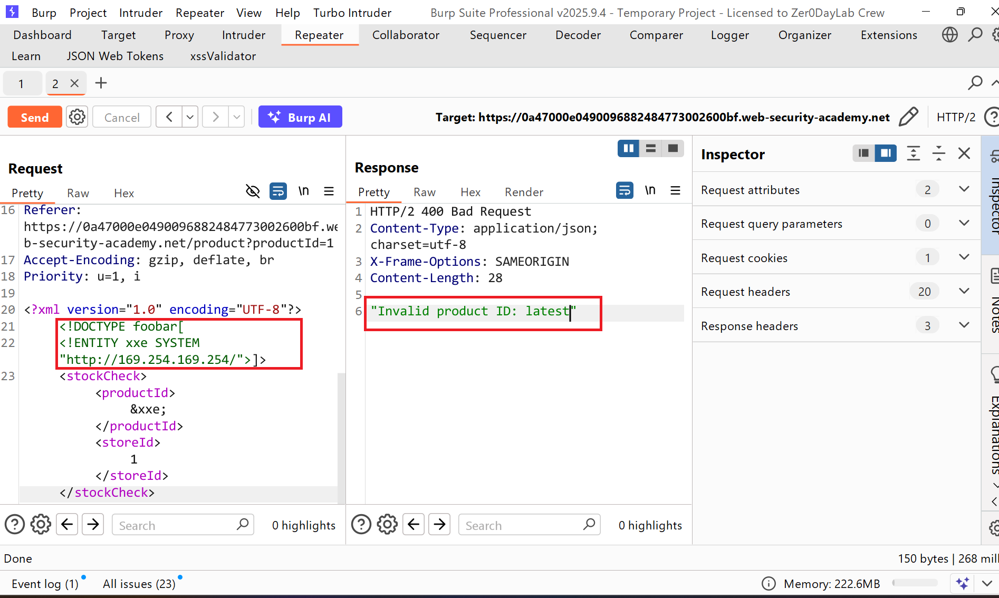
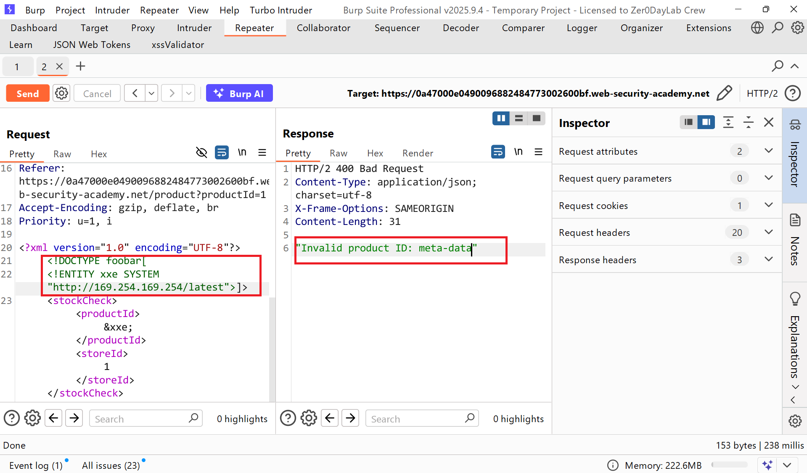
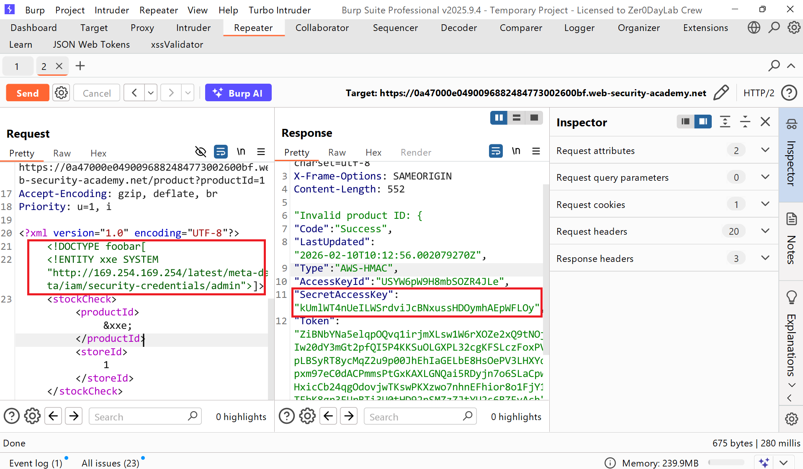
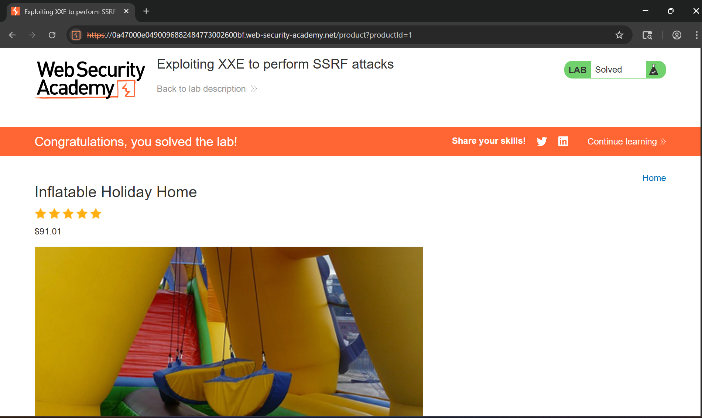

# Writeup LAB: Exploiting XXE to perform SSRF attacks

## Goal
The lab server is running a (simulated) EC2 metadata endpoint at the default URL, which is `http://169.254.169.254/`. This endpoint can be used to retrieve data about the instance, some of which might be sensitive.
To solve the lab, exploit the XXE vulnerability to perform an SSRF attack that obtains the server's IAM secret access key from the EC2 metadata endpoint.
## Khai thác.
Trang chủ:

Trong bài thực hành trước, chúng ta đã phát hiện ra lỗ hổng tấn công XXE trong tính năng "Kiểm tra kho hàng" , tính năng này phân tích đầu vào XML và trả về bất kỳ giá trị không mong muốn nào trong phản hồi


Cũng với như bài thực hành trước chúng ta có thể thử test với kí tự lạ xem ứng dụng có parse XML lỗi thì kết quả cũng vậy.

chứng tỏ ở đây chúng ta có thể tận dụng lỗ hổng khai báo thực thể DTD thực thi tệp tùy ý bằng cách test đọc tệp `/etc/passwd`
```xml
<?xml version="1.0" encoding="UTF-8"?>
<!DOCTYPE foobar[
<!ENTITY xxe SYSTEM "file:///etc/passwd">]>
<stockCheck><productId>&xxe;</productId><storeId>1</storeId></stockCheck>
```

Và thành công bây giờ chúng ta có thể truy xuất với SSRF thực hiện yêu cầu thông qua tiêu đề HTTP bằng cách sử dụng URL mục tiêu và mục tiêu ở đây là `http://169.254.169.254/` thực hiện để truy xuất khóa bí mật trong metadata
```xml
<?xml version="1.0" encoding="UTF-8"?>
<!DOCTYPE foobar[
<!ENTITY xxe SYSTEM "http://169.254.169.254/">]>
<stockCheck><productId>&xxe;</productId><storeId>1</storeId></stockCheck>
```
Kết quả tuy nhiên chúng ta có thể đã vào được nội bộ thành công nhưng chưa thấy khóa bí mật nhưng ở đây có rò rỉ thông tin thông qua `Invalid product ID: infomartion` chúng ta có thể thực hiện truy xuất tệp theo từng đường dẫn đó sẽ ra sao?


Sau quá trình rò ri theo thông tin thì thu thập được đường dẫn tới khóa bí mật như sau: `http://169.254.169.254/latest/meta-data/iam/security-credentials/admin`

Tiến hành submit khóa bí mật và hoàn thành LAB
