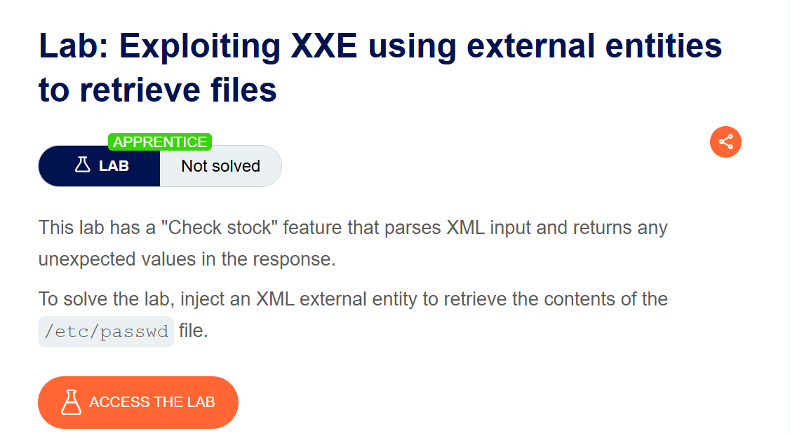
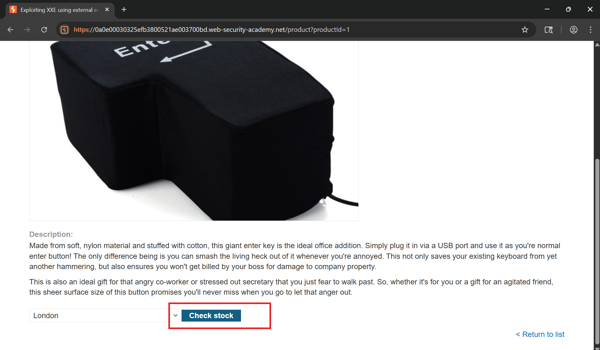
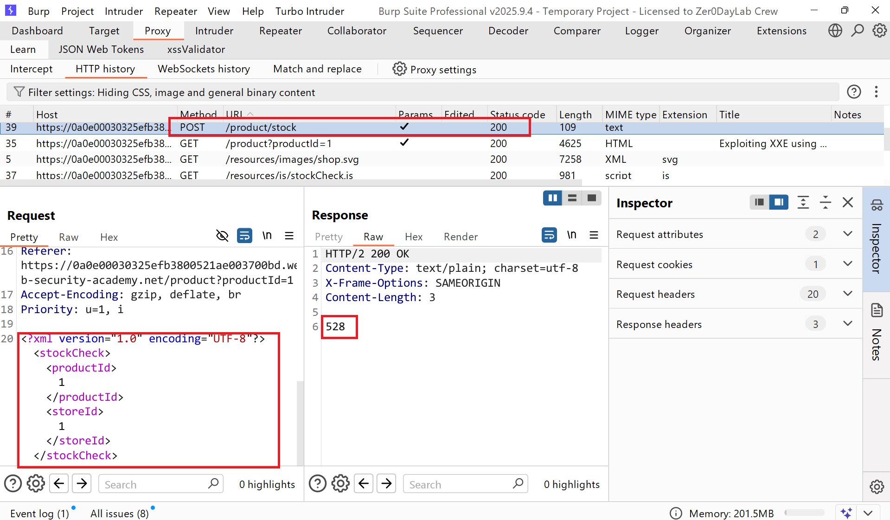
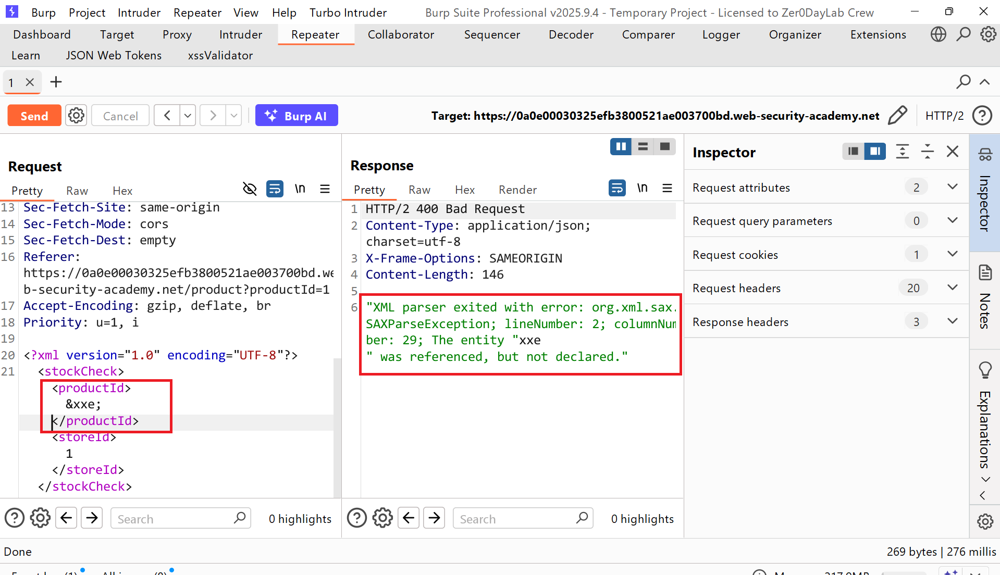
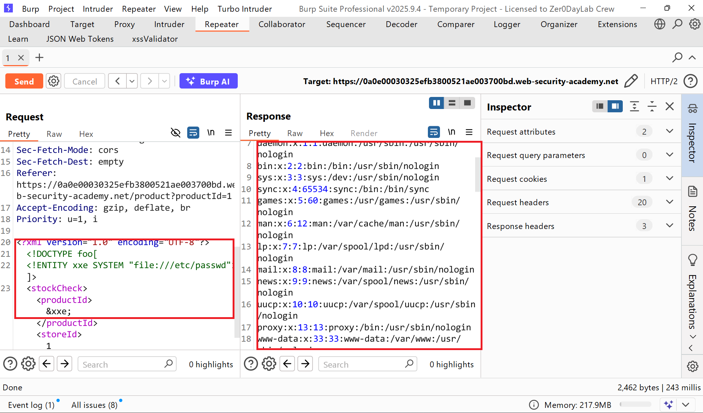
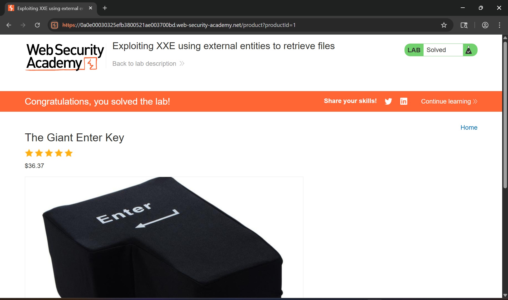

# Writeup LAB: Exploiting XXE using external entities to retrieve files

## Goal
To solve the lab, inject an XML external entity to retrieve the contents of the `/etc/passwd` file.
## Khai thác
Vào trang chủ ứng dụng tiến hành nhấp nút check stock vì mô tả challenge có nói đến ở chức năng này có parse XML

Lịch sử HTTP Burp

Để thực hiện truy xuất một tệp tin chúng ta có thể thực hiện test xem liệu ở chức năng stock có thực sự parse XML không bằng cách thêm dấu kí tự lạ `&` và kết quả nó báo rằng thực thể đã được tham chiếu nhưng chưa được khai báo

Với thông tin đó chúng ta có thẻ truy xuất tệp `/etc/passwd` bằng cách khai báo một thực thể DTD như sau:
```xml
<?xml version="1.0" encoding="UTF-8"?>
<!DOCTYPE foo[
<!ENTITY xxe SYSTEM "file:///etc/passwd">]>
<stockCheck><productId>&xxe;</productId><storeId>1</storeId></stockCheck>
```
Lúc này khi XML parse xxe nó sẽ gọi thực thể XXE được khai báo với đầu vào SYSTEM đọc file khi đó khiến ứng dụng parse thực thi tệp bên trong. 

Refesh trang và hoàn thành LAB
